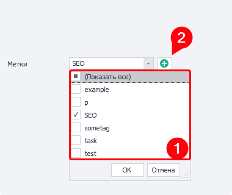

:::info **Please read the [*Material Usage Rules on this site*](../../../Disclaimer).**
:::

> 🔗 **[Original page](https://zennolab.atlassian.net/wiki/spaces/RU/pages/851574897)** — Source of this material

_______________________________________________  

## Description

In this tab, you can configure the number of runs and threads, as well as proxy usage.

  

## Number to run

Number of repetitions.
The project will run as many times as specified in this field.

`-1` (minus one) means an infinite number of repetitions. The project will run endlessly until you stop it (by clicking [❗→ Stop](https://zennolab.atlassian.net/wiki/spaces/RU/pages/851116136#%D0%A1%D1%82%D0%BE%D0%BF "https://zennolab.atlassian.net/wiki/spaces/RU/pages/851116136#%D0%A1%D1%82%D0%BE%D0%BF") or by setting the repeats to 0 (zero) instead of -1), or until one of the stop conditions from the [❗→ relevant tab](https://zennolab.atlassian.net/wiki/spaces/RU/pages/852885665 "https://zennolab.atlassian.net/wiki/spaces/RU/pages/852885665") is met.

## Max threads

The number of threads that will be launched for this project at the same time.

:::note Note
Later in this article, you'll find several examples explaining the relationship between the “Number to run” and “Max threads” settings.
:::

## Priority

Here you can set the template's priority.
Priority threads can interrupt the instance request of lower-priority threads (if the [❗→ corresponding setting](https://zennolab.atlassian.net/wiki/spaces/RU/pages/809074766#%D0%9F%D1%80%D0%B8%D0%BE%D1%80%D0%B8%D1%82%D0%B5%D1%82%D0%BD%D1%8B%D0%B5-%D0%BF%D0%BE%D1%82%D0%BE%D0%BA%D0%B8-%D0%BF%D1%80%D0%B5%D1%80%D1%8B%D0%B2%D0%B0%D1%8E%D1%82-%D0%B7%D0%B0%D0%BF%D1%80%D0%BE%D1%81%D1%8B-%D0%BC%D0%B5%D0%BD%D0%B5%D0%B5-%D0%BF%D1%80%D0%B8%D0%BE%D1%80%D0%B8%D1%82%D0%B5%D1%82%D0%BD%D1%8B%D1%85-%D0%BF%D0%BE%D1%82%D0%BE%D0%BA%D0%BE%D0%B2 "https://zennolab.atlassian.net/wiki/spaces/RU/pages/809074766#%D0%9F%D1%80%D0%B8%D0%BE%D1%80%D0%B8%D1%82%D0%B5%D1%82%D0%BD%D1%8B%D0%B5-%D0%BF%D0%BE%D1%82%D0%BE%D0%BA%D0%B8-%D0%BF%D1%80%D0%B5%D1%80%D1%8B%D0%B2%D0%B0%D1%8E%D1%82-%D0%B7%D0%B0%D0%BF%D1%80%D0%BE%D1%81%D1%8B-%D0%BC%D0%B5%D0%BD%D0%B5%D0%B5-%D0%BF%D1%80%D0%B8%D0%BE%D1%80%D0%B8%D1%82%D0%B5%D1%82%D0%BD%D1%8B%D1%85-%D0%BF%D0%BE%D1%82%D0%BE%D0%BA%D0%BE%D0%B2")) is enabled.

## Tags

Tags let you group projects together. You can assign several tags at once.

You can either select existing tags (from the dropdown list)[1] or add new ones (using the “+” button)[2]

Screenshot

## Proxy

Should the project use proxies from the built-in [❗→ ZennoProxyChecker](https://zennolab.atlassian.net/wiki/spaces/RU/pages/475365507 "https://zennolab.atlassian.net/wiki/spaces/RU/pages/475365507")?

- **Do not use** — run without proxies, using the real IP address.
- **If possible** — if there are “live” proxies in ProxyChecker, the project will use them. If there are none, it will run without proxies.
- **Use (without removal)** — proxies are used by the project without being removed from the list of “live” proxies in ProxyChecker. If there is no suitable proxy available, the project will wait until one appears.
- **Use** — proxies are used by the project and removed from the list of “live” proxies in ProxyChecker. If there is no suitable proxy available, the project will wait until one appears.

## Rules

Selecting the rule or rules that determine which proxy from the list of “live” proxies will be used for the project. [❗→ Rules](https://zennolab.atlassian.net/wiki/spaces/RU/pages/848560252 "https://zennolab.atlassian.net/wiki/spaces/RU/pages/848560252") are created in ProxyChecker.

  

## Running templates in multi-threaded mode

ZennoPoster Standard and Pro let you run several threads for a project simultaneously.

What is a thread and are there limits on them?

A thread is an independent execution unit, with its own browser and its own data set ([❗→ variables](https://zennolab.atlassian.net/wiki/spaces/RU/pages/735608872 "https://zennolab.atlassian.net/wiki/spaces/RU/pages/735608872"), [❗→ lists](https://zennolab.atlassian.net/wiki/spaces/RU/pages/534053375 "https://zennolab.atlassian.net/wiki/spaces/RU/pages/534053375"), [❗→ tables](https://zennolab.atlassian.net/wiki/spaces/RU/pages/735903776 "https://zennolab.atlassian.net/wiki/spaces/RU/pages/735903776"), etc.).  
You can think of a thread as a person performing a certain set of actions in a browser. Running several threads is like several people doing things at once.

**Thread limits:**  
ZennoPoster Lite supports only one thread.  
Standard — 5 threads.  
Pro — no restrictions.

To do this, specify the desired number of threads in the “Max threads” setting, and the number of repetitions in the “Number to run” setting.
You might also need to click [❗→ Start](https://zennolab.atlassian.net/wiki/spaces/RU/pages/851116136#%D0%A1%D1%82%D0%B0%D1%80%D1%82 "https://zennolab.atlassian.net/wiki/spaces/RU/pages/851116136#%D0%A1%D1%82%D0%B0%D1%80%D1%82") in the Main Menu (if the project is in [❗→ status](https://zennolab.atlassian.net/wiki/spaces/RU/pages/853737528#%D0%A1%D1%82%D0%B0%D1%82%D1%83%D1%81 "https://zennolab.atlassian.net/wiki/spaces/RU/pages/853737528#%D0%A1%D1%82%D0%B0%D1%82%D1%83%D1%81") “Stopped”).

:::warning Warning
Don't immediately try to run the project with 100 threads! Each thread consumes your computer's resources — RAM, CPU, and hard disk access (the intensity of usage depends on your template's logic and the websites it interacts with). Launching too many threads at once might cause not just the program, but the whole OS to freeze (or even crash).
:::

### Example #1

*Number to run* — 60  
*Max threads* — 1

*Result*: One thread starts and consecutively performs 60 runs, one after another. If one run takes a minute, then under these conditions all runs will take 60 minutes.

### Example #2

*Number to run* — 60  
*Max threads* — 10

*Result*: 10 threads launch at the same time and work in parallel. If each run takes a minute, then to complete 60 runs you'll need just 6 minutes (since 10 runs are being handled each minute)!

### Example #3

*Number to run* — `-1` (minus one)  
*Max threads* — 10

*Result*: 10 threads launch at the same time and will keep running until you stop the project (by clicking [❗→ Stop](https://zennolab.atlassian.net/wiki/spaces/RU/pages/851116136#%D0%A1%D1%82%D0%BE%D0%BF "https://zennolab.atlassian.net/wiki/spaces/RU/pages/851116136#%D0%A1%D1%82%D0%BE%D0%BF") or setting repetitions to 0 (zero) instead of `-1` in *Number to run*, after which active threads will finish running, and no new ones will start).

* * *

## Useful links

- [❗→ Key terms](https://zennolab.atlassian.net/wiki/spaces/RU/pages/475693086 "https://zennolab.atlassian.net/wiki/spaces/RU/pages/475693086")
- [❗→ Main menu](https://zennolab.atlassian.net/wiki/spaces/RU/pages/851116136 "https://zennolab.atlassian.net/wiki/spaces/RU/pages/851116136")
- [❗→ Project table](https://zennolab.atlassian.net/wiki/spaces/RU/pages/853737528 "https://zennolab.atlassian.net/wiki/spaces/RU/pages/853737528")
- [❗→ Side menu](https://zennolab.atlassian.net/wiki/spaces/RU/pages/852787297/- "https://zennolab.atlassian.net/wiki/spaces/RU/pages/852787297/-")