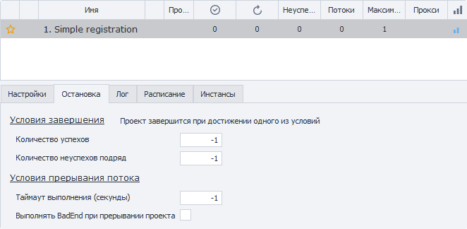

:::info **Please read the [*Material Usage Rules on this site*](../../../Disclaimer).**
:::

> 🔗 **[Original page](https://zennolab.atlassian.net/wiki/spaces/RU/pages/852885665)** — Source of this material

_______________________________________________  

## Description

This tab contains settings for the conditions under which the project will stop running.

  

## Number of Successes

The project will stop after the specified number of successful runs set in this option.

Default: `-1` (minus one; infinite) — do not count successes.

## Number of Consecutive Failures

The project will stop after it ends with an error the number of times in a row as specified in this option.

The consecutive failures counter resets after the template succeeds at least once.
By default, the “Consecutive Failures” column is disabled in the projects table, but you can enable it. How to do so is described in the article [❗→ Projects Table](https://zennolab.atlassian.net/wiki/spaces/RU/pages/853737528#%D0%9A%D0%B0%D0%BA-%D0%B2%D0%BA%D0%BB%D1%8E%D1%87%D0%B8%D1%82%D1%8C%3F "https://zennolab.atlassian.net/wiki/spaces/RU/pages/853737528#%D0%9A%D0%B0%D0%BA-%D0%B2%D0%BA%D0%BB%D1%8E%D1%87%D0%B8%D1%82%D1%8C%3F").

Default: `-1` (minus one; infinite) — do not count consecutive failures.

## Execution Timeout (seconds)

The time allocated for a single project run. If the project doesn't finish within this time, it will be interrupted, regardless of which step the template is on.

Example

Suppose you have a template and know it usually runs for around 6–8 minutes.
You might set “Execution Timeout” to 600 seconds (10 minutes, with a bit of margin). If the template were to freeze for any reason during execution, it would be interrupted 600 seconds after it started.

## Run BadEnd When Project Is Interrupted

If this option is enabled and you interrupt the project using the [❗→ appropriate button](https://zennolab.atlassian.net/wiki/spaces/RU/pages/852885672#%D0%9F%D1%80%D0%B5%D1%80%D0%B2%D0%B0%D1%82%D1%8C "https://zennolab.atlassian.net/wiki/spaces/RU/pages/852885672#%D0%9F%D1%80%D0%B5%D1%80%D0%B2%D0%B0%D1%82%D1%8C"), or if the “Execution Timeout” is reached (as described above), project execution will jump to [❗→ BadEnd](https://zennolab.atlassian.net/wiki/spaces/RU/pages/534020265 "https://zennolab.atlassian.net/wiki/spaces/RU/pages/534020265").

## Useful links

- [❗→ Projects Table](https://zennolab.atlassian.net/wiki/spaces/RU/pages/853737528 "https://zennolab.atlassian.net/wiki/spaces/RU/pages/853737528")