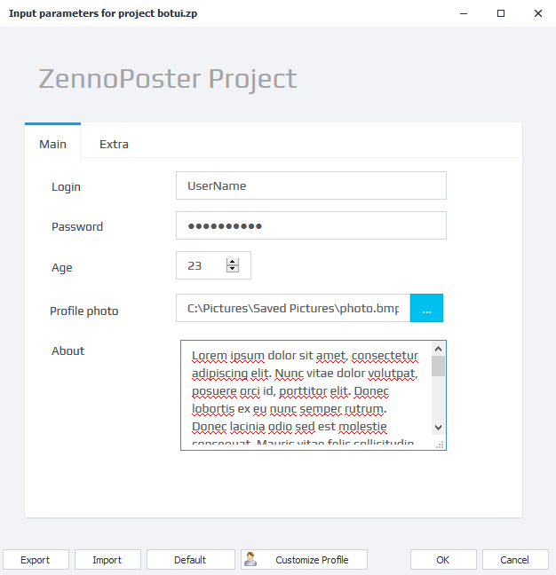
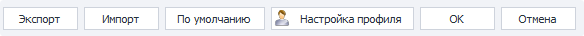
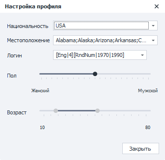

---
sidebar_position: 4
title: "ZennoPoster Input Settings"
description: ""
date: "2025-09-10"
converted: true
originalFile: "Входные настройки ZennoPoster.txt"
targetUrl: "https://zennolab.atlassian.net/wiki/spaces/RU/pages/1846051204/ZennoPoster"
---
import DisclaimerNotice from '@site/src/components/DisclaimerNotice';

<DisclaimerNotice />

> 🔗 **[Original page](https://zennolab.atlassian.net/wiki/spaces/RU/pages/1846051204/ZennoPoster)** — Source of this material

_______________________________________________  

## Description

Input settings are used to pass data into your template.
This can include file paths, a line of text, multi-line text, numbers, captcha or SMS service credentials, dropdowns, and more.

ZennoPoster has two types of input settings — classic and bot interface (BotUI).

:::note Note
If you are a template developer, you can learn more about data types and creating input settings in the articles Input Settings for the Project (Classic Settings) and Bot Interface (BotUI).
:::

Settings examples

Classic settings

Bot interface (BotUI)

  

## Control Buttons

### Export

Allows you to save the current settings values to a file.

You can also load saved settings using [❗→ bat files](https://zennolab.atlassian.net/wiki/spaces/RU/pages/1940979747/bat "https://zennolab.atlassian.net/wiki/spaces/RU/pages/1940979747/bat").

### Import

With this function, you can load settings from a file (first, you need to save them using the “Export” button).

### Default

Resets all settings to their default values (those set by the template developer).

### Profile Settings

Clicking this button opens the profile generation settings window, where you can change the nationality, gender, age, and login generation formula.
You can read more about these options in the article [❗→ "Profile" section "User Tab"](https://zennolab.atlassian.net/wiki/spaces/RU/pages/483426308#%D0%92%D0%BA%D0%BB%D0%B0%D0%B4%D0%BA%D0%B0-%D0%BF%D0%BE%D0%BB%D1%8C%D0%B7%D0%BE%D0%B2%D0%B0%D1%82%D0%B5%D0%BB%D1%8C "https://zennolab.atlassian.net/wiki/spaces/RU/pages/483426308#%D0%92%D0%BA%D0%BB%D0%B0%D0%B4%D0%BA%D0%B0-%D0%BF%D0%BE%D0%BB%D1%8C%D0%B7%D0%BE%D0%B2%D0%B0%D1%82%D0%B5%D0%BB%D1%8C")

### OK

Save and apply all the changes you’ve made.

### Cancel

Don’t save your changes.

  

## Important Note

Input settings are read only once at the start of a thread!

If you change the settings during the execution of a thread, it won’t affect the current thread until a new run starts.

Let’s look at an example: suppose your project’s input settings let you specify the full name and date of birth. The user fills in this data and starts the template. The template launches and begins its work.
Let’s say the user made a mistake and entered the wrong information. They reopen the settings for the running template and enter new data. Any threads that started before the settings were changed will continue working with the old values. The new values will only be picked up by the project for threads started after the changes.

  

## Useful Links

- [❗→ Project input settings](https://zennolab.atlassian.net/wiki/spaces/RU/pages/534020594 "https://zennolab.atlassian.net/wiki/spaces/RU/pages/534020594")
- [❗→ Bot interface](https://zennolab.atlassian.net/wiki/spaces/RU/pages/725352539 "https://zennolab.atlassian.net/wiki/spaces/RU/pages/725352539")