---
sidebar_position: 1
title: "Selling Bot Projects"
description: ""
date: "2025-09-15"
converted: true
originalFile: "Продажа проектов ботов.txt"
targetUrl: "https://zennolab.atlassian.net/wiki/spaces/RU/pages/494895200"
---
import DisclaimerNotice from '@site/src/components/DisclaimerNotice';

<DisclaimerNotice />

> 🔗 **[Original page](https://zennolab.atlassian.net/wiki/spaces/RU/pages/494895200)** — Source of this material

_______________________________________________  

## Adding a Bot for Sale

- Go to your Personal Account, open the **Bots** section, and go to the **My Projects** tab:

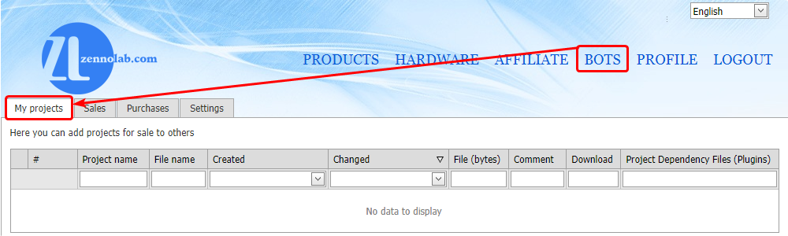

- Enter the project name (this is how the project will be displayed in the sales panel and in ZennoBox for the buyer)
- Select the project file on your computer

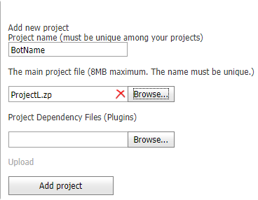

### Uploading Plugins

If the project you are adding contains [❗→ Plugins](https://zennolab.atlassian.net/wiki/spaces/RU/pages/475365697 "https://zennolab.atlassian.net/wiki/spaces/RU/pages/475365697"), they need to be uploaded separately. 
To do this:

- Select the plugins you need to upload.

 - You can select several plugins at once, or add them one by one.
To see the list of added plugins, simply hover your cursor over the input field:

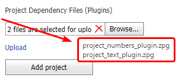

 - To remove added plugins, click the cross on the right side of the input field.

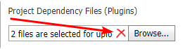

- Click the **Upload** button

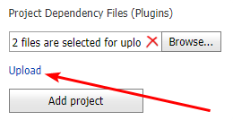

 - After a successful upload, a list with the names of the added plugins will appear:

:::warning Attention
Plugins must not be encrypted, as re-encrypting them is impossible. In other words, you cannot resell a plugin you bought yourself.
:::

### Uploading the Bot to the System

After you select the project file (and plugins, if needed), click the **Add Project** button.

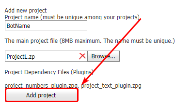

If everything goes well, your bot will appear in the list:

  

## Selling a Bot

Go to the **Sales** tab, to the **Sell Projects** section:

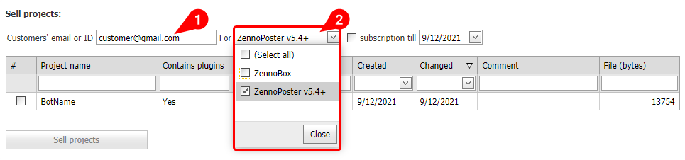

### Recipient

You need to enter the buyer's email or ZennoLab ID

### Platform

Choose the platform the project will be sold for: **ZennoBox**, **ZennoPoster**, or **ZennoBox and** **ZennoPoster**

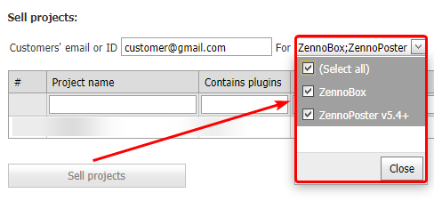

### Subscription

When this setting is enabled, your template will work for the user until the specified date; after that, the user will not be able to run the project.
You can always extend a previously sold project's subscription free of charge (how to do this is described below in the FAQ section).

:::warning Attention
The date is NOT inclusive. In other words, if you set the subscription until 03.03, then on March 3rd the template will stop working, and the following message will appear in the log: Subscription expired. Subscription valid until: &lt;date\_here&gt;.
:::

### Selecting Project(s) and Selling

Next, from the list of uploaded projects, select the ones you'd like to sell now and click **Sell Projects**.

:::note Note
When you select projects, the Sell Projects button will automatically display the total commission amount that will be deducted from your balance.
:::

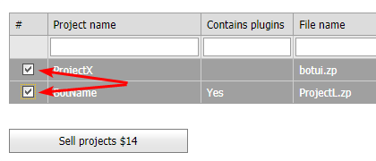

If everything is successful, a new entry will appear in the **Your Sales** table (at the top of the **Sales** tab):

That's it! Your bot has been sold.

  

## Updating a Bot

Updating a bot is done in the **My Projects** tab.

- Click the pencil next to the bot you want to update.

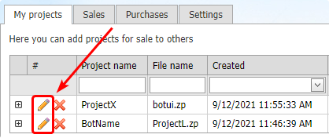

- Select the project file (1) and click the **Upload** button (2)
- If the project uses plugins (3), select the plugins and also click **Upload** (4)
- If everything was done correctly, the name of the uploaded file(s) will be shown instead of the input and **Upload** button

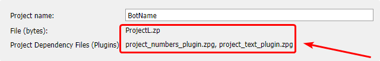

- Once the updated files are uploaded to the system, click the green checkmark button (5)

After you update the bot, your clients will see the following in ZennoPoster or ZennoBox:

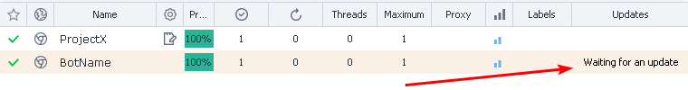

This means the update will be delivered to them within 5-10 minutes, and the bot will be ready to use again.

Done! Your bot has been updated.

  

## FAQ

### How do I cancel a project sale?

Expand answer

**ATTENTION!** If the refund is initiated within 30 days from the sale of the project, the commission you paid during the sale will be returned to your balance.

If more than 30 days have passed since the sale, the commission will not be returned!

After you cancel the sale, the projects will stop working for the buyer!

You can do this in the *Bots section, *Sales tab, in the *Sales Management section, the very first item - *Make a refund… The sale number can be found in the **Your Sales** table:

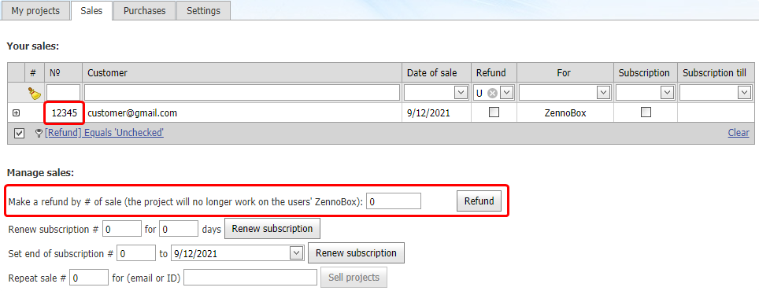

### How do I extend a subscription?

Expand answer

You can extend a previously issued subscription on the same tab where you sell bots, just in the **Sales Management** section.

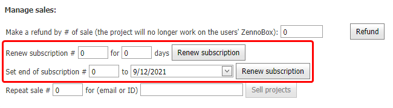

You can extend it for a certain number of days or until a specific date. 
The sale number can be found in the **Your Sales** table, in the **№** column:

### How is the commission calculated when selling projects?

Expand answer

**When selling a single project**

The commission is $10 for each sale of one project. 

**When selling multiple projects at once**

If you sell several projects at once to the same person, each additional project after the first adds $2 to the total commission (for example, selling 5 projects at once incurs an $18 commission = $10 + $2 + $2 + $2 + $2).

**When selling a project with plugins**

If a project contains [❗→ Plugins](https://zennolab.atlassian.net/wiki/spaces/RU/pages/475365697 "https://zennolab.atlassian.net/wiki/spaces/RU/pages/475365697"), the commission is $12, regardless of how many plugins are included.
If you sell several plugin-containing projects at once to one person, the commission is calculated the same way as selling multiple projects without plugins: the first is $12, the rest are $2 each.

### Where can I find my purchased projects?

Expand answer

You can find the project download directory in the ZennoPoster settings (not ProjectMaker): the *Other* tab => [❗→ *Configuring the project download directory](https://zennolab.atlassian.net/wiki/spaces/RU/pages/808779861/ZennoPoster#%D0%9D%D0%B0%D1%81%D1%82%D1%80%D0%BE%D0%B9%D0%BA%D0%B0-%D0%B4%D0%B8%D1%80%D0%B5%D0%BA%D1%82%D0%BE%D1%80%D0%B8%D0%B8-%D0%B7%D0%B0%D0%B3%D1%80%D1%83%D0%B7%D0%BA%D0%B8-%D0%BF%D1%80%D0%BE%D0%B5%D0%BA%D1%82%D0%BE%D0%B2 "https://zennolab.atlassian.net/wiki/spaces/RU/pages/808779861/ZennoPoster#%D0%9D%D0%B0%D1%81%D1%82%D1%80%D0%BE%D0%B9%D0%BA%D0%B0-%D0%B4%D0%B8%D1%80%D0%B5%D0%BA%D1%82%D0%BE%D1%80%D0%B8%D0%B8-%D0%B7%D0%B0%D0%B3%D1%80%D1%83%D0%B7%D0%BA%D0%B8-%D0%BF%D1%80%D0%BE%D0%B5%D0%BA%D1%82%D0%BE%D0%B2").

### How do I sell a project correctly if it uses nested projects?

Expand answer

If your template connects to other templates using the [❗→ Project in Project](https://zennolab.atlassian.net/wiki/spaces/RU/pages/489291822 "https://zennolab.atlassian.net/wiki/spaces/RU/pages/489291822") feature, you should place the nested projects in the same directory as the main project or within its subdirectories. Set the path using the `{ -Project.Directory- }` macro.

### How do I provide auxiliary files (lists, tables, etc.)?

Expand answer

You can't transmit such files via your Personal Account. You'll have to send them to the buyer directly. And in the [❗→ input settings](https://zennolab.atlassian.net/wiki/spaces/RU/pages/534020594 "https://zennolab.atlassian.net/wiki/spaces/RU/pages/534020594"), set up for these files to be selected.

