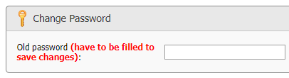

---
sidebar_position: 2
title: "ZennoBox"
description: ""
date: "2025-09-15"
converted: true
originalFile: "ZennoBox.txt"
targetUrl: "https://zennolab.atlassian.net/wiki/spaces/RU/pages/495386651/ZennoBox"
---
import DisclaimerNotice from '@site/src/components/DisclaimerNotice';

<DisclaimerNotice />

> 🔗 **[Original page](https://zennolab.atlassian.net/wiki/spaces/RU/pages/495386651/ZennoBox)** — Source of this material

_______________________________________________  

## Description

ZennoBox is a feature program that lets you sell your projects to people who don't have ZennoPoster. 
Basically, it's ZennoPoster tied to specific projects that your users purchase from you and/or other sellers. This solution is helpful if you want to [❗→ sell your projects](https://zennolab.atlassian.net/wiki/spaces/RU/pages/494895200 "https://zennolab.atlassian.net/wiki/spaces/RU/pages/494895200") to people who aren't familiar with the ZP world.

## How it works for the buyer

Someone buys a project from you; in the admin panel, you [❗→ assign the project](https://zennolab.atlassian.net/wiki/spaces/RU/pages/494895200 "https://zennolab.atlassian.net/wiki/spaces/RU/pages/494895200") to their name and pay a small commission. This person downloads ZennoBox (for free), and after installing, your project that you sold them will already be loaded.

## How to create your own project for sale

To sell projects, the Lite version is enough. The maximum number of threads your project can run on in ZennoBox matches the maximum number of threads in your ZennoPoster version (limit: the maximum number of threads for ZennoBox across all projects is 20).

1. You need to add a static block [❗→ Input Settings](https://zennolab.atlassian.net/wiki/spaces/RU/pages/534020594 "https://zennolab.atlassian.net/wiki/spaces/RU/pages/534020594") to your project and set parameters that buyers of your project will be able to change.
2. You need to send your buyer a [registration link](https://userarea.zennolab.com/ru/Registration.aspx "https://userarea.zennolab.com/ru/Registration.aspx") in our system if they aren't registered yet.
3. Go to your account in the admin panel on the **Bots** tab, and [❗→ sell your projects to them](https://zennolab.atlassian.net/wiki/spaces/RU/pages/494895200 "https://zennolab.atlassian.net/wiki/spaces/RU/pages/494895200") using the email address that your buyer used to register.
4. After that, your buyer will be able to download ZennoBox, where the projects you've sold them will automatically show up.

:::note Note
You can find detailed instructions on selling bots in the Selling Bots article.
:::

## Saving

If you sell several projects to one person at the same time, the commission for the second and additional projects is greatly reduced.

## Commission

A commission is charged in order to:

- prevent large projects from being distributed for free to the public;
- compensate us for allowing people to use ZennoPoster without buying it;
- pay for maintenance of ProxyChecker servers and bot copy protection systems.

### When selling a single project

The commission is $10 for each sale of a single project. 

### When selling multiple projects at once

If you sell several projects to the same person at once, each additional project after the first will add $2 to the total commission (for example: if you sell 5 projects at once, the commission will be $18 = $10 + $2 + $2 + $2 + $2).

### When selling a project with plugins

If a project contains [❗→ Plugins](https://zennolab.atlassian.net/wiki/spaces/RU/pages/475365697 "https://zennolab.atlassian.net/wiki/spaces/RU/pages/475365697"), the commission for it will be $12, regardless of how many plugins are included.

## Convenience

No matter how many bots a buyer purchases from you and/or others, all of them will simply appear in their program, ready to run. There's no need to download anything else.

## Updates

When you update your project in the admin panel, your user will get the update automatically.

If you want to sell an update, you'll need to create a new project and sell it separately.

## Refund

Within 30 days, you can refund the commission you paid when assigning the template back to your personal account balance. The buyer, in turn, will lose access to that template.

:::note Note
Instructions on how to make a refund can be found in the Selling Projects article.
:::

## Limitations

### Threads

The maximum number of ZennoBox threads depends on your program version:

- Lite - 1 thread
- Standard - 5
- Pro - 20

### Running with ZennoPoster at the same time

You cannot run ZennoPoster and ZennoBox simultaneously on the same computer (even under different user accounts)! They will conflict with each other!

## Hide seller's email

:::warning Attention
Be careful, as previously assigned projects may stop working: they'll be moved to a new directory, and if your project(s) have accompanying files, you'll need to move them manually.
:::

When you sell a template, a directory is created for the buyer at `C:\Documents\ZennoLab\ZennoBox\PurchasedProducts` and by default, the seller's email is used as the folder name. If for any reason you don't want your email to be visible, you can change this behavior in [your Personal Account, under the *Profile* tab](https://userarea.zennolab.com/lk/userarea/Profile.aspx "https://userarea.zennolab.com/lk/userarea/Profile.aspx"). 

To do this, check the option “Hide the seller's template email”:

Once this option is enabled, your zennolab id will be used instead of your email, and will look like this: 45d82355-ft57-98ac-aaaa-9cb010d87qcf9@zennolab.com

To save your changes, enter your password in the appropriate field and click the “Save” button.

  

## Useful links

- [❗→ Selling bots](https://zennolab.atlassian.net/wiki/spaces/RU/pages/494895200 "https://zennolab.atlassian.net/wiki/spaces/RU/pages/494895200")
- [❗→ Plugins](https://zennolab.atlassian.net/wiki/spaces/RU/pages/475365697 "https://zennolab.atlassian.net/wiki/spaces/RU/pages/475365697")
- [❗→ Project in project (Nested projects)](https://zennolab.atlassian.net/wiki/spaces/RU/pages/489291822 "https://zennolab.atlassian.net/wiki/spaces/RU/pages/489291822")