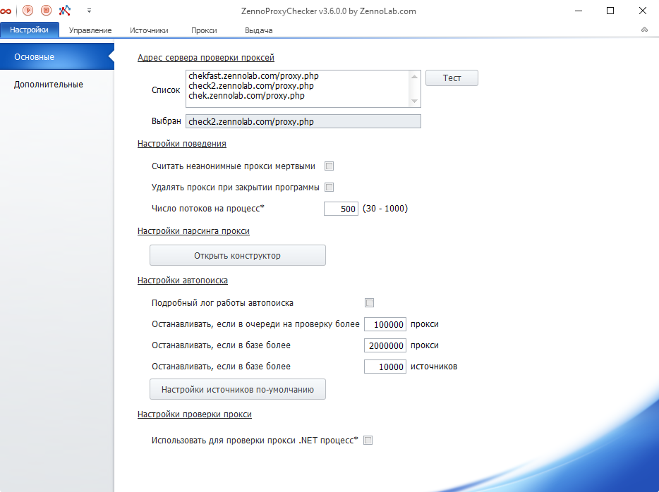
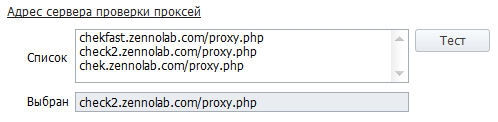
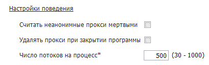
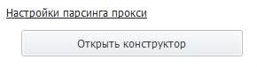
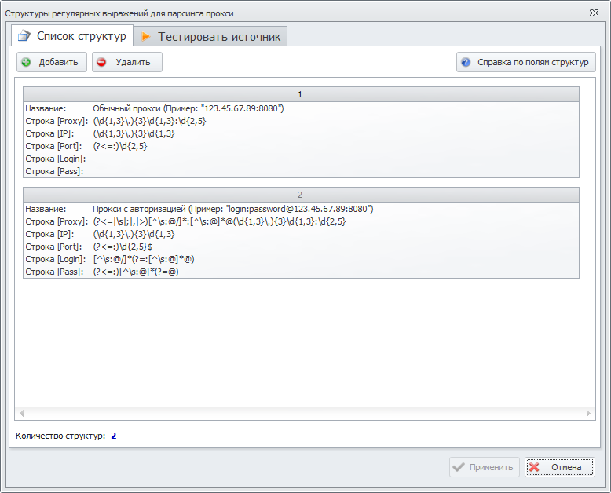
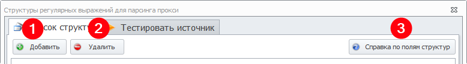
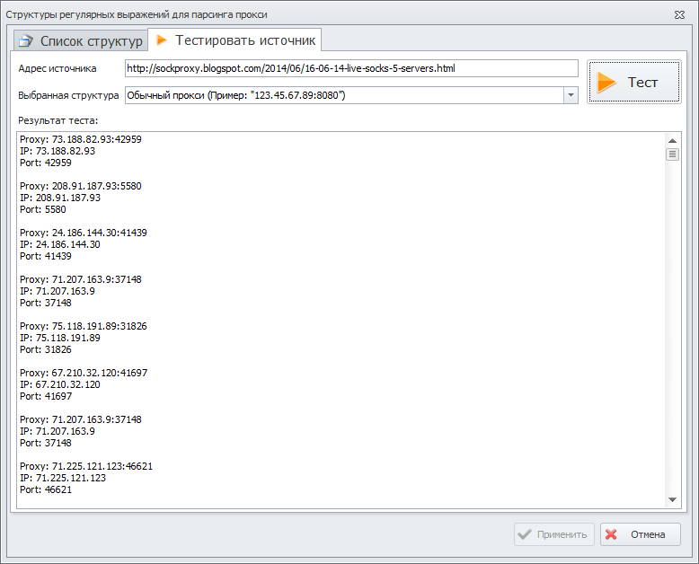
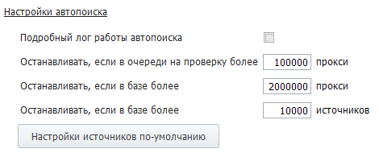
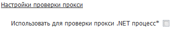

---
sidebar_position: 2
title: "ProxyChecker Settings"
description: ""
date: "2025-09-10"
converted: true
originalFile: "Настройки ProxyChecker.txt"
targetUrl: "https://zennolab.atlassian.net/wiki/spaces/RU/pages/848560318/ProxyChecker"
---
:::info **Please read the [*Terms of Use for materials on this resource*](../Disclaimer).**
:::

> 🔗 **[Original page](https://zennolab.atlassian.net/wiki/spaces/RU/pages/848560318/ProxyChecker)** — Source of this material

_______________________________________________  
# ProxyChecker Settings

:::info Information
This article is copied from the ZennoProxyChecker help section, since the settings are identical in both programs. Original - [❗→ Main settings](https://zennolab.atlassian.net/wiki/spaces/RU/pages/534020624). You may come across screenshots, internal help links, and other things related to ZennoProxyChecker in this article.
:::

Table of Contents

  

## Proxy Check Server Address

Select a proxy check server from the list of addresses.

### List

The URL addresses the program uses to check proxies. 
By default, three addresses are listed here, but you can add your own.

### Test Button

When you click it, the program will sequentially check the addresses from the **List** above for availability.
The test will end when the first working check server is found. Or when all addresses in the list have been tried.

### Selected

Here you will see the address that will be used to check if all proxies are alive or not.
The first working address from the **List** appears here.

  

## Behavior Settings

### Consider Non-anonymous Proxies Dead

The program will filter out non-anonymous proxies and only show anonymous ones.

### Remove Proxies on Program Exit

Clears the proxy list when the program is closed.

### Number of Threads per Process

Sets the number of threads used for checking.

:::warning Attention
You need to restart the program for changes to take effect.
:::

  

## Proxy Parsing Settings

Here you can add new and edit existing proxy parsing structures (a structure is essentially regular expressions).
To open the *parsing structure builder*, click the **Open builder** button.

### Proxy Parsing Structure Builder

#### "Structure List" Tab

By default, there are already 2 regular expressions added here.
You can also use your own regular expressions by clicking the **Add (1)** or **Delete (2)** button. 

Some websites may have their own proxy markup, so if necessary, you can create your own parsing structure for almost any format and test it on a specific source using the tester. By clicking the **Structure fields reference (3)** button, you can get a description of the available fields.

#### "Test Source" Tab

**Source address** - here you should specify the website address from which proxies will be parsed.

**Selected structure** - select the parsing rule you added earlier from the *Structure List* tab.

Then, click the **Test** button to start testing.

In the *Test result* window, you will see the proxies found according to the parsing rule.

:::warning Attention
After closing the Builder window or clicking cancel, parsing results will not be saved.
:::

  

## Auto Search Settings

### Detailed Autosearch Log

If you check this box, you'll see a detailed report of **ZennoProxyChecker**'s work in autosearch mode.

### Stop if More Than XXX Proxies Waiting for Check

If the number of proxies in the check queue exceeds this value, autosearch will stop.

### Stop if More Than XXX Proxies in the Database

If the number of proxies in the database exceeds this value, autosearch will stop.

### Stop if More Than XXX Sources in the Database

If the number of sources in the database exceeds this value, autosearch will stop.

### Default Source Settings

These settings will apply to all newly added sources. You can read more about these features and settings in the article [❗→ Source Settings](https://zennolab.atlassian.net/wiki/spaces/RU/pages/1892876309 "https://zennolab.atlassian.net/wiki/spaces/RU/pages/1892876309") 

  

## Proxy Check Settings

### Use .NET Process for Proxy Checking

If checked, proxies will be checked using the .NET implementation CheckingProcessor (restart required).

  

## Useful Links

- [❗→ Working with Proxies](https://zennolab.atlassian.net/wiki/spaces/RU/pages/534086266 "https://zennolab.atlassian.net/wiki/spaces/RU/pages/534086266")
- [❗→ Source Settings](https://zennolab.atlassian.net/wiki/spaces/RU/pages/1892876309 "https://zennolab.atlassian.net/wiki/spaces/RU/pages/1892876309")