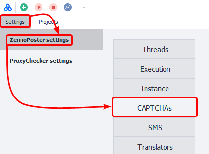
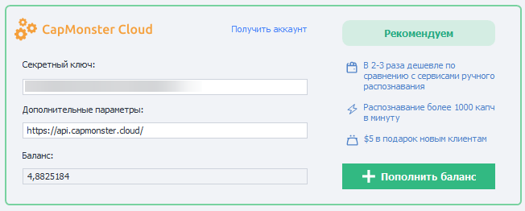
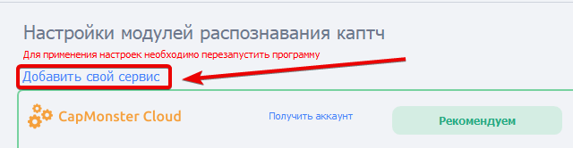
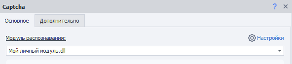

---
sidebar_position: 4
title: "Captchas"
description: ""
date: "2025-09-10"
converted: true
originalFile: "Капчи.txt"
targetUrl: "https://zennolab.atlassian.net/wiki/spaces/RU/pages/808845385"
---
:::info **Please read the [*Material Usage Rules on this site*](../Disclaimer).**
:::

> 🔗 **[Original page](https://zennolab.atlassian.net/wiki/spaces/RU/pages/808845385)** — Source of this material

_______________________________________________  

## Description

A **captcha** is an automatically generated test to determine if the user is a person or a computer. It often looks like a distorted set of letters and/or numbers. These can be written in different color combinations, with noise, distortion, overlaid lines, or random shapes.

The image below shows some examples of captchas:


There are also versions where you're asked not just to enter characters from an image, but to do something else—find buses, palm trees, cars, and other objects; solve a puzzle; arrange objects in a certain order, or sort them.

Examples of such captchas include Recaptcha, Funcaptcha, hCaptcha, and others.

  

## What is this used for?

These services are designed so that you don’t have to enter captchas by hand.

ZennoPoster lets you solve captchas on your own (for simple text-based captchas, at least). To do this, in the [❗→ captcha recognition action](https://zennolab.atlassian.net/wiki/spaces/RU/pages/534053026 "https://zennolab.atlassian.net/wiki/spaces/RU/pages/534053026"), just select the MonkeyEnter.dll module. But this can become tedious if you’re dealing with hundreds or even thousands of captchas! And what if your project runs 24/7 and a captcha might pop up at any time? That’s when these services really come in handy.

  

## How do you open this window?

### ProjectMaker

- Go to the top menu **Edit =&gt; Settings =&gt; Captchas**.


- Or via the [❗→ Start page](https://zennolab.atlassian.net/wiki/spaces/RU/pages/735608964 "https://zennolab.atlassian.net/wiki/spaces/RU/pages/735608964")


### ZennoPoster

**Settings =&gt; ZennoPoster Settings =&gt; Captchas**




### What the settings window looks like


  

## How do I connect?

### Secret key

Most often, to use a service you’ll need an API key—a unique string of random characters that lets the service identify you. Here’s an example: ```8fc9b30e544885b8480fb590dfcbdd71```

To get an API key, go to the website of the service you want. Have a look at the pricing and terms. If you decide to use it, just register and grab your API key from your captcha service’s dashboard.

### Login and password

Some services, instead of an API key, use your login and password from registration to identify you.

### Additional parameters

The URL for API requests. This is set by default. If it’s not set, check with the developers of the service you chose.

:::warning Attention
Don’t change this field unless you have a reason!
:::

### Balance

Once you enter your API key or login/password pair, your current balance on the service will appear here.




This field may also show errors (not for all services). For example: IP\_BANNED, ERROR\_WRONG\_USER\_KEY, and so on.


:::warning Attention
If, after you enter your API key, this field stays empty, it means an error occurred. Possible reasons: wrong key (or login/password), service issues, or your key was banned.
:::

### Available services

- [CapMonster Cloud](https://capmonster.cloud/ "https://capmonster.cloud/") - Recommended 
- [2captcha.com](https://2captcha.com/ "https://2captcha.com/")
- [Anti-Captcha.com](https://anti-captcha.com/ "https://anti-captcha.com/")
- [BypassCaptcha.com](http://bypasscaptcha.com/ "http://bypasscaptcha.com/")
- [CaptchaBot.com](http://captchabot.com/ "http://captchabot.com/") - No longer works
- [CheapCaptcha.com](https://cheapcaptcha.com/ "https://cheapcaptcha.com/")
- [DeathByCaptcha.com](https://deathbycaptcha.com/ "https://deathbycaptcha.com/")
- [DeCaptcher.com](http://decaptcher.com/ "http://decaptcher.com/")
- [ImageDecoders.com](http://imagedecoders.com/ "http://imagedecoders.com/")
- [Imagetyperz.com](http://imagetyperz.com/ "http://imagetyperz.com/")
- [Jsdati.com](https://www.jsdati.com/ "https://www.jsdati.com/")
- http://RIPCaptcha.com - No longer works
- [RuCaptcha.com](https://rucaptcha.com/ "https://rucaptcha.com/")
- http://Ruokuai.com - No longer works
- http://Uuwise.com - No longer works
- [CapMonster2](https://zennolab.com/ru/products/capmonster/ "https://zennolab.com/ru/products/capmonster/")

  

## Adding a new module

:::info Information
Added in 7.3.0.0
:::

:::warning Attention
For simple text captchas only.
:::

Starting from ZennoPoster 7.3.0.0, you can add your own captcha recognition service based on the APIs of popular services.

To do this, go to the **Settings** page and select **Add your service**.




A window will pop up for you to enter details about the new service:


### Module name

Enter the name of your module here.

:::warning Attention
Maximum 20 characters.
:::

### API

Choose the API your module will be based on.

### API-key

The API key from the service.

This is the same as the **Secret key** field for default services (see above).

### Server

The URL to which requests will be sent.

:::note Tip
If you’re not sure what to enter in a certain field, check with your service provider.
:::

### Sending captchas to your module

After you add the module, you can select it in the [❗→ Recognize captcha action](https://zennolab.atlassian.net/wiki/spaces/RU/pages/534053026 "https://zennolab.atlassian.net/wiki/spaces/RU/pages/534053026").




### Deleting a module

To remove a created module from the program, delete these two files:

- `c:\Users\USERNAME\AppData\Roaming\ZennoLab\Configs\ИмяМодуля.dll.config`
- `c:\Users\USERNAME\AppData\Roaming\ZennoLab\CustomModules\Captcha\ИмяМодуля.dll`

`USERNAME`—replace this with your OS user name

:::warning Attention
It’s best to close ZennoPoster and ProjectMaker when deleting these files.
:::

## Useful links

- [❗→ Recognize captcha](https://zennolab.atlassian.net/wiki/spaces/RU/pages/534053026 "https://zennolab.atlassian.net/wiki/spaces/RU/pages/534053026")
- [❗→ Recognize Recaptcha](https://zennolab.atlassian.net/wiki/spaces/RU/pages/534053033/ReCaptcha "https://zennolab.atlassian.net/wiki/spaces/RU/pages/534053033/ReCaptcha")
- [Page for testing different types of captchas](https://lessons.zennolab.com/captchas/ "https://lessons.zennolab.com/captchas/")