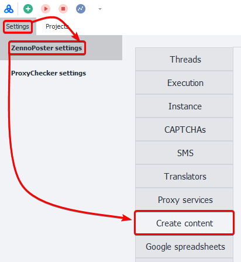
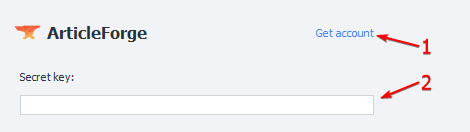

:::info **Please read the [*Material Usage Rules on this site*](../../../Disclaimer).**
:::

> 🔗 **[Original page](https://zennolab.atlassian.net/wiki/spaces/RU/pages/808812655)** — Source of this material

_______________________________________________  

## Description

These allow you to generate content based on a given text using third-party services. AI-based technologies are capable of creating text that's comparable to what a human could write.

:::info Information
These services process only English-language text.
:::

  

## How do I open this window?

### ProjectMaker

- From the top menu: **Edit=&gt;Settings=&gt;Content Creation**.

- Via the [❗→ Start page](https://zennolab.atlassian.net/wiki/spaces/RU/pages/735608964 "https://zennolab.atlassian.net/wiki/spaces/RU/pages/735608964")

### ZennoPoster

**Settings=&gt;ZennoPoster Settings=&gt;Content Creation**

### Settings Window Appearance

  

## What is this used for?

- Text rewriting
- Creating unique content

## How do I set up the services?

### Setting up ArticleForge

1. Create an account if needed.
2. Enter your key to identify yourself with the service.

:::info Information
You can get the secret key in your personal account
:::

  

### Setting up WordAi

1. Go to the service registration page.
2. Enter the login and password for your account.

  

## How do I use content creation in a template?

For more details on how to use these services in your templates, see the article [❗→ Content Creation](https://zennolab.atlassian.net/wiki/spaces/RU/pages/489095179 "https://zennolab.atlassian.net/wiki/spaces/RU/pages/489095179") 

  

## Useful links

1. [❗→ Content Creation](https://zennolab.atlassian.net/wiki/spaces/RU/pages/489095179 "https://zennolab.atlassian.net/wiki/spaces/RU/pages/489095179")
2. [❗→ Start page](https://zennolab.atlassian.net/wiki/spaces/RU/pages/735608964 "https://zennolab.atlassian.net/wiki/spaces/RU/pages/735608964")