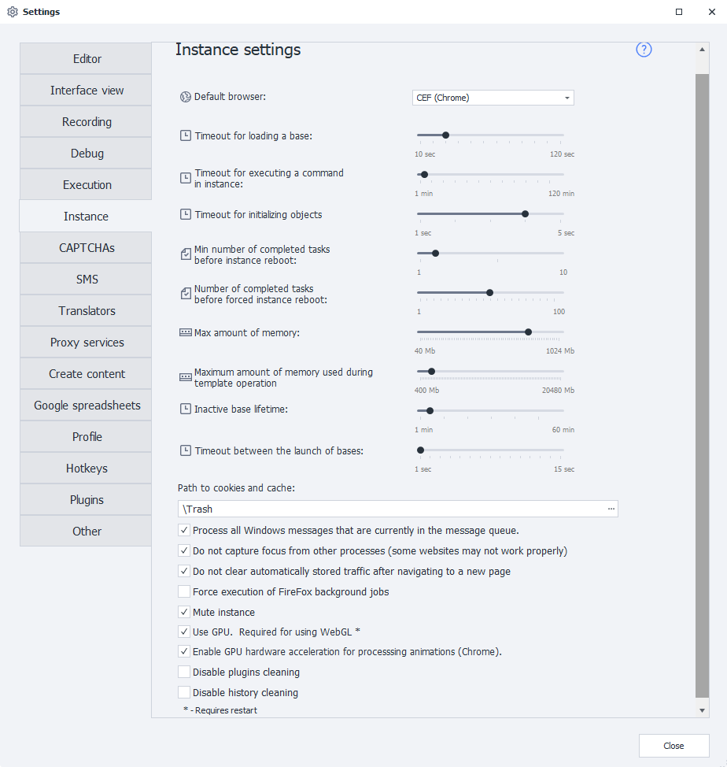

---
sidebar_position: 3
title: "Instance Settings"
description: ""
date: "2025-09-10"
converted: true
originalFile: "Настройки инстанса.txt"
targetUrl: "https://zennolab.atlassian.net/wiki/spaces/RU/pages/808845378"
---
import DisclaimerNotice from '@site/src/components/DisclaimerNotice';

<DisclaimerNotice />

> 🔗 **[Original page](https://zennolab.atlassian.net/wiki/spaces/RU/pages/808845378)** — Source of this material

_______________________________________________  




### Default browser

Select which browser will be launched by default. You can also change the browser at the template level in the [❗→ project settings](https://zennolab.atlassian.net/wiki/spaces/RU/pages/534315477#%D0%A2%D0%B8%D0%BF-%D0%B1%D1%80%D0%B0%D1%83%D0%B7%D0%B5%D1%80%D0%B0 "https://zennolab.atlassian.net/wiki/spaces/RU/pages/534315477#%D0%A2%D0%B8%D0%BF-%D0%B1%D1%80%D0%B0%D1%83%D0%B7%D0%B5%D1%80%D0%B0"), or through the “[❗→ Launch instance](https://zennolab.atlassian.net/wiki/spaces/RU/pages/489324572 "https://zennolab.atlassian.net/wiki/spaces/RU/pages/489324572")” action.

:::warning Attention
This setting is only available in ProjectMaker.
:::

### Database loading timeout

The time allotted for starting a new thread within a running process.

### Command execution timeout in the instance

The time to wait for any command to be executed in the instance (any [❗→ action](https://zennolab.atlassian.net/wiki/spaces/RU/pages/486342706/ProjectMaker "https://zennolab.atlassian.net/wiki/spaces/RU/pages/486342706/ProjectMaker")).

### Object initialization wait timeout

The time given for the web page to finish loading; sometimes needed for loading certain elements (like captchas). Sometimes, if the page hasn't fully loaded, you'll see a message saying “HTML element not found.” In that case, you can try increasing this parameter, but keep in mind that raising it will also increase the template's execution time.

### Minimum number of tasks before reload

The instance database won't be reloaded until this number of tasks has been completed.

### Number of completed tasks before forced reload

The number of tasks after which the instance database will definitely be reloaded (regardless of whether they were successful). You can also force an instance restart with the “[❗→ Reload instance](https://zennolab.atlassian.net/wiki/spaces/RU/pages/489324572#%D0%9F%D0%B5%D1%80%D0%B5%D0%B7%D0%B0%D0%B3%D1%80%D1%83%D0%B7%D0%B8%D1%82%D1%8C-%D0%B8%D0%BD%D1%81%D1%82%D0%B0%D0%BD%D1%81 "https://zennolab.atlassian.net/wiki/spaces/RU/pages/489324572#%D0%9F%D0%B5%D1%80%D0%B5%D0%B7%D0%B0%D0%B3%D1%80%D1%83%D0%B7%D0%B8%D1%82%D1%8C-%D0%B8%D0%BD%D1%81%D1%82%D0%B0%D0%BD%D1%81")” action inside your template.

### Maximum memory usage

The maximum amount of memory a single instance can use, after which the instance database will be forcibly marked for reload.

### Maximum memory usage during template execution

:::info Info
Added in 7.4.0.0
:::

Limit for the amount of RAM allocated for a single thread. If a thread goes over this value while working, it will be forcibly stopped with a message in the [❗→ log](https://zennolab.atlassian.net/wiki/spaces/RU/pages/725352532 "https://zennolab.atlassian.net/wiki/spaces/RU/pages/725352532"): “Project stopped due to exceeding memory usage limit”.

### Lifetime of inactive database

The duration an instance database remains in the inactive state.

### Timeout between launching databases

Delays between database launches. Helps prevent CPU spikes on weaker computers.

### Path to cookies and cache

The path for storing temporary files (it's best to keep them in the same folder as the program).

Files downloaded using ProjectMaker's browser will also be saved to this folder.

By default, this folder is in the program’s install directory. Its path might look like:
```
C:\Program Files\ZennoLab\RU\ZennoPoster Pro V7\7.4.0.0\Progs\Trash\
```

### Process all Windows messages currently in the queue

Allows the application to process all events that may occur while the instance is running.

### Do not steal focus from other processes

Allows you to avoid screen flickering and losing app focus when using ZennoPoster, but you should make sure your projects are not affected, as some sites require proper browser focus switching during work (for example, VK).

### Do not clear traffic automatically when navigating

Disables clearing the request log in the [❗→ traffic window](https://zennolab.atlassian.net/wiki/spaces/RU/pages/735805465 "https://zennolab.atlassian.net/wiki/spaces/RU/pages/735805465") every time you navigate to a page. You can also control this option at the template level via [❗→ C# code](https://zennolab.atlassian.net/wiki/spaces/RU/pages/492011596 "https://zennolab.atlassian.net/wiki/spaces/RU/pages/492011596"):

```csharp
instance.ClearTrafficWhenNavigate = false; // Disable clearing
instance.ClearTrafficWhenNavigate = true; // Enable clearing
```

### Force background operations in FireFox

Allows you to force the instance to keep working if it freezes. If you aren't experiencing random freezes when running templates on a site, it's better not to use this setting.

### Disable sound

Disables sound while working in the instance.

### Use GPU. Required for WEBGL to work

Rendering project actions will be faster thanks to GPU usage. 

### Use GPU hardware acceleration for animations (Chrome)

Allows/disables rasterization on the GPU.

:::warning Attention
Enabling this setting without an integrated GPU accelerator may lead to unstable operation.
:::

### Disable clearing plugins

Prevents plugins from being cleared in Firefox.

### Disable clearing history

Prevents history clearing in Firefox.