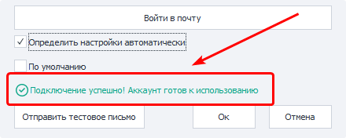
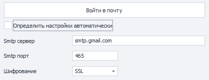

---
sidebar_position: 13
title: "Mail"
description: ""
date: "2025-09-10"
converted: true
originalFile: "Почта.txt"
targetUrl: "https://zennolab.atlassian.net/wiki/spaces/RU/pages/2084601865"
---
import DisclaimerNotice from '@site/src/components/DisclaimerNotice';

<DisclaimerNotice />

> 🔗 **[Original Page](https://zennolab.atlassian.net/wiki/spaces/RU/pages/2084601865)** — Source of this material

_______________________________________________  


## Description

In this section, you can set up connections to your email inboxes, which can later be used to send yourself notifications using the [❗→ Send Mail](https://zennolab.atlassian.net/wiki/spaces/RU/pages/1399914500 "https://zennolab.atlassian.net/wiki/spaces/RU/pages/1399914500") action.

  

## Add

When you click this button, a window will open to add a new connection.


### Service Name

This is the name that will be shown in the list of available services and in the [❗→ Send Mail](https://zennolab.atlassian.net/wiki/spaces/RU/pages/1399914500 "https://zennolab.atlassian.net/wiki/spaces/RU/pages/1399914500") action.

:::warning Attention
Service name is a required field and must be unique within the application.
:::

### Sender Name

This text will be displayed in the “Sender Name” field for the recipient.

### Email

The full email address from which messages will be sent.

### Password

The password for the email address.

Some email providers require a separate password to connect to your mailbox via third-party apps (an app-specific password).  
Instructions for some programs can be found in the article [❗→ at this link](https://zennolab.atlassian.net/wiki/spaces/RU/pages/2084569120 "https://zennolab.atlassian.net/wiki/spaces/RU/pages/2084569120"). 

### Log in to Mail

When you click the button, it checks if the SMTP server connection details are correct.  
The email-password pair is not checked here.

If your details are correct, you’ll see the message “**Successfully connected! Account is ready to use**” at the bottom of the window:



If the program is unable to connect to the server, a pop-up window with an error will appear:


In this case, you’ll need to set up the connection manually. To do this, uncheck the “Detect settings automatically” option (described below).

### Detect Settings Automatically



If this setting is enabled, the program will try to automatically determine the connection settings for the SMTP server based on the email address you entered.

If a connection error occurs, you can manually enter the login details by unchecking this box. You can find the connection settings on your email provider’s website.

### Default

When this option is enabled, the current connection will be used as the default. This means that in all “[❗→ Send Mail](https://zennolab.atlassian.net/wiki/spaces/RU/pages/1399914500 "https://zennolab.atlassian.net/wiki/spaces/RU/pages/1399914500")” blocks where nothing else is specified, this mail service will be used for sending.

### Do Not Verify Server Certificates

:::info Information
Added in ZennoPoster 7.7.0.0
:::

Sometimes, when trying to connect an account, you may get the error “**An error occurred while attempting to establish an SSL or TLS connection**.”

This usually happens when there is a connection between your computer and the mail server, but a secure connection cannot be established. This is often because, for some reason, the system can’t verify the authenticity of the server’s SSL/TLS certificates and denies the connection.

Possible causes include: 

- Windows hasn’t been updated for a long time, so the trusted certificate stores are outdated,
- Antivirus software checks all incoming traffic and has to swap the server’s certificates to decrypt it,
- firewall or security software.

The solution is straightforward—as the name suggests, update Windows, disable antivirus (especially pay attention to inbound traffic or mail scanning settings), or disable the firewall/security software.

If nothing helps, you can enable this setting. In that case, any certificates sent by the mail server when establishing the connection will not be checked, and a secure connection will be successfully established.

:::warning Attention
Please note that if you disable certificate verification, the traffic between you and your email provider could be intercepted!
:::

### Send Test Email

To check that your details work, click the “Send Test Email” button.  
Zennoposter will then try to send an email to your address using the specified SMTP server and credentials.

If all credentials are correct, you’ll see the status message “**Test email sent successfully**.” After that, the mail service will be ready for use in a [❗→ block](https://zennolab.atlassian.net/wiki/spaces/RU/pages/1399914500 "https://zennolab.atlassian.net/wiki/spaces/RU/pages/1399914500").  
If your credentials are incorrect, for example if the password is wrong, you’ll see the message “**Failed to send test email**” in the status line, and the modal window will provide a more detailed error description.

#### Note

Keep in mind that some email providers require you to explicitly enable access to mail for third-party apps. You can find the connection settings for some providers [❗→ on this page](https://zennolab.atlassian.net/wiki/spaces/RU/pages/2084569120 "https://zennolab.atlassian.net/wiki/spaces/RU/pages/2084569120").  
You can also search for settings using a query like 
```
smtp настройки подключения <YOUR_PROVIDER>
```
for example—`smtp настройки подключения aol`.

* * *

## Edit

This button allows you to edit already existing email accounts.

* * *

## Default

This setting lets you change the default account.

* * *

## Delete

Deletes the selected account from the program settings.

* * *

## Useful Links

- [❗→ Send Mail](https://zennolab.atlassian.net/wiki/spaces/RU/pages/1399914500 "https://zennolab.atlassian.net/wiki/spaces/RU/pages/1399914500")
- [❗→ Email service connection settings](https://zennolab.atlassian.net/wiki/spaces/RU/pages/2084569120 "https://zennolab.atlassian.net/wiki/spaces/RU/pages/2084569120")
- [❗→ Receive Mail](https://zennolab.atlassian.net/wiki/spaces/RU/pages/735576144 "https://zennolab.atlassian.net/wiki/spaces/RU/pages/735576144")