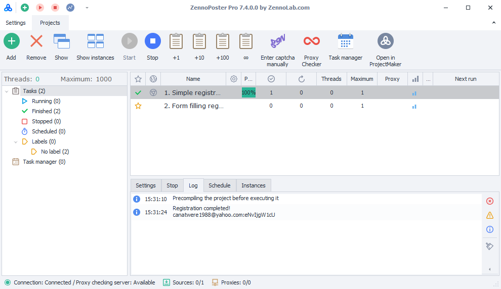

:::info **Please read the [*Material Usage Rules on this site*](../../../Disclaimer).**
:::

> 🔗 **[Original Page](https://zennolab.atlassian.net/wiki/spaces/RU/pages/808779861/ZennoPoster)** — Source of this material

_______________________________________________  


## General Settings

### Disable Program Error Reports (global)

Sometimes, due to internal browser issues, an instance may "crash." ZennoPoster detects this and restores the crashed instance. If there is an error message popup window when the instance crashes, there's a chance the instance won't be able to reload.

### Disable Project Settings Recovery Dialog

Disables the ability to recover settings in case of an unexpected program shutdown. We do not recommend disabling this option. It might be useful if this window is blocking ZennoPoster from starting automatically.

### Skip Scheduler Task for Running Tasks

If a project is already running when its scheduled task is triggered, the scheduler will only start the task after the current execution finishes.

### Minimize ZennoPoster to Tray

When the program window is minimized, it will be sent to the tray.

### Track Thread States

Enables tracking of thread states in the program. For diagnostics and statistics. Only enable this if you need this information for support.

### Compact Large Object Heap

Allows you to set how frequently the large object heap is compacted. This is useful when processing large amounts of string data, for example, when auto-search is enabled in ProxyChecker.

### Automatically Resume Active Tasks After Restart

Determines whether to resume tasks that were active before the program was closed.

## Theme Settings

:::note Note
This setting is only available in ZennoPoster! To learn how to customize the appearance in ProjectMaker, read this article — [❗→ Appearance](https://zennolab.atlassian.net/wiki/spaces/RU/pages/808779861/ZennoPoster)
:::

### Light




### Dark


## Project Download Directory Settings

:::note Note
This setting is only available in ZennoPoster!
:::

Projects that are [❗→ sold to you](https://zennolab.atlassian.net/wiki/spaces/RU/pages/494895200 "https://zennolab.atlassian.net/wiki/spaces/RU/pages/494895200") by other users will be saved to this folder.

A separate directory will be created automatically for each seller (using either the developer's email or ZennoLab ID as the name), and the project files will be placed inside.

:::caution Important
You must not copy projects into this folder manually!
:::

  

## Log Settings

### Disable Log Autoscroll Only After Log Entry Click

Autoscroll in the log will only be disabled after you click a log entry.

### Show Notification Only in Log

Messages sent via the [❗→ **Notification** action](https://zennolab.atlassian.net/wiki/spaces/RU/pages/534053050/Notification "https://zennolab.atlassian.net/wiki/spaces/RU/pages/534053050/Notification") will only appear in the log with no popup window, regardless of [❗→ the action settings](https://zennolab.atlassian.net/wiki/spaces/RU/pages/534053050/Notification#%D0%92%D1%8B%D0%B2%D0%BE%D0%B4%D0%B8%D1%82%D1%8C-%D1%82%D0%BE%D0%BB%D1%8C%D0%BA%D0%BE-%D0%B2-%D0%BB%D0%BE%D0%B3 "https://zennolab.atlassian.net/wiki/spaces/RU/pages/534053050/Notification#%D0%92%D1%8B%D0%B2%D0%BE%D0%B4%D0%B8%D1%82%D1%8C-%D1%82%D0%BE%D0%BB%D1%8C%D0%BA%D0%BE-%D0%B2-%D0%BB%D0%BE%D0%B3").

### Show Date in Log

Additionally displays the current date in the log.

### Log Notification of Successful Project Completion

A log entry indicating successful completion of a project.

### Log Notification of Unsuccessful Project Completion

A log entry indicating a project's unsuccessful completion.

### Keep Log Entries for (hours)

The maximum amount of time to keep log entries.

### Maximum Log Entries per Task

The number of log entries stored for any single task.

:::info Information
The maximum value is 9999
:::

### Maximum Log Entry Size

Limits the maximum size of an entry that can be displayed in the [❗→ log window](https://zennolab.atlassian.net/wiki/spaces/RU/pages/725352532 "https://zennolab.atlassian.net/wiki/spaces/RU/pages/725352532").

### Limit Maximum Log File Entry Size

This setting limits the size of an entry that can be saved to the log file.

:::info Information
Log files are stored in the directory where ZennoPoster is installed, in the ```Logs``` folder.  
An example path is ```C:\Program Files\ZennoLab\RU\ZennoPoster Pro V7\7.4.0.0\Progs\Logs\```
:::

:::note Note
For users working with large data who do not need a full log, we recommend enabling this limit, as it will improve ZennoPoster's performance and reduce memory consumption.
:::

:::warning Attention
The program must be restarted for changes to take effect.
:::

  

## Miscellaneous

### Detailed Log (Debug Info for Developers)

Records detailed operational information, which may be required if you contact support.

### Diagnostics

Diagnostic utility (diagnostic.exe) to gather information when issues arise. After it's done, a report.zip file will be created in the ZennoPoster installation directory.

:::info Information
Instructions on how to run Diagnostics properly can be found [❗→ at this link](https://zennolab.atlassian.net/wiki/spaces/RU/pages/808779861/ZennoPoster).
:::

### Save Settings

Settings manager for saving the current program configuration. To save your settings, you need to launch the manager and close the program.

### Restore Settings

Settings restoration manager to load configurations previously saved using the settings manager. You need to launch the manager and close the program.

### Reset Settings

Reset the current program settings to their defaults.

### BuildId

This string is a combination of letters and numbers unique to each program version, as well as the release date.

You can select and copy the value in this field using the context menu (see example under the spoiler)

<details>
<summary>Click to expand</summary>


</details>