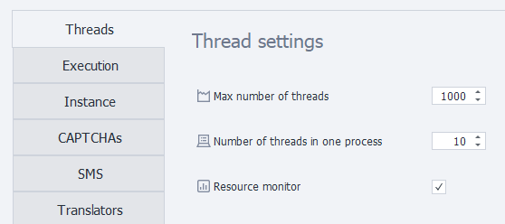

---
sidebar_position: 1
title: "Poster Thread Settings"
description: ""
date: "2025-09-10"
converted: true
originalFile: "Настройка потоков постера.txt"
targetUrl: "https://zennolab.atlassian.net/wiki/spaces/RU/pages/808812646"
---
import DisclaimerNotice from '@site/src/components/DisclaimerNotice';

<DisclaimerNotice />

> 🔗 **[Original page](https://zennolab.atlassian.net/wiki/spaces/RU/pages/808812646)** — Source of this material

_______________________________________________  

## Maximum number of threads

This is the maximum allowed number of threads for all running projects.

## Number of threads per process

:::warning Attention
This setting only works when using the Firefox 45 engine. If you use any other browser type, only one thread per process will always be used (regardless of this setting).
:::

Allows you to combine several threads working within a single process and sharing computer resources. This saves resources, but threads within the same process will run a bit slower.

## Computer resource monitoring

If this option is enabled, threads will only start when the computer has enough free resources.