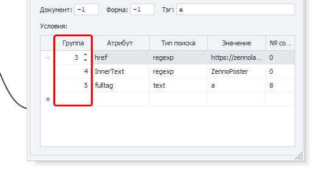
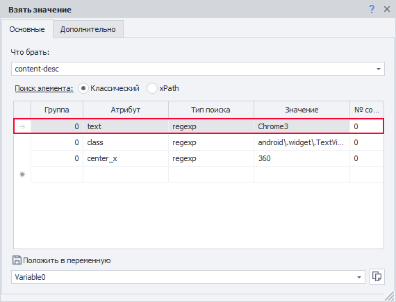

---
sidebar_position: 2
title: "Project Execution Settings"
description: ""
date: "2025-09-10"
converted: true
originalFile: "Настройки выполнения проектов.txt"
targetUrl: "https://zennolab.atlassian.net/wiki/spaces/RU/pages/809074766"
---
:::info **Please read the [*Material Usage Rules on this site*](../Disclaimer).**
:::

> 🔗 **[Original page](https://zennolab.atlassian.net/wiki/spaces/RU/pages/809074766)** — Source of this material

_______________________________________________  

### Clipboard buffer size between processes

Allows you to set the buffer size between processes from 10 to 1000 MB. This setting defaults to 10 and generally does not need to be changed unless you are specifically recommended to do so when troubleshooting issues.

:::warning Attention
Do not interpret this setting as the "maximum size of a list or table" used in the template. It is unrelated.
:::

### FTP operation timeout (sec)

The amount of time the program will wait for an FTP operation to complete.

### Number of HTTP request attempts

How many times the program will attempt to make an [❗→ HTTP request](https://zennolab.atlassian.net/wiki/spaces/RU/pages/534085713 "https://zennolab.atlassian.net/wiki/spaces/RU/pages/534085713").

### Use alternative HTTP request method

Sets the alternative HTTP request transmission method as default. This is applied globally for the entire program and all new projects.

:::note Note
ZennoPoster has two ways of working with HTTP requests—an external solution (the standard method, Chilkat library) and a built-in solution (the alternative method). If something doesn’t work as expected when using the standard method for HTTP requests, try switching to the alternative method. You can also do this via Project Settings.
:::

### Use HTTP Connection Pool

Enables optimized processing of HTTP requests, increasing stability.

### Maximum number of HTTP Connection Pool connections

:::info Information
Added in 7.3.0.0
:::

This setting allows you to limit the number of connections for ZennoPoster and ProjectMaker, which helps stabilize the program when processing large numbers of HTTP requests.

### Consider group order when using classic element search

When enabled, conditions will be checked in order, following the numbering in the "Group" column.

### Use updated element search method

:::info Information
This setting is available only in ZennoDroid. Added in 2.4.2.0
:::

Classic element search

Relevant for actions using classic search: “Get value”, “Set value”, “Trigger event”.

Before version 2.4.2, the first condition in the list was ignored during classic element search if there were two or more conditions. The action could succeed even if the first condition was not met.

Turning on this setting fixes the issue—the first condition will be considered.

Use with caution. It may change the logic of old templates.

### Save files safely

Helps prevent corruption of lists and files during unexpected server reboots.

### Search for project with .zp extension when using "Project in project" action

:::info Information
Added in 7.4.0.0
:::

When this setting is enabled, if the "[❗→ Project in project](https://zennolab.atlassian.net/wiki/spaces/RU/pages/489291822 "https://zennolab.atlassian.net/wiki/spaces/RU/pages/489291822")" action uses an old-format project with the .xmlz extension and it is not found, the program will look for a project with the same name but with the new .zp extension.

### Leave an empty UTF-8 encoded file

If a list remains empty during template execution, it will be saved with UTF-8 encoding.

### Launch unfinished projects on startup

When the program starts, any projects that were left unfinished during the previous session will be resumed, provided you chose this option when closing the program.

### Priority threads interrupt lower priority thread requests

Allows thread priority to be considered when processing requests in multithreaded template execution.

### Validate entered data

:::warning Attention
This setting has been removed starting from version 7.1.7.0
:::

Validates the data entered into web element fields. If you encounter an issue where a field on a website is filled in twice, uncheck this option.

### Reset task failures when adding attempts

Resets the unsuccessful attempt counter when you increase the number of attempts for execution.

### Detailed e-mail log

Enables detailed logging for email operations.

### Detailed FTP log

Enables detailed logging for FTP operations.

### Detailed HTTP log

Enables detailed logging for HTTP operations.

### <u data-renderer-mark="true">File change handling policy:</u>

Here you specify how the program should behave when files linked to lists or tables are changed externally.

#### Always load file changes during operation

The program will load file updates.

#### Never load external changes during operation

The program will load the file at startup and will not load any further changes.

#### Ask the user

The program will prompt you for confirmation each time it detects file changes.

### C# thread culture

:::info Information
Added in 7.3.1.0
:::

This setting affects the localization (culture) of the thread used for project execution and debugging, as well as for [❗→ C# bricks](https://zennolab.atlassian.net/wiki/spaces/RU/pages/492011596 "https://zennolab.atlassian.net/wiki/spaces/RU/pages/492011596"). In the Russian version, the default is "ru-RU". This can affect parsing of dates, numbers with decimal commas, etc.

:::note Note
To set InvariantCulture, simply clear the input field and leave it empty.
:::

:::note Note
A program restart is required for any changes to the C# thread culture setting to take effect.
:::