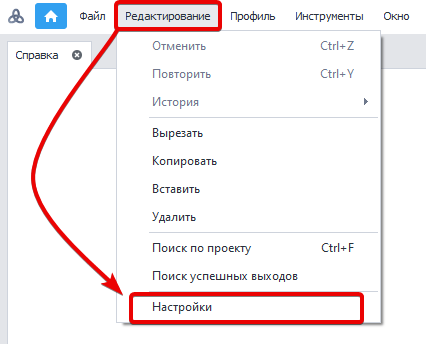
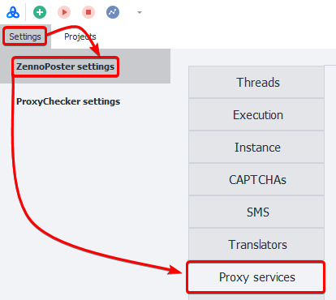
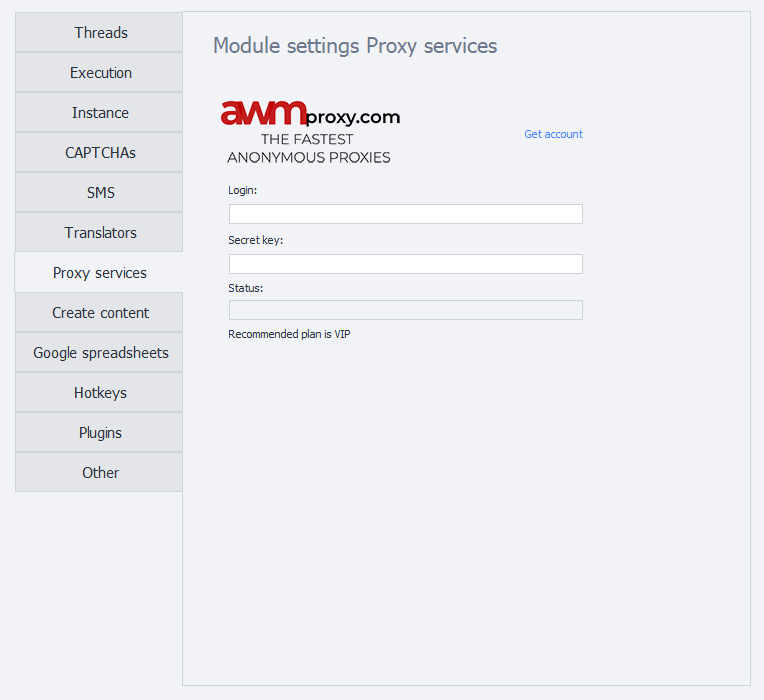
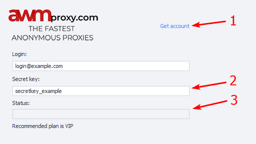
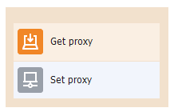

:::info **Please read the [*Material Usage Rules on this site*](../../../Disclaimer).**
:::

> 🔗 **[Original Page](https://zennolab.atlassian.net/wiki/spaces/RU/pages/809140312/-)** — Source for this material

_______________________________________________  

## Description

Quick setup of proxy services for use in Zennoposter.

## How to open the window?

### ProjectMaker

- From the top menu **Edit=&gt;Settings=&gt;Proxy Services**.

- Via [❗→ Start Page](https://zennolab.atlassian.net/wiki/spaces/RU/pages/735608964 "https://zennolab.atlassian.net/wiki/spaces/RU/pages/735608964")

### ZennoPoster

**Settings=&gt;ZennoPoster Settings=&gt;Proxy Services**

### What the settings window looks like

## What is this used for?

Quick access to the proxy service list

## How do you configure services?

:::warning Attention
After making any changes, you need to restart the program.
:::

### Setting up AWMproxy

1. Register with the service if you don't have an account yet.
2. Enter your **API key**, which you first need to get in your personal account.
3. If everything is correct, your rate and number of days will be shown in the *Status* line.

:::info Information
In your personal account, you need to specify the IP address you'll use to access the proxy.
:::

  

### Checking status

If you entered something incorrectly or your account is blocked, the program will notify you.

Example: 

- Wrong Email or Password
- Account blocked
- Authorization error! Api-key is wrong2

:::info Information
To fix the error, check the data you entered or contact your service provider.
:::

  

### Adding to your project

To use a proxy in your project, you need to add the [❗→ Get Proxy](https://zennolab.atlassian.net/wiki/spaces/RU/pages/492208129 "https://zennolab.atlassian.net/wiki/spaces/RU/pages/492208129") action or set it centrally in the [❗→ Project Settings](https://zennolab.atlassian.net/wiki/spaces/RU/pages/534315477 "https://zennolab.atlassian.net/wiki/spaces/RU/pages/534315477").

  

## Example usage

Getting a list of values from one site but different pages.

1. Register with the required proxy service.
2. Enter your account details.
3. Add the [❗→ Get Proxy](https://zennolab.atlassian.net/wiki/spaces/RU/pages/492208129 "https://zennolab.atlassian.net/wiki/spaces/RU/pages/492208129") action to your project.
4. Set up the proxy.

This way, it will be harder for the website's security system to tell that it's the same person working.

  

## Useful links

1. [❗→ Get Proxy](https://zennolab.atlassian.net/wiki/spaces/RU/pages/492208129 "https://zennolab.atlassian.net/wiki/spaces/RU/pages/492208129")
2. [❗→ Settings](https://zennolab.atlassian.net/wiki/spaces/RU/pages/489324572 "https://zennolab.atlassian.net/wiki/spaces/RU/pages/489324572")
3. [❗→ Project Settings](https://zennolab.atlassian.net/wiki/spaces/RU/pages/534315477 "https://zennolab.atlassian.net/wiki/spaces/RU/pages/534315477")
4. [❗→ Start Page](https://zennolab.atlassian.net/wiki/spaces/RU/pages/735608964 "https://zennolab.atlassian.net/wiki/spaces/RU/pages/735608964")