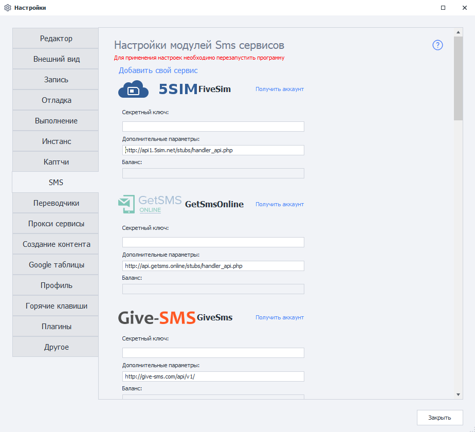
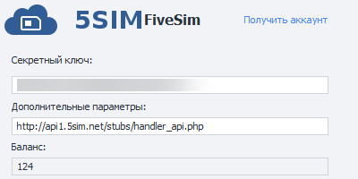
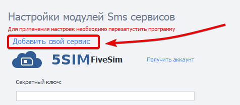
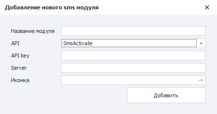

---
sidebar_position: 5
title: "SMS Services"
description: ""
date: "2025-09-10"
converted: true
originalFile: "SMS-сервисы.txt"
targetUrl: "https://zennolab.atlassian.net/wiki/spaces/RU/pages/809074773/SMS-"
---
:::info **Please review the [*Terms of Use for materials on this resource*](../Disclaimer).**
:::

> 🔗 **[Original page](https://zennolab.atlassian.net/wiki/spaces/RU/pages/809074773/SMS-)** — Source of this material

_______________________________________________  
# SMS Services

  

## What is this used for?

Some websites require a mobile phone number to verify registration, sending a code to that number which you then need to enter on the site. SMS services are made for exactly these situations. ZennoPoster, in turn, aims to make working with them as easy as possible.

  

## How do I open this window?

### ProjectMaker

- Through the top menu **Edit=&gt;Settings=&gt;SMS**.

- Through the [❗→ Start page](https://zennolab.atlassian.net/wiki/spaces/RU/pages/735608964 "https://zennolab.atlassian.net/wiki/spaces/RU/pages/735608964")

### ZennoPoster

**Settings=&gt;ZennoPoster Settings=&gt;SMS**

### What the settings window looks like

  

## How do I connect?

### Secret Key

To use the service, you need what's called an API key—a unique string of random characters that lets the service identify you. An example of such a key is `8fc9b30e544885b8480fb590dfcbdd71`.

To get your API key, go to the website of the service you want to use. Check out their prices and terms. Once you’ve made your choice, register for the service and get your API key in your personal account on their site.

### Additional Parameters

The URL for receiving API requests. It's set by default. If it's not set, you need to check with the developers of your chosen service.

:::warning Note
Don't change this value unless you really need to!
:::

### Balance

After you enter your API key, your current balance on the service will show up in this field.

:::warning Note
If this field stays empty after you enter your API key, then something went wrong. Possible reasons: the API key was entered incorrectly, there’s a problem with the service, or your key was banned.
:::

### Available services

:::info Info
ZennoPoster 7.4.0.0
:::

<table>
<tr>
<td>

- [5sim.net](http://5sim.net/ "http://5sim.net/")
- [getsms.online](http://getsms.online/ "http://getsms.online/")
- [give-sms.com](http://give-sms.com/ "http://give-sms.com/")
- [simsms.org](http://simsms.org/ "http://simsms.org/")
- [sms-acktiwator.ru](http://sms-acktiwator.ru/ "http://sms-acktiwator.ru/")
- [sms-activate.ru](http://sms-activate.ru/ru/ "http://sms-activate.ru/ru/")
- [smshub.org](https://smshub.org/ "https://smshub.org/")

</td>
<td>

- [smska.net](http://smska.net/ "http://smska.net/")
- [smspva.com](http://smspva.com/ "http://smspva.com/")
- [sms-reg.com](http://sms-reg.com/ "http://sms-reg.com/")
- [smsvk.net](http://smsvk.net/ "http://smsvk.net/")
- [vak-sms.com](http://vak-sms.com/ "http://vak-sms.com/")
- [virtualsms.ru](http://virtualsms.ru/ "http://virtualsms.ru/")

</td>
</tr>
</table>

  

## Adding a new service

:::info Info
Added in 7.2.1.0
:::

Starting with ZennoPoster version 7.2.1.0, you can add your own custom SMS service to the program, based on the APIs of popular services.

To do this, go to the **Settings** page and select **Add your own service**.

A window will appear for you to enter the details of the new service:

### Module name

Enter the name of your new service here.

:::warning Note
Maximum 20 characters.
:::

### API

Select the API on which your module will be based.

### API-key

The API key from the service.

This is the same as the **Secret Key** field for built-in services (described above).

### Server

The URL where requests will be sent.

### Icon

The image you specify here will be displayed in **Settings**.

Supported formats: `jpg, bmp, gif, png`

:::note Tip
If you’re not sure what to enter in a certain field, contact your service provider for help.
:::

### Working with the added service

Once you’ve added your service, you can select it in the [❗→ SMS service action](https://zennolab.atlassian.net/wiki/spaces/RU/pages/486539308/SMS "https://zennolab.atlassian.net/wiki/spaces/RU/pages/486539308/SMS") and use it just like the built-in services.

### Deleting a module

To remove a module you’ve created from the program, you need to delete two files:

- `c:\Users\USERNAME\AppData\Roaming\ZennoLab\Configs\ИмяМодуля.dll.config`
- `c:\Users\USERNAME\AppData\Roaming\ZennoLab\CustomModules\Sms\ИмяМодуля.dll`

`USERNAME`—here you need to enter your user name in the operating system.

:::warning Note
It's best to turn off ZennoPoster and ProjectMaker when deleting these files.
:::

## Useful links

- [❗→ Action for working with SMS services](https://zennolab.atlassian.net/wiki/spaces/RU/pages/486539308 "https://zennolab.atlassian.net/wiki/spaces/RU/pages/486539308")