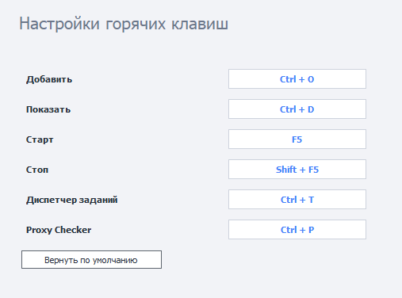

---
sidebar_position: 10
title: "ZennoPoster Hotkeys"
description: ""
date: "2025-09-10"
converted: true
originalFile: "Горячие клавиши ZennoPoster.txt"
targetUrl: "https://zennolab.atlassian.net/wiki/spaces/RU/pages/809107528/ZennoPoster"
---
import DisclaimerNotice from '@site/src/components/DisclaimerNotice';

<DisclaimerNotice />

> 🔗 **[Original page](https://zennolab.atlassian.net/wiki/spaces/RU/pages/809107528/ZennoPoster)** — Source of this material

_______________________________________________  

## Description

**Add** (`Ctrl + O`) - opens the window to add a new project to the program.

**Show** (`Ctrl + D`) - opens the [❗→ Instances](https://zennolab.atlassian.net/wiki/spaces/RU/pages/853803144 "https://zennolab.atlassian.net/wiki/spaces/RU/pages/853803144") tab for the selected project.

**Start** (`F5`) - starts the selected project.

**Stop** (`Shift + F5`) - stops the selected project.

**Task Manager** (`Ctrl + T`) - opens the [❗→ Task Manager](https://zennolab.atlassian.net/wiki/spaces/RU/pages/851116198 "https://zennolab.atlassian.net/wiki/spaces/RU/pages/851116198") window.

**Proxy Checker** (`Ctrl + P`) - opens the [❗→ Proxy Checker](https://zennolab.atlassian.net/wiki/spaces/RU/pages/851705960 "https://zennolab.atlassian.net/wiki/spaces/RU/pages/851705960") management window.

  

## Reassigning Hotkeys

To set a new key combination, simply click on the shortcut you’re interested in and hold down the desired key combination on your keyboard.

Example

  

## Restore Defaults

You can use this button to reset all hotkey settings to their original values.