---
sidebar_position: 6
title: "ZennoPoster Translators"
description: ""
date: "2025-09-10"
converted: true
originalFile: "Переводчики ZennoPoster.txt"
targetUrl: "https://zennolab.atlassian.net/wiki/spaces/RU/pages/808747136/ZennoPoster"
---
:::info **Please read the [*Material Usage Rules on this site*](../Disclaimer).**
:::

> 🔗 **[Original page](https://zennolab.atlassian.net/wiki/spaces/RU/pages/808747136/ZennoPoster)** — Source of this material

_______________________________________________  

## Description

This section contains the data needed to use automatic translation services while running your project.

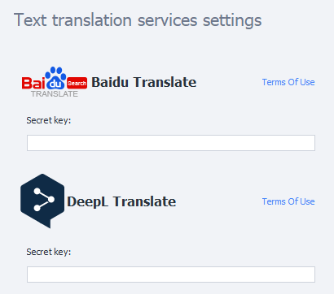

## How to open the window?

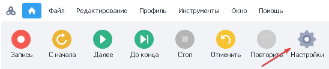

Or via the [❗→ start page](https://zennolab.atlassian.net/wiki/spaces/RU/pages/735608964 "https://zennolab.atlassian.net/wiki/spaces/RU/pages/735608964") ProjectMaker

Select the section

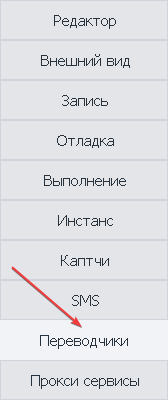

## What is this used for?

- Translating articles
- Translating a message text to the recipient’s specific language
- Translating text for chatbot auto-responders

## How to set up the services?

### Setting up Baidu Translate

:::info Information
The native language of the resource is Chinese. For ease of use, it’s recommended to use a browser with a built-in translator.
:::

1. Go to the usage guide for the service for setting up the [❗→ Text Processing](https://zennolab.atlassian.net/wiki/spaces/RU/pages/488865793 "https://zennolab.atlassian.net/wiki/spaces/RU/pages/488865793") action.
2. Secret key for server authentication.

How to get the Secret Key

- Go to the service website - https://fanyi.baidu.com/
- Hover over the specified character

- A pop-up window will appear for authorization

1. Authorize via the app.
2. Enter your login and password.
3. Register with the service.

### Service Authorization

1. Enter your login and password in the appropriate fields.
2. Authorization button.
3. Password recovery.
4. Return to app authorization.
5. Register an account.

### Register a new account

In the authorization window, select *Register

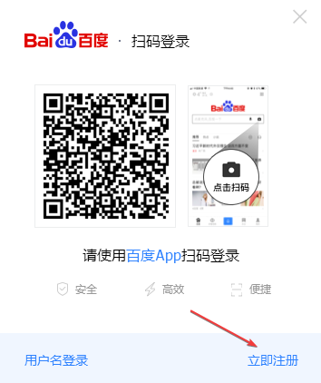

A page opens to enter info for the new account

1. Choose a username.
2. Enter a phone number without the country code.
3. Set a password, following the service guidelines.
4. Click the button to receive an SMS.
5. Enter the activation code.
6. Accept the site’s terms of use.
7. Click Register.

The service **only** accepts Chinese phone numbers, and may ask you to send an SMS to a number.

After registration, copy the key in your personal account and paste it in **Settings**.

  

### Setting up Deepl Translate

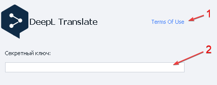

1. Go to the usage guide for the service for setting up the [❗→ Text Processing](https://zennolab.atlassian.net/wiki/spaces/RU/pages/488865793 "https://zennolab.atlassian.net/wiki/spaces/RU/pages/488865793") action.
2. Secret key for server authentication.

:::info Information
The service is temporarily unavailable to citizens and companies from the Russian Federation. However, if you have a valid billing address and payment option from an EU country, Switzerland, the UK, the US, Canada, or Japan, you can access DeepL Pro by entering these details during registration.
:::

How to get the Secret Key

You must register and log in on the website.

- Go to https://www.deepl.com/translator and move your cursor to the upper-right corner

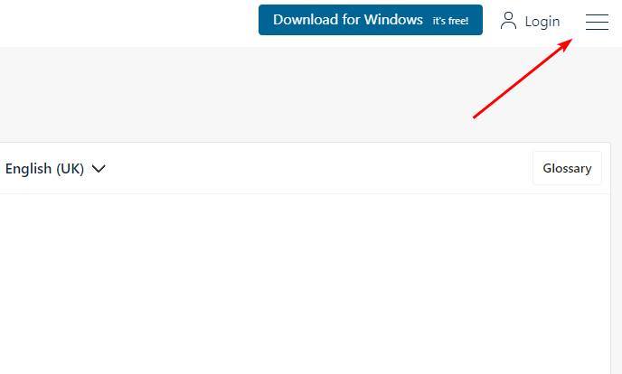

- In the menu that opens, select *Plans & Pricing

- Choose the *For Developers* plans

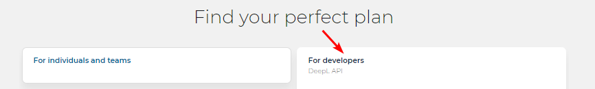

- Currently the service offers one plan — select it

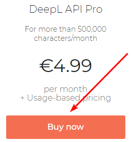

Pricing may vary depending on your country

- In the *Registration* window that opens, fill out the fields and click *Continue

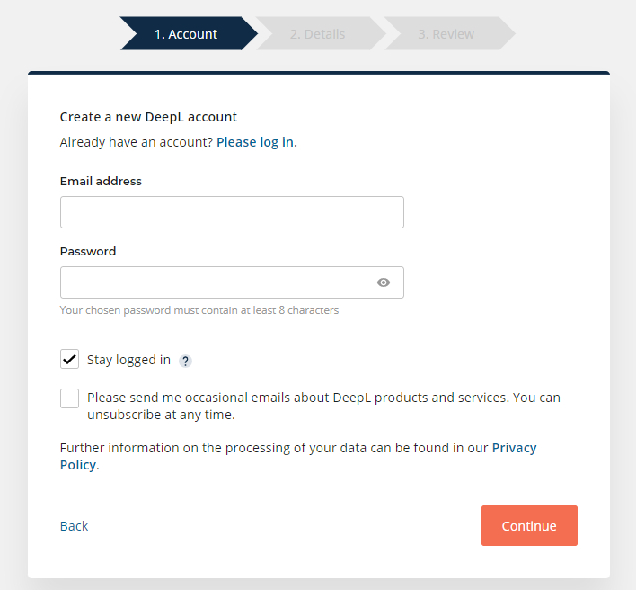

If you already have an account, click at the top of the page and enter your login info

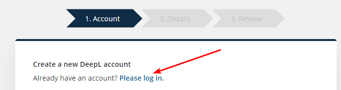

- In the *Details* tab, read the pricing plan terms carefully before filling them out.

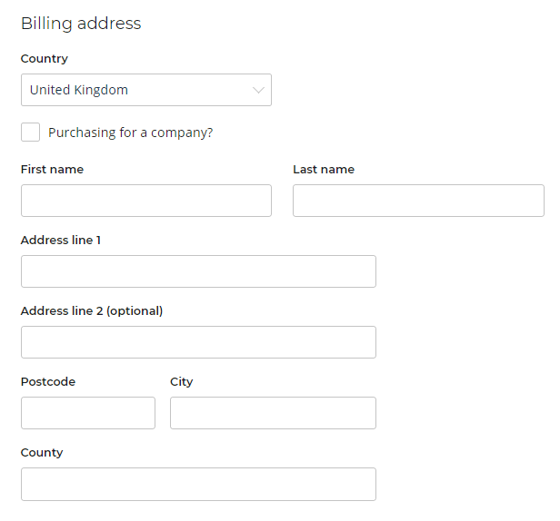

The service will review your provided info

Available payment methods

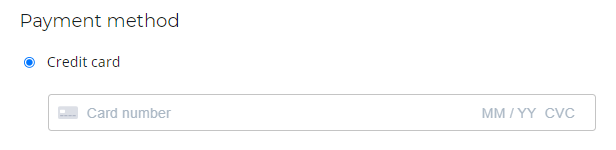

- After entering all the details, pay for your chosen plan
- Go to your personal account and copy the *Secret Key

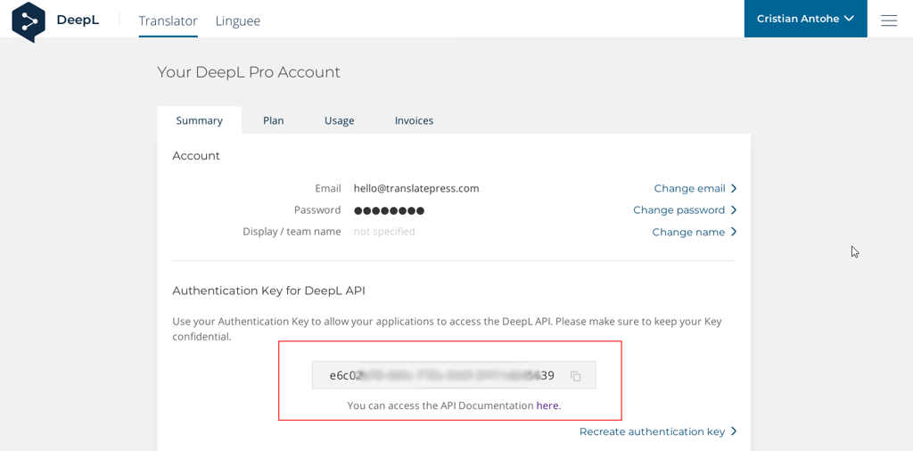

  

### Setting up Google Translate via API

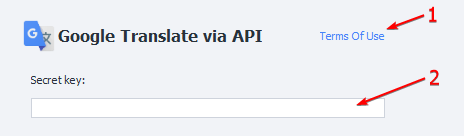

1. Go to the usage guide for the service for setting up the [❗→ Text Processing](https://zennolab.atlassian.net/wiki/spaces/RU/pages/488865793 "https://zennolab.atlassian.net/wiki/spaces/RU/pages/488865793") action.
2. Secret key for server authentication.

:::info Information
Please review the pricing before use
:::

How to get the Secret Key

- Go to https://www.google.com/ and in the upper-right corner, click the *Sign in* button

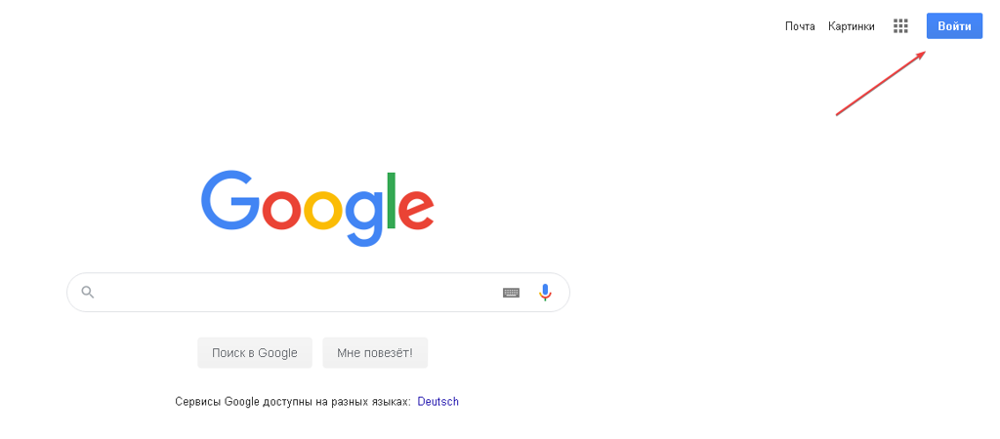

- Enter your account credentials to sign in

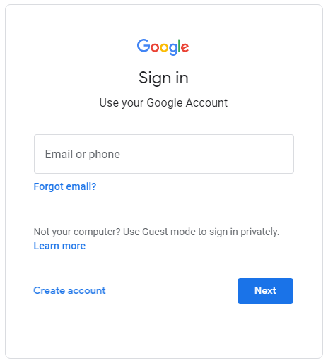

- Go to https://console.cloud.google.com, check the required boxes, and accept the service terms

- Click the projects menu

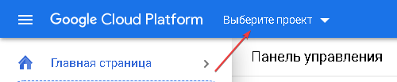

- Go to project creation, fill in the fields, and click *Create project

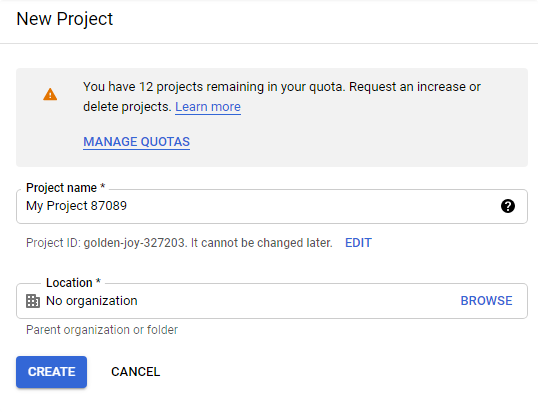

- Go to the page to add the required library https://console.developers.google.com/apis/library/translate.googleapis.com
- Activate the API

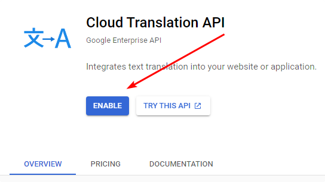

You’ll need to create a billing account first

- After the *Secret Key (API key) is issued, copy it into the appropriate field

  

### Setting up Google Translate via Web Interface

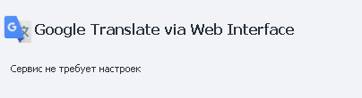

No setup required for this method.

:::info Information
The content translation service is completely free
:::

  

### Setting up Microsoft Translation

1. Go to the usage guide for the service for setting up the [❗→ Text Processing](https://zennolab.atlassian.net/wiki/spaces/RU/pages/488865793 "https://zennolab.atlassian.net/wiki/spaces/RU/pages/488865793") action.
2. Secret key for server authentication.

:::info Information
A 30-day free trial is available
:::

How to get the Secret Key

- Go to https://azure.microsoft.com/ru-ru/free/ and in the upper right corner, click *Sign in*

- Enter your account info

- On the main page, choose to create a free account

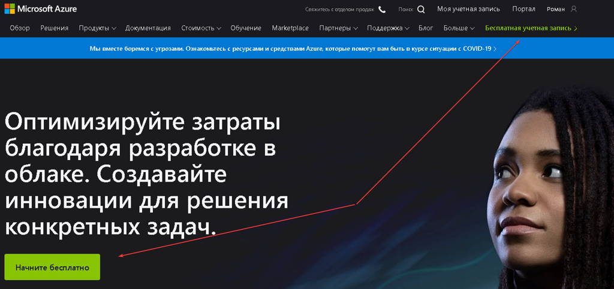

- Fill in your account info, phone number, and details

- After you get the trial period, go to the portal https://portal.azure.com and click *Create resource*

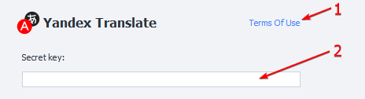

- In the search bar, enter *Translator and wait for the result, then proceed

- Click create

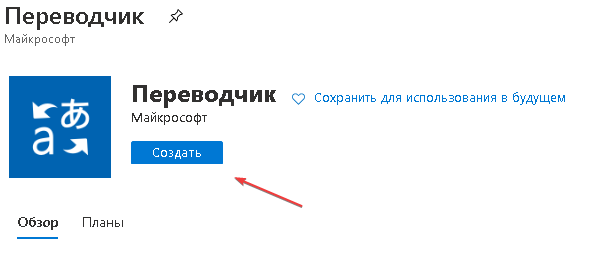

Carefully review the pricing plans

- After you receive the *Secret Key (API key), copy it into the appropriate field

  

### Setting up Yandex Translate

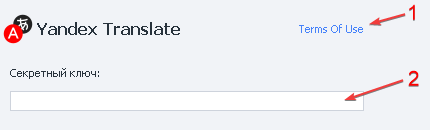

1. Go to the usage guide for the service for setting up the [❗→ Text Processing](https://zennolab.atlassian.net/wiki/spaces/RU/pages/488865793 "https://zennolab.atlassian.net/wiki/spaces/RU/pages/488865793") action.
2. Secret key for server authentication.

:::info Information
Yandex has suspended the issuing of free keys. As of 08/15/2020, all previously issued keys will be blocked.
:::

How to get the Secret Key

- Go to https://translate.yandex.ru/developers/keys

- Follow the new instructions to create a key

A billing account is required to receive a key

- After the *Secret Key (API key) is issued, copy it to the appropriate field

  

## Usage Example

Translate a phrase from Russian to English and send a message.

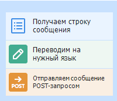

1. Get a string with text from the [❗→ list](https://zennolab.atlassian.net/wiki/spaces/RU/pages/534053375 "https://zennolab.atlassian.net/wiki/spaces/RU/pages/534053375").
2. Add the [❗→ Text Processing](https://zennolab.atlassian.net/wiki/spaces/RU/pages/488865793 "https://zennolab.atlassian.net/wiki/spaces/RU/pages/488865793") action.
3. Set up the translation function, specifying the service and parameters.
4. Send the message to the recipient.

This way, you can translate content while a project is running using these services.

  

## Useful links

1. [❗→ Text Processing](https://zennolab.atlassian.net/wiki/spaces/RU/pages/488865793 "https://zennolab.atlassian.net/wiki/spaces/RU/pages/488865793")