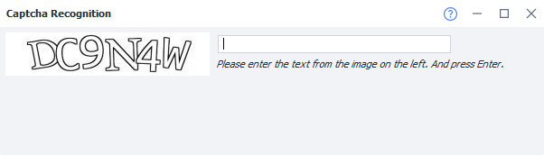
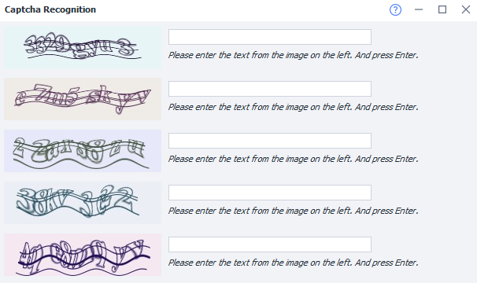

:::info **Please read the [*Material Usage Rules on this site*](../../Disclaimer).**
:::

> 🔗 **[Original page](https://zennolab.atlassian.net/wiki/spaces/RU/pages/851705951)** — Source of this material

_______________________________________________  

## Description

A window for manual captcha entry. It appears if in the [❗→ captcha recognition action](https://zennolab.atlassian.net/wiki/spaces/RU/pages/534053026 "https://zennolab.atlassian.net/wiki/spaces/RU/pages/534053026"), *MonkeyEnter.dll was selected as the recognition module.

If captchas are coming in from several threads at once, they will be displayed like this:

  

## Useful links

- [❗→ Manual captcha entry (ProjectMaker)](https://zennolab.atlassian.net/wiki/spaces/RU/pages/534053215 "https://zennolab.atlassian.net/wiki/spaces/RU/pages/534053215")
- [❗→ Action "Recognize captcha"](https://zennolab.atlassian.net/wiki/spaces/RU/pages/534053026 "https://zennolab.atlassian.net/wiki/spaces/RU/pages/534053026")