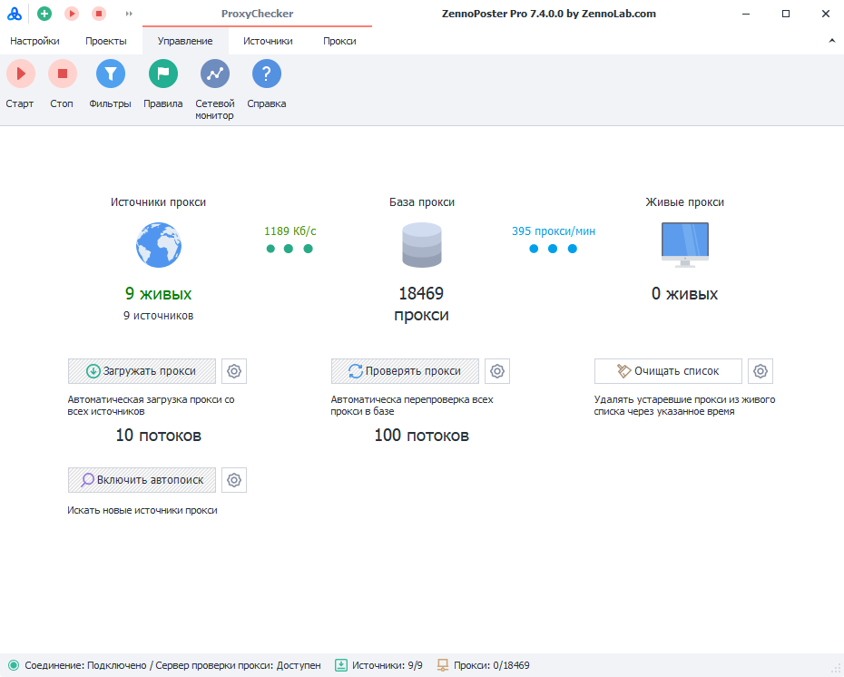

:::info **Please read the [*Terms of Use for materials on this resource*](../Disclaimer).**
:::

> 🔗 **[Original page](https://zennolab.atlassian.net/wiki/spaces/RU/pages/851705960/ProxyChecker)** — Source of this material

_______________________________________________  
# ProxyChecker

## Description

ProxyChecker is a software product designed for loading proxies, storing them, and automatically re-checking them according to flexible criteria.

ProxyChecker allows you to:

- Store proxy sources and work with them conveniently.
- Periodically load new proxies from sources into the storage.
- Set filters for all sources or for each individual one.
- Flexibly configure proxy checks for each source.

:::caution Important
Limitation of the built-in ProxyChecker in ZennoPoster: it's not possible to export the proxy list.
:::

:::info Information
For more detailed information about ProxyChecker, you can find it at this link — ZennoProxyChecker
:::

  

## Useful links

- [❗→ Settings for the built-in ProxyChecker](https://zennolab.atlassian.net/wiki/spaces/RU/pages/848560318 "https://zennolab.atlassian.net/wiki/spaces/RU/pages/848560318")