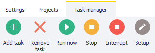
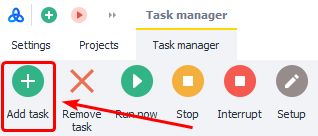
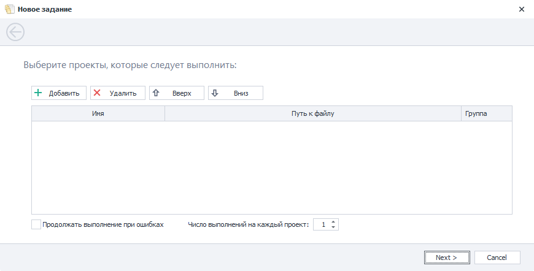
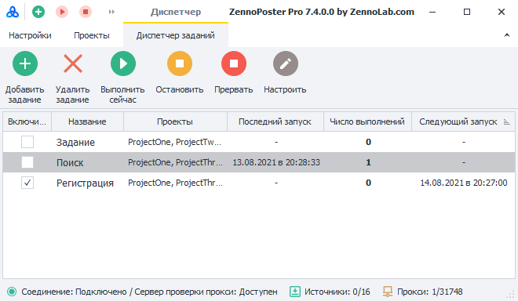
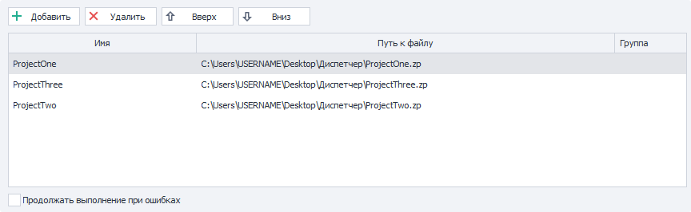
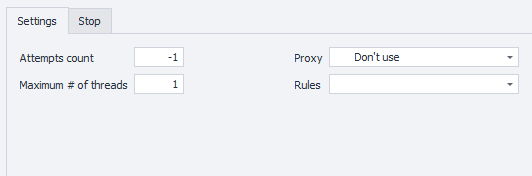
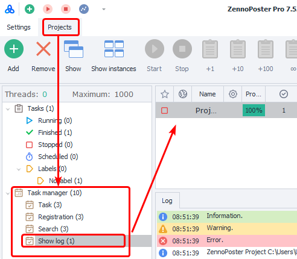

:::info **Please read the [*Material Usage Rules on this site*](../Disclaimer).**
:::

> 🔗 **[Original page](https://zennolab.atlassian.net/wiki/spaces/RU/pages/851116198)** — Source of this material

_______________________________________________  

## Description

The Task Manager allows you to set up project execution by schedule or by trigger (when a file appears at a specified path).
It is very similar to the [❗→ Schedule Planner](https://zennolab.atlassian.net/wiki/spaces/RU/pages/534086320 "https://zennolab.atlassian.net/wiki/spaces/RU/pages/534086320"), but with the Scheduler you have to set a schedule for each project separately, whereas the Task Manager lets you create a task that contains multiple projects (which will run sequentially from top to bottom).

  

## Main Menu




### Add Task

Adds a new task to the Task Manager.
The process is described in more detail below.

### Delete Task

Deletes the selected task.

### Run Now

Executes a task once.

### Stop

Graceful stop: the currently running template will finish its logical execution and then the task will stop, even if there are more projects in the queue. The schedule is also disabled.
To start the schedule again, you need to re-check the box next to the task in the “Enable” column.

### Abort

Immediate stop.
The project’s work will be interrupted immediately.

### Configure

This button opens the settings for the selected task. Details are described below.

  

## Creating a New Task

To start, click the “Add Task” button in the main menu.

<details>
<summary>Screenshot</summary>




</details>
### Schedule Settings Window

After that, a new window will open where you first need to configure the schedule for the task (more about schedule options can be found in the articles on the [❗→ Schedule Planner](https://zennolab.atlassian.net/wiki/spaces/RU/pages/534086320 "https://zennolab.atlassian.net/wiki/spaces/RU/pages/534086320")).
Once you’re done setting up the schedule, click “Next”.

<details>
<summary>Screenshot</summary>


</details>
### Project Addition Window




#### **Add**

Clicking this button opens the standard file selection dialog. You can select multiple templates at once.

#### **Delete**

Allows you to remove selected templates from the task.

#### **Up/Down**

When the task starts, the projects in it will run one after another from top to bottom. These buttons let you change the order of templates in the queue.

#### **Group**


Allows you to group projects within a task.

Templates *with the same group name* and *located next to each other* will be executed simultaneously.
Execution will move to the next group (or template) only after all projects in the current group have finished.

You can manually enter any text value into this column.

<details>
<summary>Example</summary>

Reminder: only tasks with the same group name and placed next to each other are executed simultaneously.

The task contains 7 projects.

| **Project Name**<figure><div><div aria-disabled="false"><div></div></div></div></figure> | **Group**<figure><div><div aria-disabled="false"><div></div></div></div></figure> |
| --- | --- |
| **Project Name**<figure><div><div aria-disabled="false"><div></div></div></div></figure> | **Group**<figure><div><div aria-disabled="false"><div></div></div></div></figure> |
| --- | --- |
| Project #1 | one |
| Project #2 | one |
| Project #3 | two |
| Project #4 | two |
| Project #5 | two |
| Project #6 | one |
| Project #7 | one |

After launching the task, Project #1 and #2 (first **one** group) will start at the same time.
Once those finish, Projects #3, #4, and #5 (group **two**) will run.
When those finish, Projects #6 and #7 (second **one** group) will start.

</details>
#### **Continue on Errors**

If this setting is enabled, execution will proceed to the next template in the queue even if the current one finished with errors.

<details>
<summary>Example</summary>

The task contains 2 templates.

The first encounters an error preventing it from finishing successfully. There are several possible outcomes.

- If “Continue on Errors” is disabled, the template will try again and again, until the number specified in the “Number of failures in a row” setting (found on the “Stop” tab, explained below in the “Task Settings” section) is reached. After that, the task will stop and wait for the next run as per the configured schedule.
- If “Continue on Errors” is enabled, again, the template will keep retrying until the number set in “Number of failures in a row” is reached. Once that number is reached, execution will move on to the next template in the queue. This continues until all templates in the task are exhausted. After the final project finishes, the task will wait for the next run per schedule.

</details>
#### **Run count per project**

Each project in the task will run the number of times set in this option.
Each project attempts to run all repeats in a row, one after another.

<details>
<summary>Example</summary>

The task contains 3 templates. The “Run count per project” setting = 3.

After the task starts, the first project will run 3 times in a row, then the second project will start and also run 3 times, then the third project will launch and attempt to run 3 times.
After that, the task will be considered complete.

</details>

Then click “Next” and “Finish”.

### Tasks Table




All added tasks are shown in the tasks table, which consists of the following columns:

**Enable** — enables/disables task execution by schedule. If the checkbox is checked, the task is enabled.
**Name** — the task name. By default, each task is named “Task.” You can change it in Settings (described below).
**Projects** — the list of projects included in this task.
**Last Run** — the time this task was last run.
**Run Count** — how many times this task has already been run.
**Next Run** — time of the next run as per the configured schedule.

**Sorting:** you can sort tasks by any column, just click the column name.

  

## Task Settings

There are a few ways to open task settings:

- highlight and click “Configure” in the main menu
- use the context menu
- double-click the task

### **Task Name**

Here you can enter a new name.

### **“Projects in Task” Tab**

#### **Editing the Task List**

The top part of the tab consists of the familiar Project Addition Window (described above in the section of the same name).




Here, you can also *Add/Delete projects,* change their order, set behavior for errors, change or assign groups.

:::note Note
In addition, here you can open and fill in the input settings for each project. To do this, double-click the project.
:::

At the bottom, there are two other tabs:

#### **Settings**




:::caution Important
Parameters are set individually for each project in the task, NOT for the whole task!
:::

- *How many times to run — how many times the project should be executed. If set to `-1` (minus one, infinite execution), the template will run as many times as set in the “Number of successes” setting on the Stop tab.
- *Maximum threads — the number of concurrent threads for this template.
- *Proxy — whether to use proxies from the built-in [❗→ ProxyChecker](https://zennolab.atlassian.net/wiki/spaces/RU/pages/475365507 "https://zennolab.atlassian.net/wiki/spaces/RU/pages/475365507").
- *Rules — [❗→ rules](https://zennolab.atlassian.net/wiki/spaces/RU/pages/848560252 "https://zennolab.atlassian.net/wiki/spaces/RU/pages/848560252") according to which proxies will be selected.

:::tip Tip
You can read more about these settings in the article Settings.
:::

#### **Stop**


- *Number of successes — by default, this will be the number you set in the “Run count per project” setting when creating the task (described above).
If set to `-1```json
 (minus one, infinite execution), the template will run as many times as you set in “How many times to run” on the Settings tab.
- *Number of failures in a row — number of errors in a row after which execution moves to the next template in the queue or stops the entire task (behavior depends on the “Continue on Errors” setting described earlier in “Project Addition Window”)
- *Execution timeout (seconds) — if the project is not finished within this time, it will be forcibly terminated.
- *Run BadEnd on interruption — this setting lets you handle project interruptions using [❗→ BadEnd](https://zennolab.atlassian.net/wiki/spaces/RU/pages/534020265/Bad+End "https://zennolab.atlassian.net/wiki/spaces/RU/pages/534020265/Bad+End"). This applies to both manual interruption (“Abort” button) and timeout interruption.

:::caution Important
Do not set “Number of failures in a row” to -1 (minus one), as in case of an error the template would never be able to finish!
:::

:::tip Tip
You can read more about these settings in the article Stop.
:::

### **“Run Conditions” Tab**

Here you can edit the schedule by which the project will be executed.
For more details on these settings, see the articles on the [❗→ Schedule Planner](https://zennolab.atlassian.net/wiki/spaces/RU/pages/534086320 "https://zennolab.atlassian.net/wiki/spaces/RU/pages/534086320").

  

## How can I view a project’s execution log?

To do this, go to Projects, then in the [❗→ side menu](https://zennolab.atlassian.net/wiki/spaces/RU/pages/852787297 "https://zennolab.atlassian.net/wiki/spaces/RU/pages/852787297") select the task, then in the [❗→ projects table](https://zennolab.atlassian.net/wiki/spaces/RU/pages/853737528 "https://zennolab.atlassian.net/wiki/spaces/RU/pages/853737528") highlight the project (or projects; you can select multiple with CTRL or SHIFT pressed). After that, the [❗→ Log tab](https://zennolab.atlassian.net/wiki/spaces/RU/pages/853737573 "https://zennolab.atlassian.net/wiki/spaces/RU/pages/853737573") will be available.




  

## Examples

### Running in Multithreaded Mode with a Different Number of Runs Per Template

<details>
<summary>Description</summary>

After adding a new task, go to its settings.

- Select the required project and go to the Settings tab.

 - In the “How many times to run” field, enter the desired number of repetitions.
 - In “Maximum threads”, enter the number of threads for this project.
- After that, go to the “Stop” tab.

 - In “Number of successes”, enter
```-1` (minus one).

</details>
* * *

## Useful Links

- [❗→ Schedule Planner](https://zennolab.atlassian.net/wiki/spaces/RU/pages/534086320 "https://zennolab.atlassian.net/wiki/spaces/RU/pages/534086320")
- [❗→ Settings](https://zennolab.atlassian.net/wiki/spaces/RU/pages/851574897 "https://zennolab.atlassian.net/wiki/spaces/RU/pages/851574897")