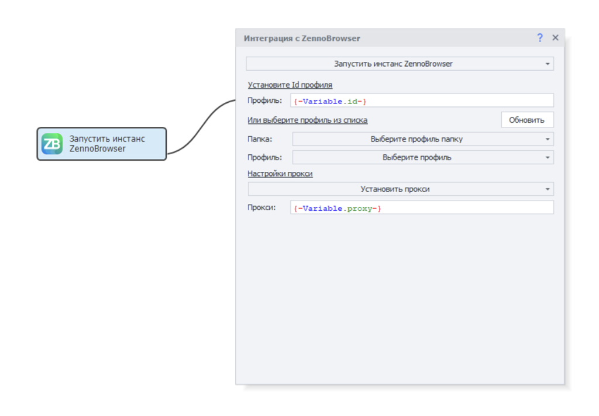
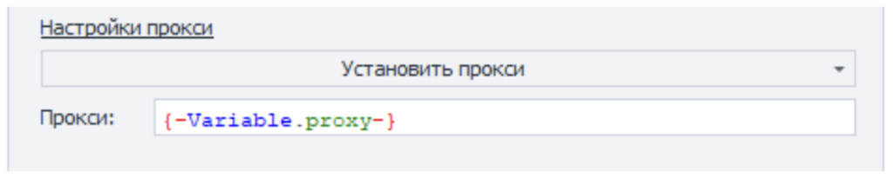
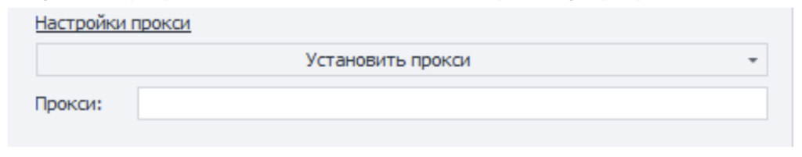
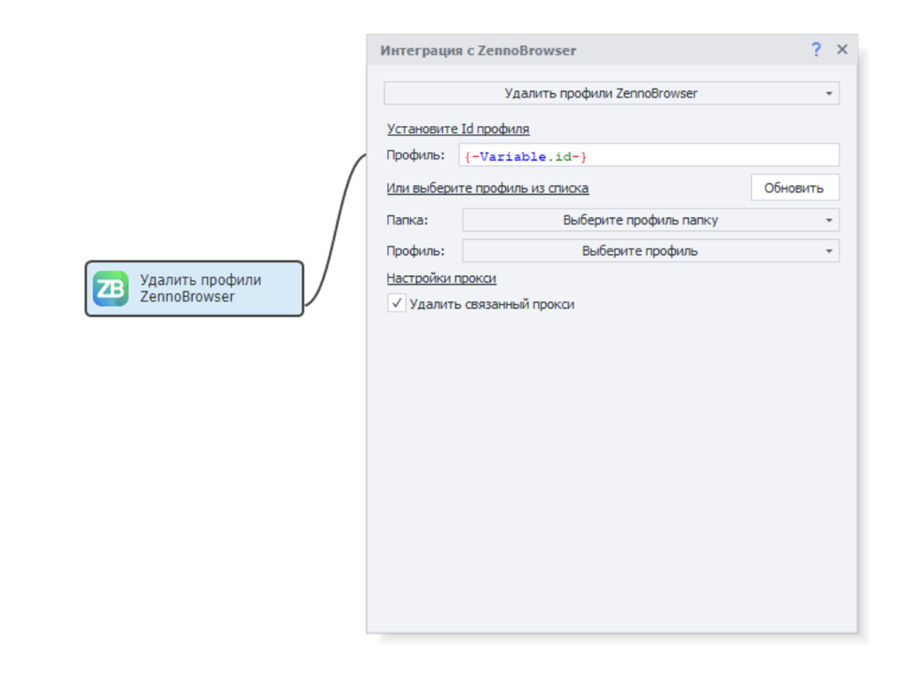

import DisclaimerNotice from '@site/src/components/DisclaimerNotice';

<DisclaimerNotice />

> 🔗 **[Original page](https://zennolab.atlassian.net/wiki/spaces/RU/pages/3670704134/ZennoPoster+7.8.6.0+02.07.2025)** — Source of this material

_______________________________________________  
# ZennoPoster 7.8.6.0 (02.07.2025)

## **ZennoPoster 7.8.6: improved ZennoBrowser integration, Chromium 137, and other updates**

**Highlights:**

**Proxy settings in the "Launch ZennoBrowser instance" action**

- Before launching a profile, you can configure its proxy. By default, the “Use profile proxy” mode is selected. In this mode, ZennoPoster7 will not change the proxy of the ZennoBrowser profile.

- The second mode, “Set proxy”, provides a field to enter a proxy string. You can use ZennoPoster7 macros just like in other actions. If you select this mode and specify a proxy, ZennoPoster7 will create a special proxy folder in ZennoBrowser called “ZP7 Proxies”. Inside this folder, ZennoPoster7 will create the proxies you specify in the launch settings, or reuse a proxy if it has already been added.

- If you select the “Set proxy” mode and leave the proxy field empty, ZennoPoster7 will clear the profile’s proxy before launching it.

**Proxy settings in the "Delete ZennoBrowser profiles" action**

When deleting a profile, you can also delete the proxy it uses with the “Delete linked proxy” option.  
The proxy will be deleted if it is not used by other profiles. If it is used by other profiles, the action will delete the profile without deleting the proxy and display a warning that the proxy cannot be removed.

**Full list of changes:**

+ Chromium browser updated to version 137.

+ Success logs have been added to the Launch ZennoBrowser instance and Get ZennoBrowser profiles blocks.

+ Proxy settings have been added to the Launch ZennoBrowser instance action. With the new setting, you can override the profile’s proxy before launch. To do this, select "Set proxy" in the proxy settings and specify a proxy string. If the string is empty, the profile will launch without a proxy. New proxies are added to a special list called "ZP7 proxies".

+ The "Delete linked proxy" option has been added to the Delete ZennoBrowser profile action. When enabled, the proxy will be deleted along with the profile if it is not used by other ZennoBrowser profiles.

+ Chromium browser now impersonates Safari more accurately. The new emulations work automatically by determining the browser based on the UserAgent. You can also set the impersonation mode using the key: --impersonation=&lt;mode&gt;, where &lt;mode&gt;:

safari - Safari mode  
auto - automatic (mode is selected based on User Agent)  
chromium - Chromium mode\

**Fixed:**

- Fixed automatic reconnection of ZP7 to ZennoLab servers. This fix also affects profile retrieval.
- The "Create ZennoBrowser profiles" action now correctly waits when creating a large number of profiles. A new setting, RemoteAgentCreateProfilesCallTimeoutSec, has been added to globalsettings for the profile creation action, with a default value of 900 seconds.

**For detailed information and setup instructions, see** [❗→ **this article**](https://zennolab.atlassian.net/wiki/spaces/RU/pages/3641737224 "https://zennolab.atlassian.net/wiki/spaces/RU/pages/3641737224")**.**

**Where can you download it?**

ZennoPoster 7.8.6.0 is already available in your [<u data-renderer-mark="true">Personal Account</u>](https://account.zennolab.com/personal-area-main/?roistat_visit=1592899 "https://account.zennolab.com/personal-area-main/?roistat_visit=1592899")!  
You will also be prompted to update when launching ProjectMaker.

**How to report issues?**

Please report any bugs in the [<u data-renderer-mark="true">Bug Tracker</u>](https://zennolab.com/discussion/threads/61815/?roistat_visit=1592899 "https://zennolab.com/discussion/threads/61815/?roistat_visit=1592899"), providing a detailed description and steps to reproduce the issue. This will help us quickly diagnose and fix the problem.