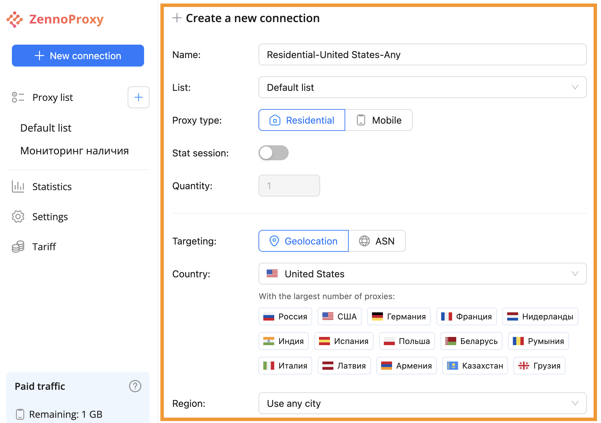
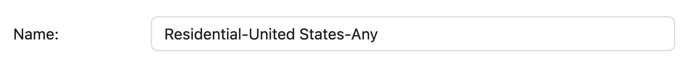
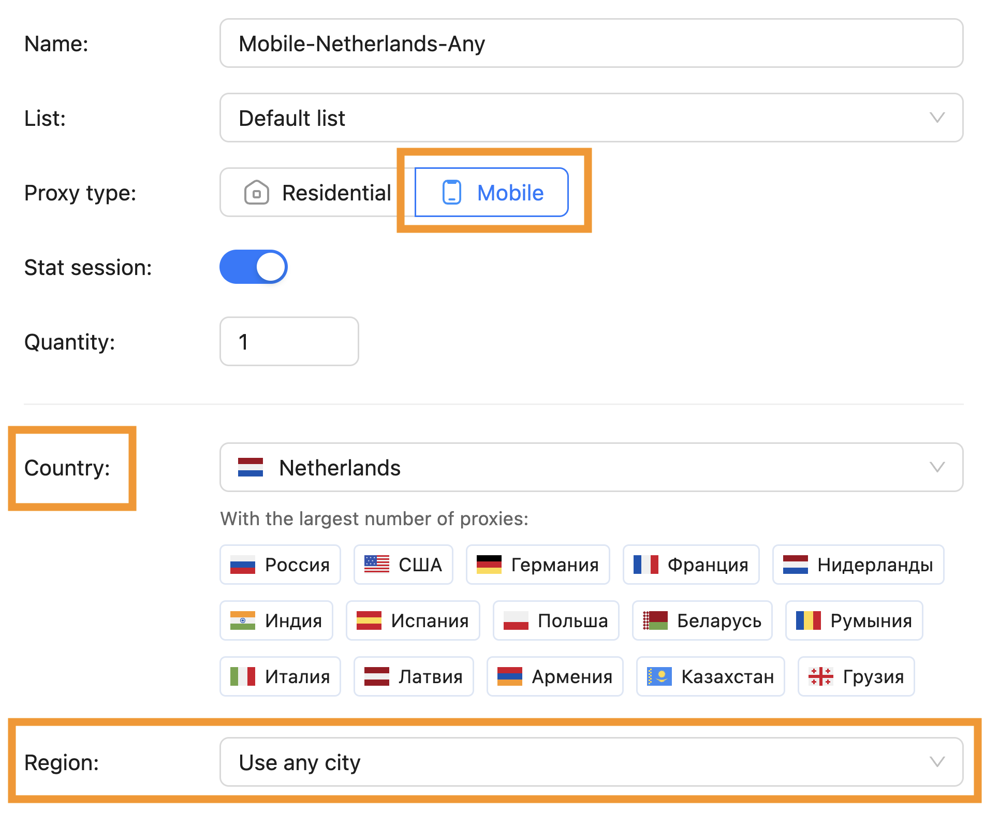
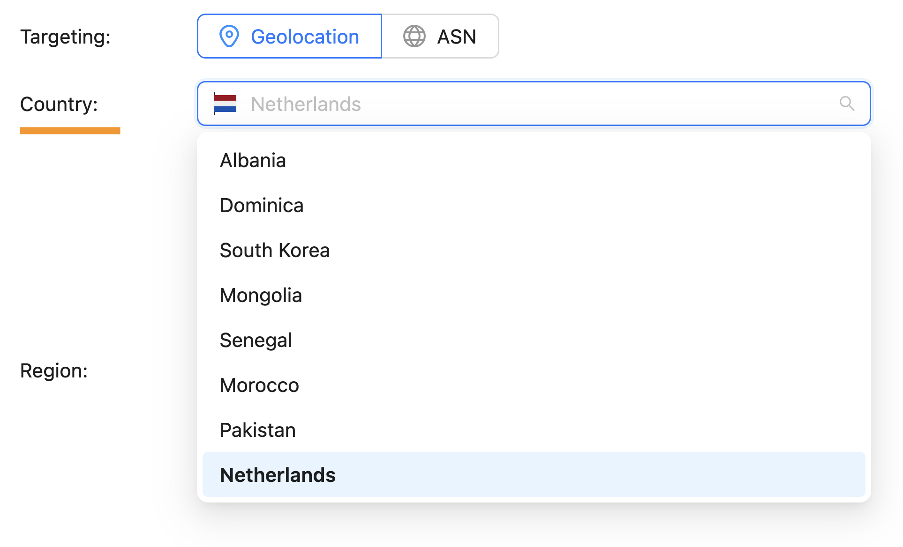

:::info **Please read the [*Rules for using materials on this site*](../Disclaimer).**
:::
## Creating  
Go to your [ZennoLab personal account](https://account.zennolab.com/personal-area-main/my-products) and switch from the main tab to the ZennoProxy tab.
  

To create a connection through a proxy, click the "+ New Connection" button in the navigation panel on the left.
  

Once you click the button, a connection settings form will appear in the main section.
  
Let's go through each setting in detail.

## Settings

### **Name**  
Give the connection a name that will make sense to you.   
Connection name can be up to 200 characters long.
  

### **List**  
Pick the desired connection list from your previously created ones. If you're making your very first connection, the default list called Default list will be available.
  

:::info **Info**  
How to create a new list → [read more](./WorkingwithLists#создание-нового-списка)
:::

### **Proxy type**  
Choose the type you need — residential or mobile proxies.
  

### **Which proxy type to choose — practical tips**

Resident: for bulk and stable scraping, parallel streams, precise city-level targeting, and long “sticky” sessions. They are quicker and more predictable.

Mobile: for “strict” antibots (registration/login/account warming up, PWA/mobile apps), when you need a mobile ASN and maximum trust. They handle “suspicious” patterns better, but aren’t great for high concurrency (CG-NAT), and sometimes the IP can unexpectedly change.

### **Static Session**

If you need a static session, slide the toggle to the right. If not, and you want to use rotation, just keep the toggle off.

Switch the toggle to the right to use a static session (one IP per session).
  

For a rotating session, leave the toggle off (gray). The IP will rotate.
  

### **Which session to choose — practical scenarios**

#### **Static:**

* Multi-accounting on social media:   
  you assign one IP per account → fewer anomaly triggers.

* E-commerce & geo-targeted promos:   
  fixed IP for cart/payment/profile → correct prices and fewer anti-fraud triggers.

* Manual market research/content:   
  a stable IP gives reproducible results; rotation distorts personalization.

#### **Rotating:**

* Large-scale web scraping: 

lots of pages/long sessions → rotating IPs reduces bans and CAPTCHAs.

* Localized SEO monitoring: 

change IP/geo to view SERPs as if you're a local user.

* Price/travel aggregators:   
  collect data from multiple sites, bypassing limits by changing IPs.

Bottom line:  
Use static proxies when you need a stable, dedicated IP;  
use rotating for high-volume requests without bans.

### **Quantity**

Number of sessions means the number of parallel, independent “lines.” Each line gives you a separate fixed IP/port.
This is handy if you need to run several parallel tasks.
For example: 5 sessions = 5 simultaneous threads/browser profiles with no shared IP.

You can only select the number of sessions with “static session” mode enabled.
  

Once static session mode is on, the field for session quantity will be available to fill in either by keyboard or by clicking the arrows.
  

### **Targeting**

For residential proxies, you have 2 targeting options: location or ASN.  
For mobile proxies, only country-level targeting (location) is available.

#### **For residential**

1) For location-based, you can pick **country → region**.  
  
2) For ASN, you can select **country → specific operator/provider**.  
  
#### **For mobile proxies**

Targeting is only by country, no region.
  
You can choose the needed location:
either from tags with countries that have the most available proxies:  
  
or from the dropdown list with the full list of available countries.
  

On the right, you can see a summary of the connection you’re setting up.
To finish and save the connection, click the "create connection" button.
