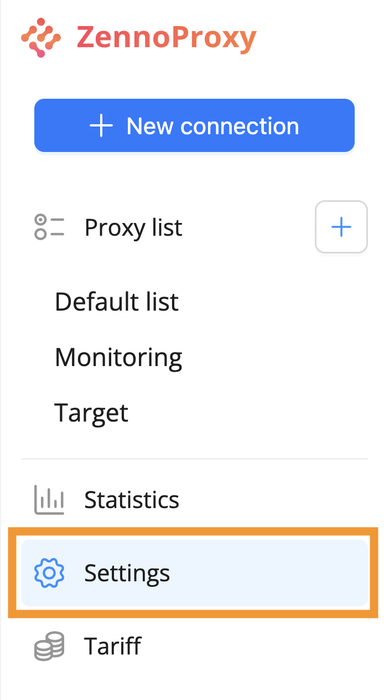
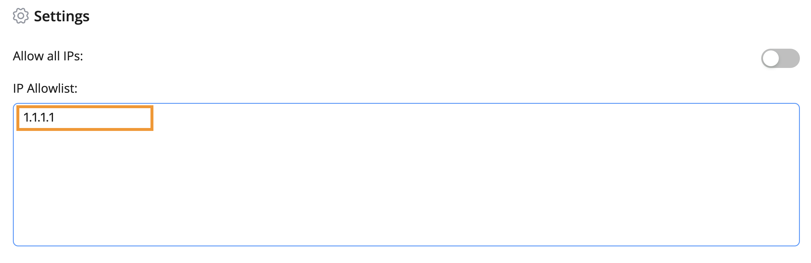

:::info **Please read the [*Rules for using content on this resource*](../Disclaimer).**
:::

## Resetting Connection String Password

Go to the “Settings” section in the menu on the left.  
  

If your connection strings have been exposed, or for any other reason you need to change the password for the strings, you can reset it by clicking the “Reset” button.
  

:::warning **Attention!**
Resetting the password creates new connection strings! All current connection strings will be updated, and any previously copied ones will stop working.
:::    
After you click the button, a pop-up will appear asking you to confirm the action.  

  

## IP Settings

This is the list of IPs allowed to connect through your proxy strings. By default, there should be one IP there—yours.  
  

If you want to allow connections from any IP, just move the slider to the right.

:::warning **Attention!**
Allowing access from all IPs lowers the security of your proxy, as anyone will be able to connect—not just your devices.
:::

