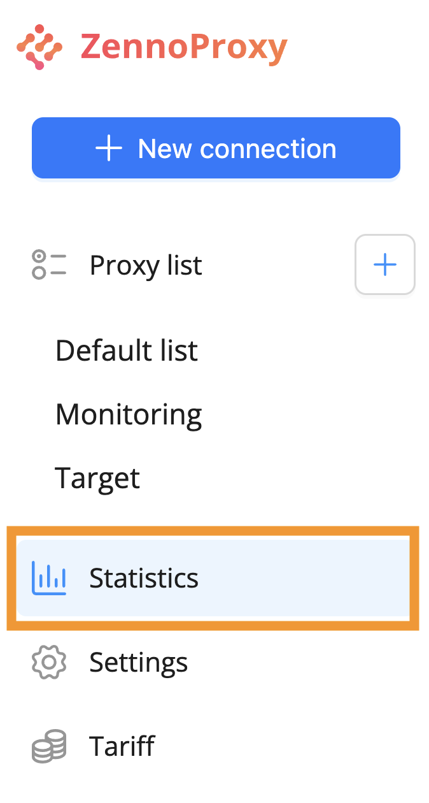

:::info **Please read the [*Terms of Use for materials on this site*](../Disclaimer).**
:::

## Interface

To view your proxy usage statistics, go to the “Statistics” section in the menu on the left.  
  

If you want to see stats for a specific period, choose the desired option from the list.  
  

You can also select a custom date range by clicking the calendar and picking your dates:  
    

### Traffic History
Here you can track how much traffic you've used, including breakdowns for mobile and residential connections.  
  

### Traffic Consumption Statistics

The next section shows a chart with your data usage.  
  

Click the “Refresh Data” button to get up-to-date numbers.  
