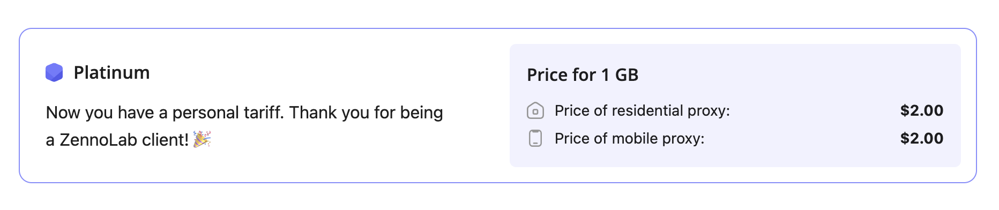

:::info **Please read the [*Material Usage Rules on this site*](../../../../Disclaimer).**
:::
# Plans
## **Platinum Plan**

One plan for now. One price. All types of proxies.

**Flat rate $2.00 / 1 GB**

 • Residential proxies – **$2.00 / GB**  
 • Mobile proxies – **$2.00 / GB**

**What you get with the plan:**  
 • Access to both residential and mobile proxies in a single plan  
 • Connection string builder with options: geo, type (HTTP(S), SOCKS4/5), and mode – get a ready-to-use string  
 • Fast start: get connected within minutes, no complicated setup

– **Sample expenses:**  
 • 1 GB → **$2.00**  
 • 5 GB → **$10.00**  
 • 10 GB → **$20.00**