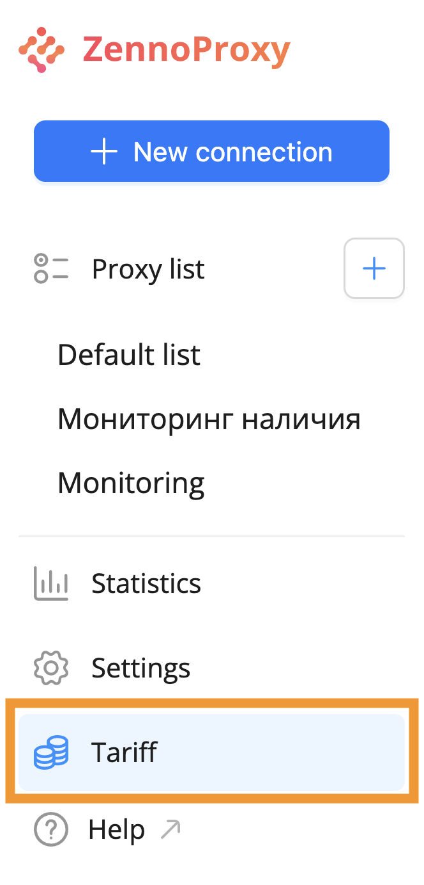
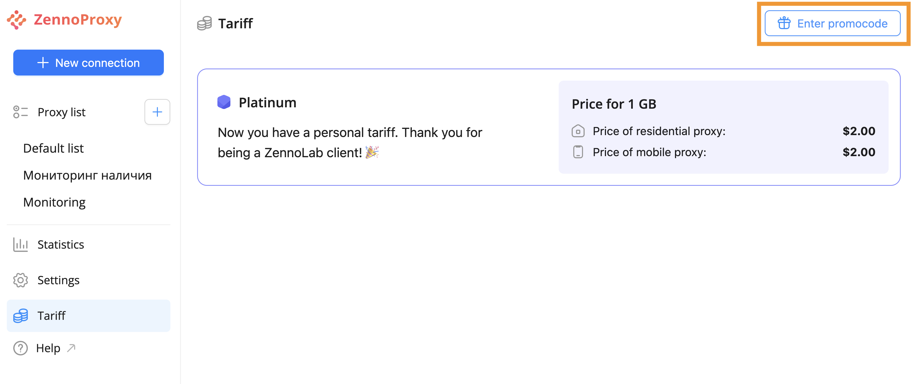
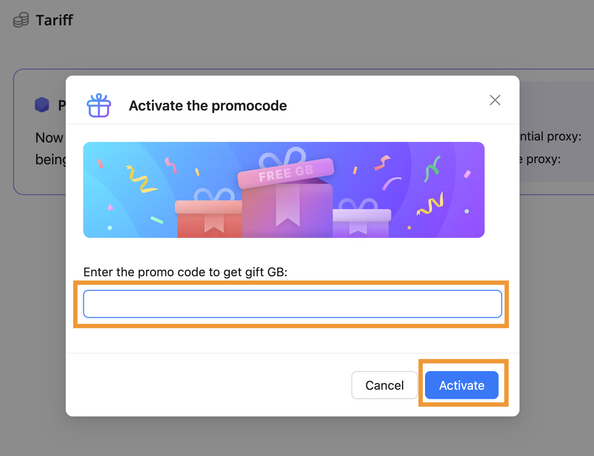

# Promo Codes
Promo codes let you add bonus GB to your account.

## **Activation Using a Promo Code**

To activate a promo code, go to the "Plans" section in the menu on the left.  

Next, click the "Enter promo code" button in the top right corner.  

A pop-up window will appear where you can enter your promo code. Click the "Activate" button. The promo code will be applied.  

Important! Each promo code is unique and can only be used once.

After clicking the "Activate" button, you'll see a message confirming the bonus GB have been added to your balance.

## **Activation via Link**

If you have a special link to activate a promo code, simply open it in your browser.  
When you follow the link, the promo code will be activated immediately.