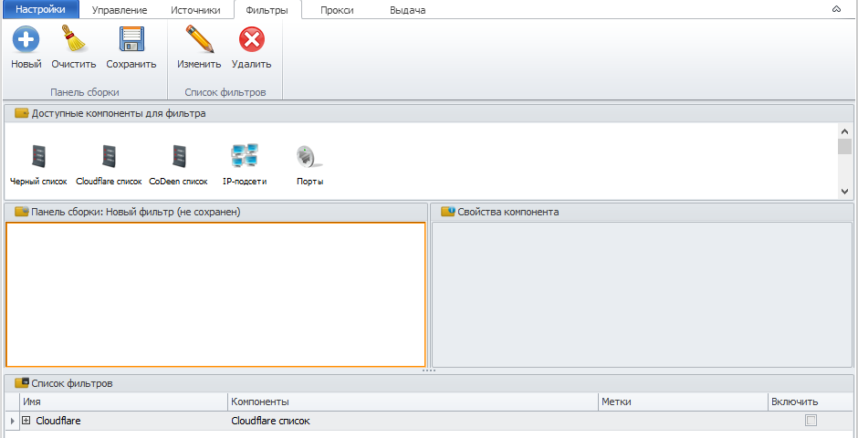
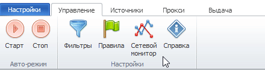
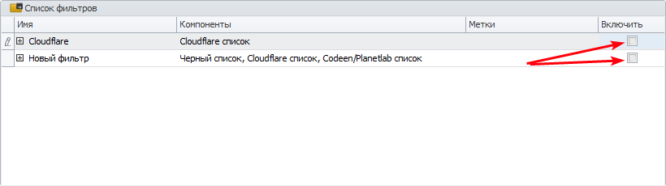

---
sidebar_position: 5
title: Filters
description: "Proxy filters in ZennoProxyChecker"
--- 

import DisclaimerNotice from '@site/src/components/DisclaimerNotice';

<DisclaimerNotice />

**Filters** are a set of rules applied to proxies before they are added to the ZennoProxyChecker database after being loaded from a source. Using filters, you can exclude proxies that are clearly unsuitable. A filter is applied to all sources simultaneously. When downloading proxies from a source, any proxies that do not meet the filter criteria are discarded and are not added to the main database.

## **Filter Components**

**Blacklist** — filters proxies according to the built-in blacklist. Proxies from the blacklist will not be loaded into the program’s database.

**Cloudflare list** — filters proxies according to the Cloudflare list.

**CoDeen list** — filters proxies according to the built-in CoDeen/Planetlab list. Proxies from the CoDeen list will not be loaded into the program.

**IP subnets** — filtering by IP address ranges. Sets restrictions on allowed proxy IP addresses using a list of subnets.

**Ports** — filtering by port number or port range. Sets restrictions on proxy ports.

## **Creating a Filter**

To create a filter, enable the *Filters* option on the *Management* tab:

Go to the *Filters* tab and create a new filter. Drag the required filter components to the *Assembly Panel* and configure their properties. Then save the filter. After that, it will appear in the list.  
The mechanism for adding and configuring filters is the same as for *Rules*; you can read more [in this article](https://docs.zennolab.com/zennoproxychecker/Program%20interface/Rules).

## **Enabling a Filter**

To apply a filter, you need to enable it. To enable it, check the box to the right of the rule.

The program will then calculate how many proxies in the database do not meet the filter conditions and will prompt you to confirm enabling this filter.  
You can also modify or delete the filter using the corresponding buttons in the menu.

## **Useful Links**

[**ZennoProxyChecker Main Settings**](https://docs.zennolab.com/zennoproxychecker/Settings/Main_settings)

[**Configuring Proxy Output**](https://docs.zennolab.com/zennoproxychecker/Working%20with%20proxies/Proxy_results)