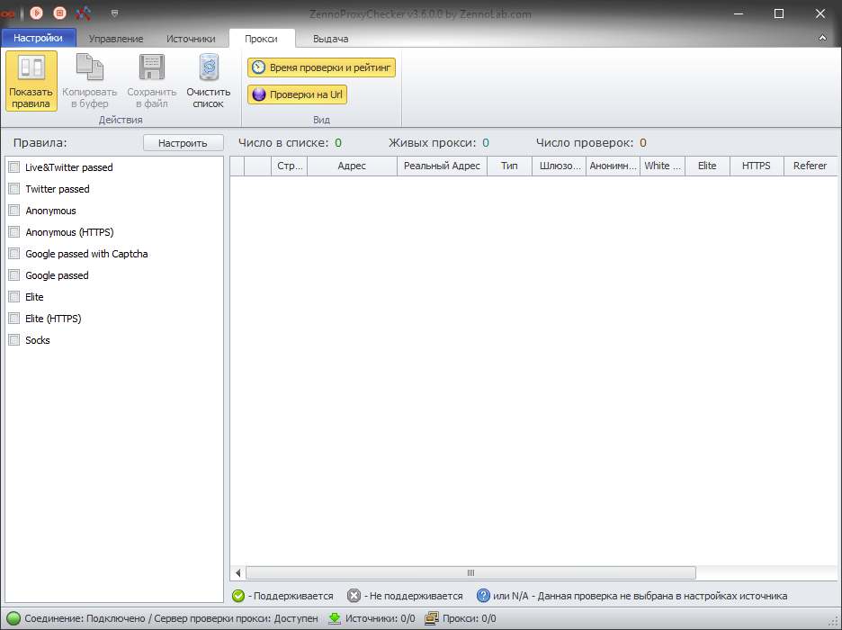
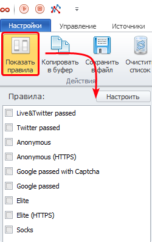
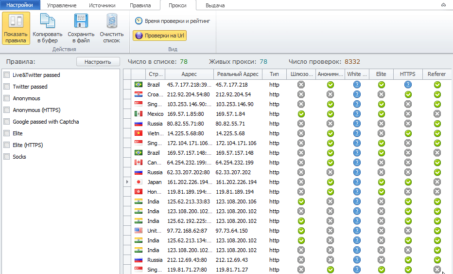
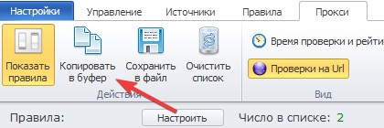
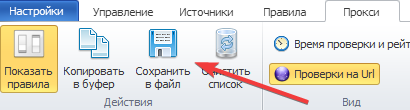
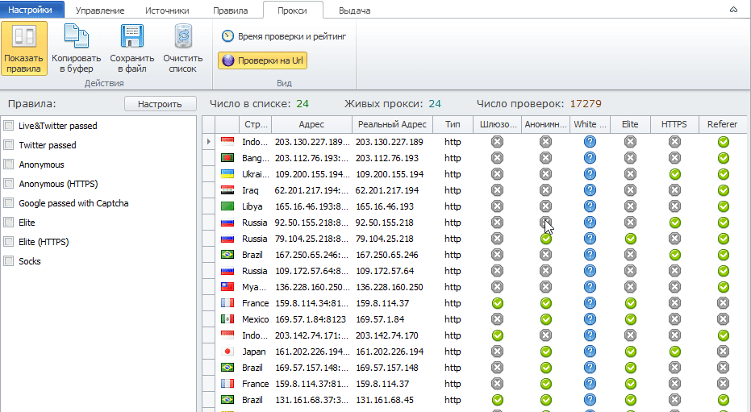
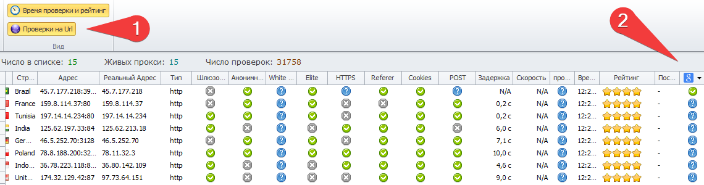
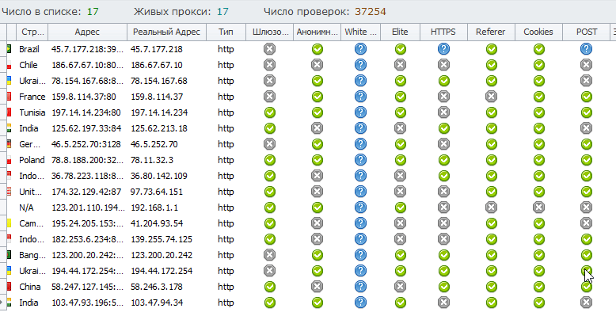
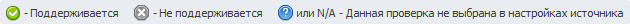

---
description: "Working with the “Proxy” tab"
sidebar_position: 4
title: Proxy
--- 

import DisclaimerNotice from '@site/src/components/DisclaimerNotice';

<DisclaimerNotice />

The **Proxy** tab is предназначена for filtering proxies according to pre-configured rules.

## **Control Panel**

### **Show Rules**

The *Show Rules* button activates the list of rules for filtering the proxy list. You can read more about the rules [here](https://docs.zennolab.com/zennoproxychecker/Program%20interface/Rules).
After activating the rule list, select one or more rules using the checkboxes. The proxies collected by ZennoProxyChecker will then be filtered according to the selected rule or rules. In the window on the right, you will see that the number of proxies has decreased, as some of them do not meet the selected rule.

You can see a visual example below in the animation:

You can see how the main list of proxies collected by the program is filtered according to the rule lists in the left column. These rules can be configured in the *Rules* tab.

### **Copy to Clipboard**
The *Copy to Clipboard* button copies the proxies to the clipboard. You can then paste these addresses into a text file or anywhere else using the CTRL + V key combination.

### **Save to File**
The *Save to File* button saves the filtered proxies to a file. You need to choose the location on your computer where the file will be saved.

### **Clear List**
The *Clear List* button removes all collected live proxies.

### **Check Time and Rating**
This button adds two columns:

 - Time — the time of the last check;
 - Rating — each proxy has its own rating. This rating increases when the proxy is used — when it is selected from the “live” list.

The rating decreases if the proxy fails a check. The program logic works as follows: proxies are regularly taken from the database for checking based on their rating — proxies with the highest rating are checked first. Proxies with a low rating are rechecked last.
However, do not assume that a live proxy with a high rating will be returned by the program over and over again — it will not be taken for checking again until the time specified in the source settings in the *Auto Mode* tab, section *Automatic Checking Settings*, has passed.

### **Check on URL**
This button activates columns that show whether the proxy has passed the check on a particular URL.

## **Sorting**
You can also sort any column by the desired parameters. To do this, click on the column name, as shown in the animation below.

## **Legend**
At the very bottom, there is a legend that explains what each icon means.

## **Useful Links**

[**Setting Up ZennoProxyChecker**](https://docs.zennolab.com/zennoproxychecker/category/proxychecker-settings)

[**Managing in ZennoProxyChecker**](https://docs.zennolab.com/zennoproxychecker/Program%20interface/Managing)