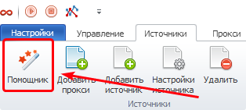
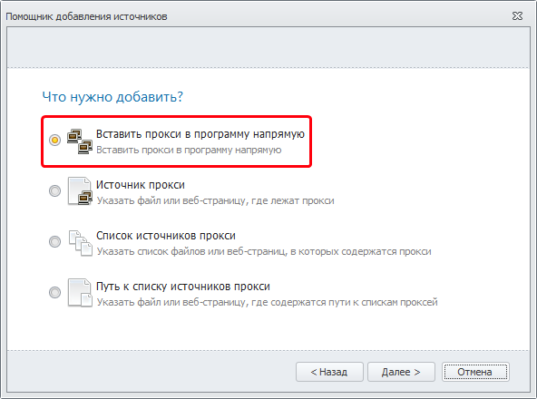
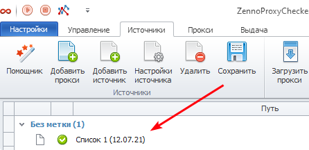
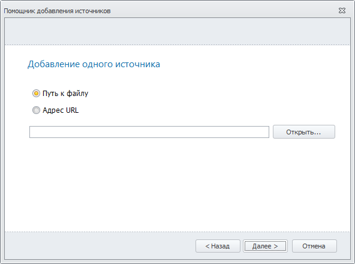
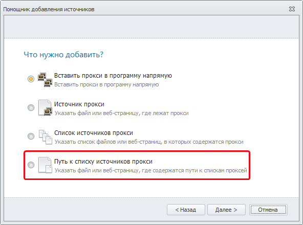

---
sidebar_position: 1
title: Helper
description: "Helper"
--- 

import DisclaimerNotice from '@site/src/components/DisclaimerNotice';

<DisclaimerNotice />

## **Helper**

The **Helper** is designed to simplify adding *Sources* for parsing into the program. After clicking the **Helper** button, the *Add Sources Helper* window will open.

### **What would you like to add?**

Next, you will see 4 action scenarios. Choose one of them and click the *Next* button in the lower right corner.

#### **Insert proxies into the program directly**
 

When you select this scenario, an empty window will open for entering proxies.

After entering the proxies, click *Next* and select the type of proxies you are adding.

Click the *Next* button and you will see information based on your request for finding the desired proxy.

If you check the *Configure now* option, then after clicking the *Add* button, not only will a new list be created, but its settings will also open immediately.

 On the main *Sources* page, a new source will appear in the *No label* category.

### **Proxy source**

In this scenario, you can specify a file or a web page from which proxies will be collected.  
After clicking the *Next* button, a window will appear where you need to choose where the proxies are stored:

 - **File path** — full path to the file;
 - **URL address** — the source address on the internet.

Click the *Next* button and select the type of proxies you are adding.

Click the *Next* button and you will see the resulting information.

If you check the *Configure now* option, then after clicking the *Add* button, not only will a new list be created, but its settings will also open immediately.

On the main *Sources* page, a new source will appear in the *No label* category.

### **List of proxy sources**

This scenario is similar to the previous one ("Proxy source"), with the only difference being that here you can specify multiple proxy sources at once (files and/or URL addresses).

### **Path to the list of proxy sources**

This scenario is also similar to "Proxy source," with the only difference being that here you need to specify the *File path* or *URL address* where the list of proxy sources is saved.

### **Useful links**

[**Main settings**](https://docs.zennolab.com/zennoproxychecker/Settings/Main_settings)

[**Source settings**](https://docs.zennolab.com/zennoproxychecker/Program%20interface/Sources)