---
sidebar_position: 2
title: Main Window
description: "Main Window"
--- 

import DisclaimerNotice from '@site/src/components/DisclaimerNotice';

<DisclaimerNotice />

## **Main Window (Sources)** 

### **Description**

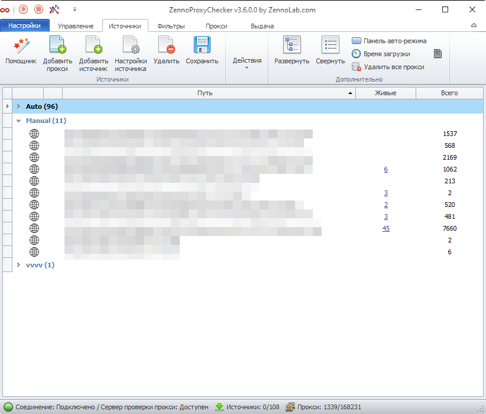

This tab displays all proxy sources added to the program.

Here you’ll find controls that allow you to change source settings, delete them, add new ones, view the number of proxies, and more.

### **Control Panel**

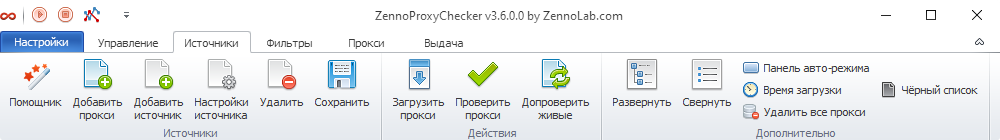

#### **Wizard**
Allows you to quickly add a proxy or a source for checking. Described in detail [in this article](https://docs.zennolab.com/zennoproxychecker/Working%20with%20proxies/Adding_proxy).

#### **Add Proxy**
Lets you add a list of proxies.

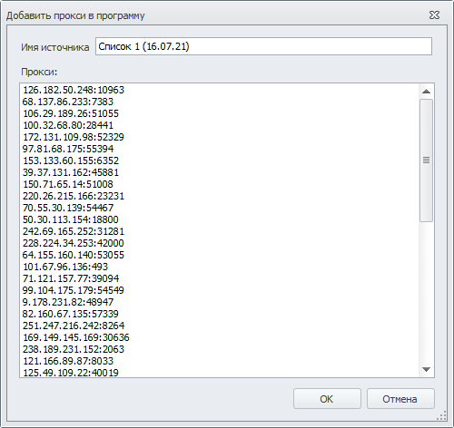

#### **Add Source**
Allows you to add a proxy collection source. Clicking it opens the source settings window. You can read more about this window in the article [Source Settings](https://docs.zennolab.com/zennoproxychecker/Program%20interface/Sources).
 
#### **Source Settings**
This button allows you to change the settings of added sources.  
After clicking the *Source Settings* button, the settings window will open, which is подробно described in the article [Source Settings](https://docs.zennolab.com/zennoproxychecker/Program%20interface/Sources).

**Delete**

Using the delete button, you can remove unnecessary sources. To do this, select the sources and click the *Delete* button.

Deleting a source will also delete all proxies from that source.

#### **Save**
This button allows you to save source addresses to a file.

#### **Load Proxies**
This function allows you to load proxies from a source.

#### **Check Proxies**
After loading proxies from a source, you can check them to find out how many of them are alive.

After clicking this button, a progress bar will appear at the top of the table. You can stop the checking process using the *Cancel* button to the right of the bar.

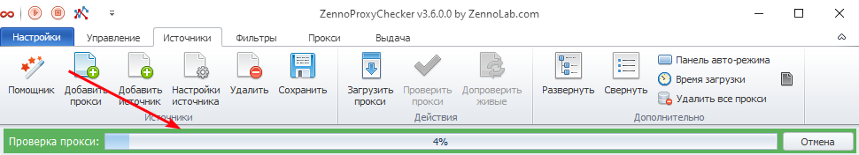

#### **Recheck Alive**
Allows you to recheck proxies from the sources that were previously found to be alive.  
The same progress bar will appear as in *Check Proxies* mode.

#### **Expand**
The *Expand* button expands a group with the list of sources if it was previously collapsed.

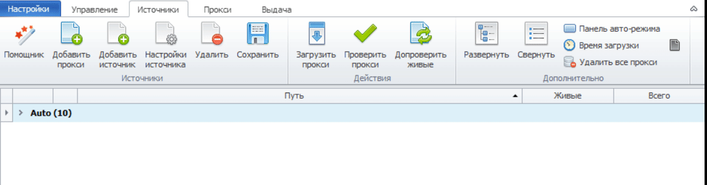

#### **Collapse**
The *Collapse* button collapses a group with the list of sources.

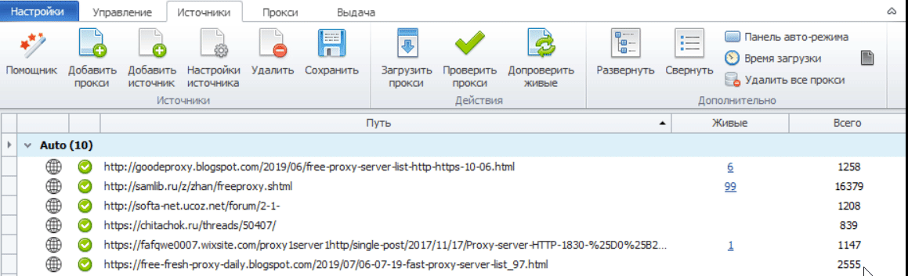

#### **Auto Mode Panel**
This button activates a panel for quick control of proxy loading and checking. The following panel appears above the list of sources:

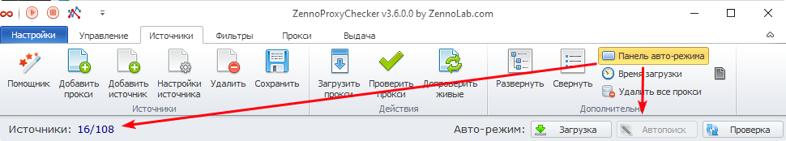

On the left side of the panel, the number of sources is displayed (alive sources/total number).  
On the right:
 - **Load** — loads proxies from sources.
 - **Auto Search** — automatically searches for new proxy sources.
 - **Check** — checks the found proxies.

#### **Load Time**
The *Load Time* button adds three new columns to the sources table: “Load Interval”, “Next Load”, and “Rating” (they are described below).

#### **Delete All Proxies**
Deletes all proxies from the program.

#### **Blacklist**

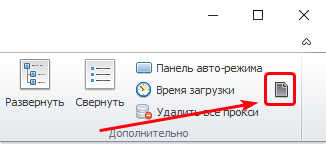

If the proxies contained in a source are not suitable for your project for any reason, or the source itself is not trustworthy, and ZennoProxyChecker continues to add and check proxies from these sources, wasting valuable time and resources, you can add such a source to the *Blacklist* and you will no longer see it.

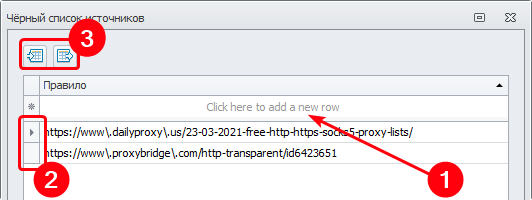

**Blacklist Management Window**

**Add to Blacklist** — to add manually, enter the address in the field and press Enter. You can also add via the context menu (described below in the *Context Menu* section).

**Remove from Blacklist** — select a source by clicking to the left of it (the rectangle labeled 2 in the screenshot) and press the Delete key.

**Import/Export** — these buttons allow you to save (export) the current blacklist or load (import) a previously saved one.

### **Sources Table**

This table contains all available information about proxy sources.

| **Source Type** | **Source Type** |
| ------------- | ------------- |
| Local source (file on a hard drive) | Remote (source by URL address) |
| 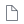 |  |

| **Source Status** | **Source Status** | **Source Status** |
| ------------- | ------------- | ------------- |
| Proxies successfully loaded | Unavailable address or non-existent file | Address is available, but no proxies were found |
|  | 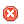 |  |

 - **Path** — the path to the source is displayed here. This can be a URL address or a path to a file on your hard drive.
 - **Alive** — the number of alive proxies from this source. Clicking this number will redirect you to the *Proxies* tab, where only proxies from this source will be displayed.
 - **Total** — the total number of proxies in this source.

The following columns appear when you activate the *Load Time* button on the *Control Panel*.

 - **Load Interval** — the pause between proxy loads from the source. You can change it in *Source Settings*.
 - **Next Load** — countdown to the next proxy load.
 - **Rating** decreases if proxies could not be obtained from the source.

#### **Selecting Multiple Sources at Once**
In the table, you can select multiple sources at once to apply settings to all of them simultaneously instead of one by one. There are several ways to do this:

##### **Ctrl**
Mouse + Ctrl key — allows you to select multiple sources individually.

##### **Shift**
Mouse + Shift key — allows you to select multiple consecutive sources. Select one source, press Shift, then click another source below or above the already selected one. As a result, all sources between them will also be selected.

##### **Group Selection**
If you click on a group name, all sources within it will be selected.

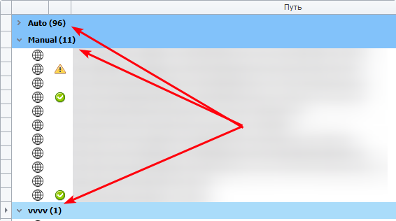

##### **Ctrl+A**
Pressing this key combination selects all proxies in expanded groups.

### **Source Context Menu**

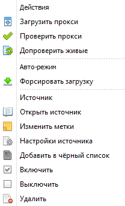

 - **Load/Check/Recheck Proxies** — these functions are similar to the actions of the same name in the *Control Panel* (described above).
 - **Force Load** — performs the same function as *Load Proxies*.
 - **Open Source** — if it is a URL address, it will open in your default browser. If it is a local file, it will open in a text editor.
 - **Edit Labels** — allows you to assign a new label to the source.

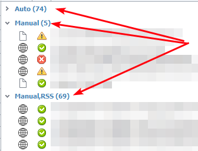

 - **Source Settings** — opens the settings window. You can read more about it in this article.
 - **Add to Blacklist** — adds the selected sources to the blacklist. More details are provided above.
 - **Enable/Disable** — allows you to disable/enable sources. A disabled source is displayed in gray in the table, and proxies are not loaded from it.
 - **Delete** — removes the source and all its proxies from the program.

### **Useful Links**

[**Wizard**](https://docs.zennolab.com/zennoproxychecker/Program%20interface/Sources/Hepler)

[**Source Settings**](https://docs.zennolab.com/zennoproxychecker/Program%20interface/Sources/Source_settings)

[**Proxies**](https://docs.zennolab.com/zennoproxychecker/Program%20interface/Proxy)

[**Managing**](https://docs.zennolab.com/zennoproxychecker/Program%20interface/Managing)