---
sidebar_position: 3
title: Source Settings
description: "Source Settings"
--- 

import DisclaimerNotice from '@site/src/components/DisclaimerNotice';

<DisclaimerNotice />

## **Source Settings**

Source settings:

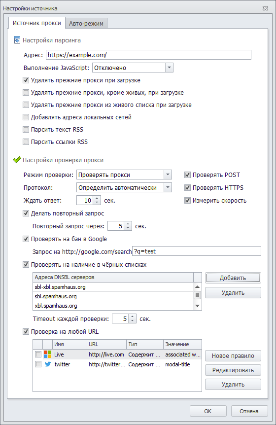

### **“Proxy Source” Tab**

#### **Parsing Settings**

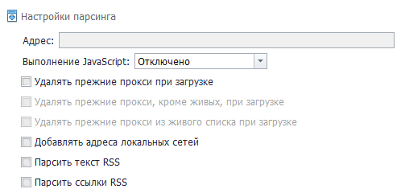

**Address** — the URL from which proxies will be collected.

**Execute JavaScript** — this setting controls whether JavaScript is executed on the website page from which proxies will be parsed. Select one of the following options from the drop-down menu:
 - *Disabled*;
 - *Enabled*;
 - *Auto-detect*.

**Delete previous proxies on start** — each time you start a new proxy collection, the proxies collected previously will be deleted.

**Delete previous proxies except live ones on load** — each time you start a new proxy collection, all proxies in the database will be deleted except live ones. This setting becomes active after enabling *Delete previous proxies on start*.

**Delete previous proxies from the live list on load** — should proxies be removed from the live list each time a new proxy collection starts? This setting becomes active after enabling *Delete previous proxies on start*.

**Add local network addresses** — select this option if you want ZennoProxyChecker to also collect local network addresses.

**Parse RSS text** — when enabled, in addition to the source text, proxies will also be searched for in the RSS feed text, if available.

**Parse RSS links** — if an RSS feed is available, all links from it will be parsed and processed the same way as automatically added resources, meaning only those where proxies are found will appear in the source list. New sources are marked with the “RSS” label.


#### **Proxy Checking Settings**

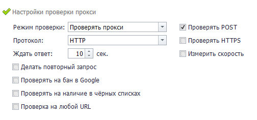

**Checking mode:**

 - **Check proxies** — proxies will be tested for functionality;
 - **Treat all proxies as live** — all proxies will be considered live without checking.

**Protocol** — select the proxy protocol used in this source. If you do not know the protocol in advance, you can select *Auto-detect*, and ProxyChecker will determine it automatically.

Available options:
 - HTTP;
 - SOCKS4;
 - SOCKS5;
 - Auto-detect.


**Check POST** — checks whether the proxy supports POST requests.

**POST** — a request method often used when submitting forms.

**Check HTTPS** — an additional check for HTTPS availability. May reduce performance.

**Measure speed** — during checking, the proxy bandwidth will also be measured. Enabling this option reduces performance and increases traffic usage.

**Wait for response** — the maximum response time after sending a request. If the proxy does not return a response within the specified time, it is considered non-working.

**Retry request** — send the request again if the first one succeeds. This filters out unreliable proxies but increases checking time.

**Check for Google ban** — the proxy is checked for a Google ban.


#### **Check Against Blacklists**

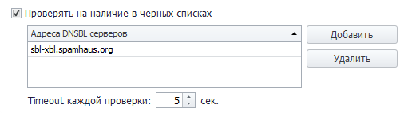

The table appears only after enabling this setting.

The proxy is checked for presence on blacklists.

When you click the *Add* button, a list of available addresses for checking will appear.

The *Delete* button allows you to remove selected addresses from the added list.

Some DNS servers do not handle a large number of requests well, which may result in false checks. In such cases, it is recommended to configure your system to use your provider’s DNS.


#### **Check on Any URL**

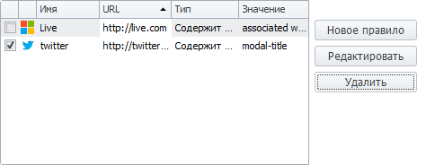

This feature is designed to check whether a proxy is banned on a specific website. **To select a rule**, check the box to the left of the rule name (in the screenshot, the twitter rule is selected).

When the feature is activated, an additional settings menu will appear (by default, two example rules are added there).

##### **Adding a New URL for Checking**

To add a new rule, click the *New rule* button. The settings window will open:

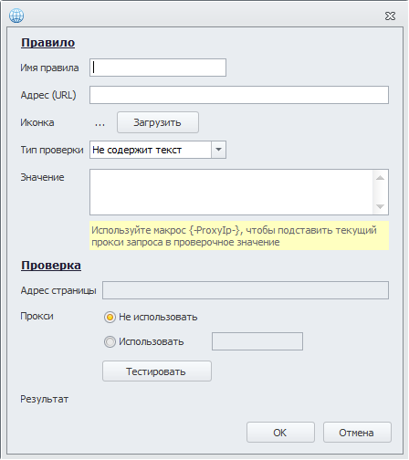

 - **Rule name** — enter any name; it does not affect the check.
 - **Address (URL)** — enter the URL of the website where the proxy will be checked.
 - **Icon** — optionally, you can upload the site’s favicon by clicking the *Upload* button.
 - **Check type**
 
 —> *Contains text* — this check type allows you to verify whether specific text is present on the website being checked. Enter the text to check in the *Value* field.
 
 —> *Does not contain text* — checks that the specified text is not present on the website. Enter the text to check in the *Value* field.
 
 —> *Regex* — enter the regular expression value that will be used for checking.

Use the macro ``` json {-ProxyIp-} ``` to insert the current request proxy into the check value.

**Testing**

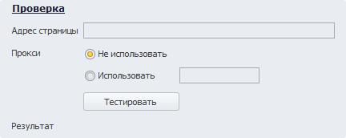

This section is used to test your settings.

The **Page address** field is automatically filled with the URL you added in the *Address (URL)* field.

**Proxy** — you can choose whether to use a proxy or not.

Format: protocol://login:password@ip:port or protocol://ip:port

After configuring everything, click the **Test (1)** button, and the result will appear in the **Result (2)** column: *Test passed* or *Test failed*.

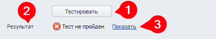

By clicking **Show (3)**, you will see the server’s response to the test request. Here you can analyze the response source code and understand why the test may have failed.

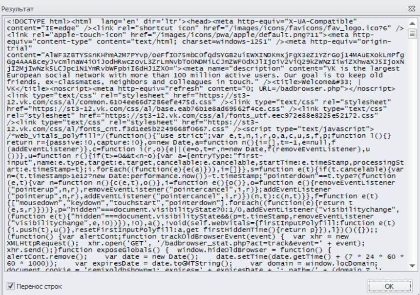

After configuring everything, click *OK* to save the rule.

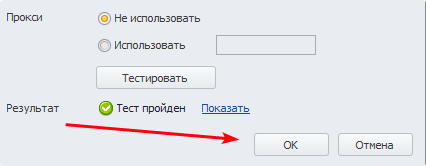

Below you can see what the saved rule looks like with all the parameters you entered. You can reopen it for editing by selecting it and clicking the *Edit* button.

To delete a rule, select it and click the *Delete* button.

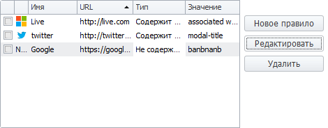

You can add an unlimited number of rules to check proxies.

### **“Auto Mode” Tab**

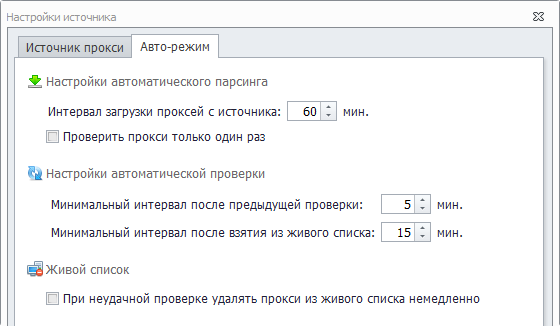

#### **Automatic Parsing Settings**
**Proxy download interval from the source** — the pause between proxy collections from the source.

For example, if you set the interval to 20 minutes, proxies will be collected every 20 minutes.

**Check proxies only once** — when enabled, all proxies from one source will be checked only once.

#### **Automatic Checking Settings**
**Minimum interval after the previous check** — the interval between proxy checks.

**Minimum interval after being taken from the live list** — the interval during which a proxy will not be checked after being taken for use.

#### **Live List**
Immediately remove a proxy from the live list after a failed check — it is recommended to disable this for public proxies and enable it for paid ones.

### **Useful Links**

[**Working with Proxies**](https://docs.zennolab.com/zennoproxychecker/category/proxychecker-working-with-proxy)

[**Sources**](https://docs.zennolab.com/zennoproxychecker/Program%20interface/Sources)