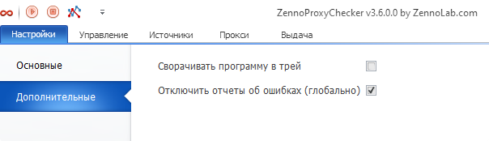

---
sidebar_position: 2
title: Advanced Settings
description: "Advanced settings of the ZennoProxyChecker program"
--- 

import DisclaimerNotice from '@site/src/components/DisclaimerNotice';

<DisclaimerNotice />

## **Minimize the program to the system tray**

When this setting is enabled, the program will minimize to the system tray instead of the taskbar.

## **Disable error reports (globally)**

Sometimes errors occur after which ProxyChecker can recover on its own. However, if an error notification window is open, the program will not be able to recover. This option allows you to disable such notifications.

## **Useful links**

[**Program settings**](https://docs.zennolab.com/zennoproxychecker/category/proxychecker-settings) 

[**Main settings**](https://docs.zennolab.com/zennoproxychecker/Settings/Main_settings)