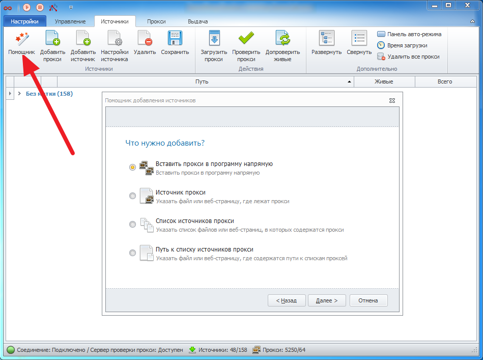
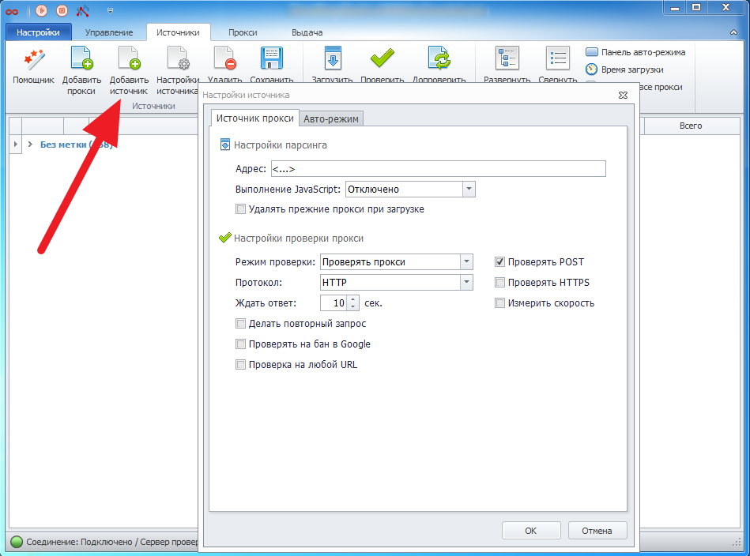
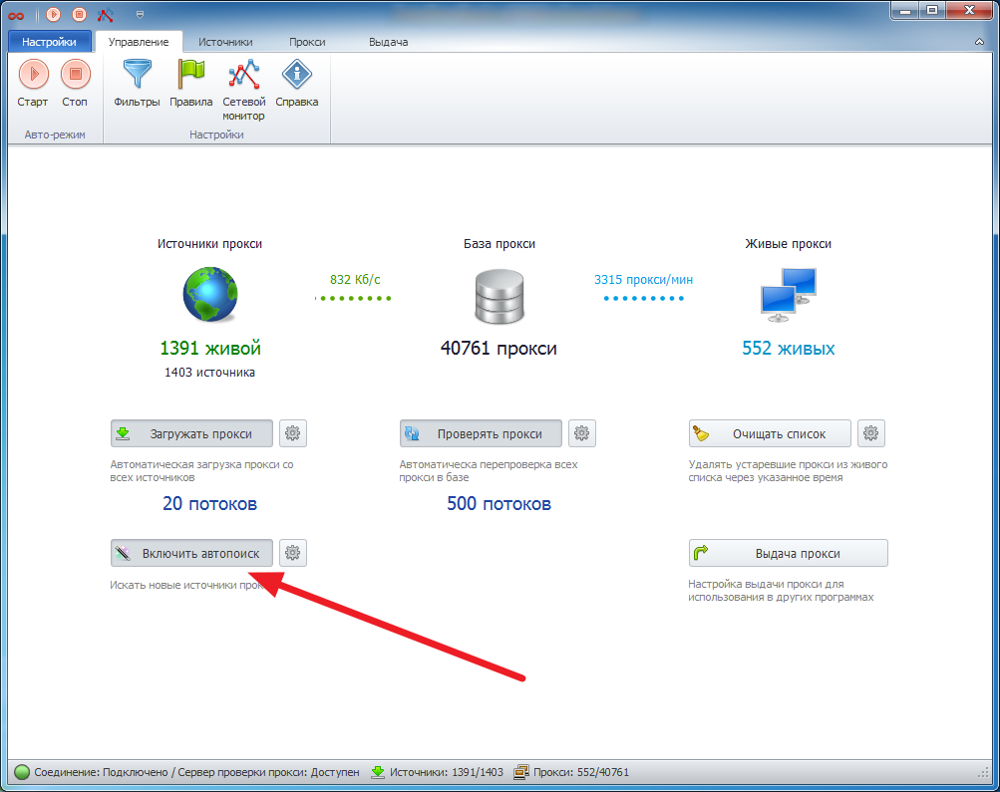

---
sidebar_position: 1
title: Adding Proxies
description: "Adding proxies to the ZennoProxyChecker program"
--- 

import DisclaimerNotice from '@site/src/components/DisclaimerNotice';

<DisclaimerNotice />

To start working in ZennoProxyChecker, you need to add proxies to the program (the *Sources* tab). You can do this in several ways.

## **Adding Using the Wizard**

Proxies can be stored in different formats and forms—either in a file on your computer or on a web page as a list. To make adding proxies easier, the program includes a built-in *Wizard* that guides you step by step through the required actions:

**Paste directly** — paste the proxy address directly into the program.

**Add source** — specify a file or web page where the proxies are located.

**Add list of sources** — specify a list of files or web pages where the proxies are located.

**Specify path to the proxy sources list** — specify a file or web page that contains paths to proxy sources.

## **Adding Proxies Manually**
You can also add proxies manually using the *Add proxy* option — this pastes proxies directly into the program. The proxy address format is ip:port for regular proxies and username:password@ip:port for proxies with authentication.

Or use *Add source* by specifying the path to a file or the address of a web page containing a source/list of sources/list of paths to proxy sources.

When adding a source, you can configure it by setting various parsing and proxy checking parameters.

## **Automatic Proxy Source Search**
The program can automatically find proxy sources on the internet and add them to the program. To do this, enable the auto-search option on the *Managing* tab.

Sources found through auto-search will be added to the program and checked according to the auto-search settings specified in the main program settings.

## **Useful Links**

[**Main Window**](https://docs.zennolab.com/zennoproxychecker/Program%20interface/Sources/Main_window)

[**Managing**](https://docs.zennolab.com/zennoproxychecker/Program%20interface/Managing)

[**Main Settings**](https://docs.zennolab.com/zennoproxychecker/Settings/Main_settings)

[**Source Settings**](https://docs.zennolab.com/zennoproxychecker/Program%20interface/Sources/Source_settings)