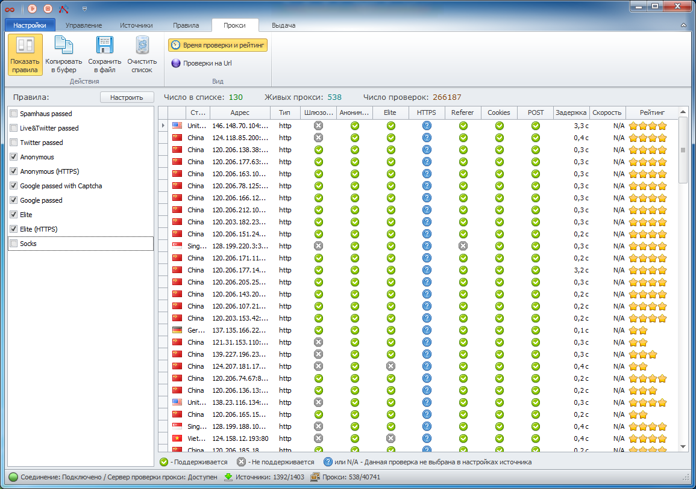

---
sidebar_position: 4
title: Live List
description: "Description of the live proxy list features"
--- 

import DisclaimerNotice from '@site/src/components/DisclaimerNotice';

<DisclaimerNotice />

## **Live Proxy List**

Proxies that have successfully passed the check are displayed in the **Live List** on the **Proxy** tab.

For each proxy in the list, basic information (country, IP address, type) and check parameters such as anonymity, gateway status, speed, latency, etc., along with the check success status, are displayed. You can also display the proxy check time and rating by enabling the corresponding option.

Each proxy has its own *rating*. This rating increases when the proxy is used after being selected from the “live” list. The rating also decreases if the proxy fails a check. The program logic is designed so that proxies are regularly taken from the database for checking based on their rating. Proxies with the highest rating are checked first. Proxies with a low rating are rechecked last.

The “live” proxy list can be filtered using [rules](https://docs.zennolab.com/zennoproxychecker/Program%20interface/Rules) (the *Show Rules* option). If several rules are selected, the list will display proxies that satisfy at least one of them. Rules are very convenient, as they allow you to select suitable proxies from other programs that have the ProxyChecker module integrated. For example, in ZennoPoster you can select proxies for your Google email account registration project by choosing the Google Passed rule.

The selected proxies from the “live” list can be copied to the clipboard or saved to a file, and you can also set up automatic export to a file or network resource. Please note that these features are available only in the licensed version of the program. If you are using the [Demo version](https://docs.zennolab.com/zennoproxychecker/introduction/ZPCh_Demo), these options will not be available.

## **Useful Links**

[**ZennoProxyChecker Interface**](https://docs.zennolab.com/zennoproxychecker/category/proxychecker-program-interface)

[**Proxy**](https://docs.zennolab.com/zennoproxychecker/Program%20interface/Proxy)

[**Export**](https://docs.zennolab.com/zennoproxychecker/Program%20interface/Results)