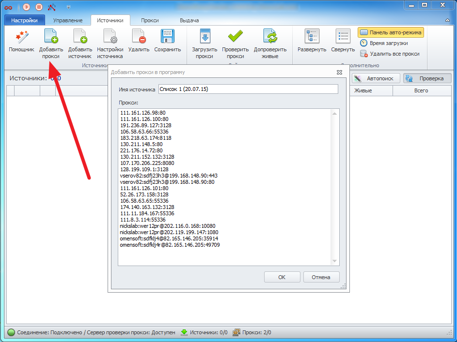

---
sidebar_position: 3
title: Quick Start
description: "Quick start guide for the ZennoProxyChecker program"
--- 

import DisclaimerNotice from '@site/src/components/DisclaimerNotice';

<DisclaimerNotice />

**The main purpose of the program** is to check proxies and select working ones for use in your projects, for working with various websites and services.  
ProxyChecker allows you to check and obtain proxies in just a few steps:

1. Add proxies to the program on the “Sources” tab using the “Add proxy” option. Proxy address format: *ip:port* for regular proxies and *login:password@ip:port* for proxies with authentication.

2. Start the proxy checking process on the “Management” tab. Enable proxy loading and checking.

3. Get verified proxies on the “Proxies” tab. Apply “Rules” to select suitable proxies.

4. The obtained proxies can be copied to the clipboard, saved to a file, or configured for export.