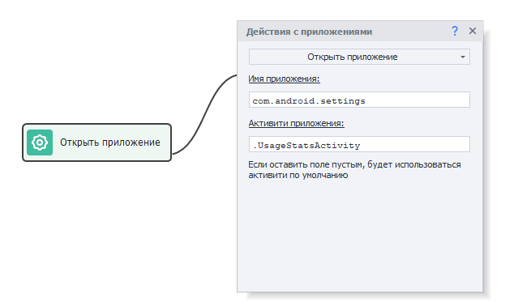
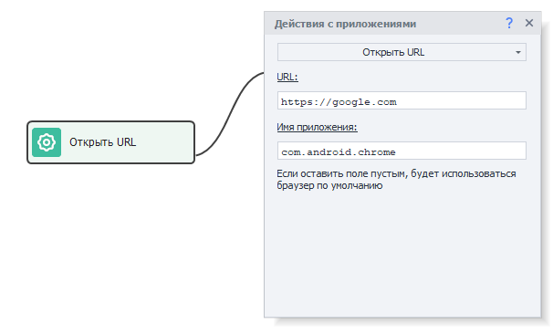
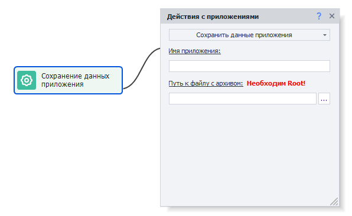
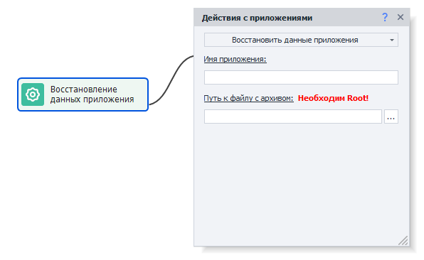
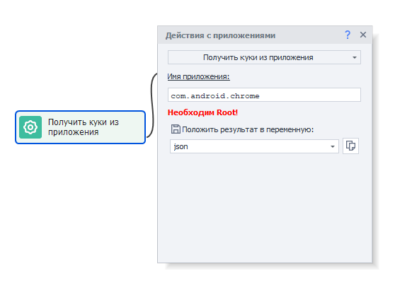
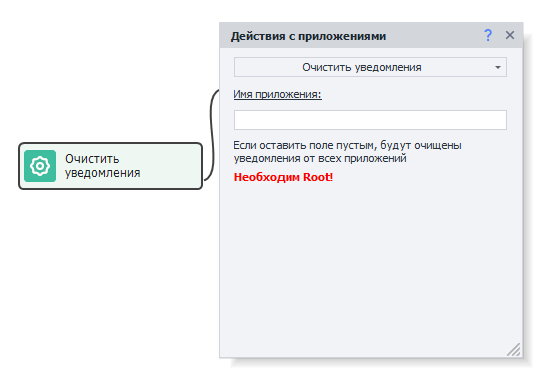

:::info Please, take a look at the [*Terms of Use for materials on this site*](../../Disclaimer).
:::

_______________________________________________
## How to add to your project?
***Right-click → Add action → Android → App Actions***

_______________________________________________
## Available actions

### Install an app

This action lets you install an app from an APK file. Supported formats: ***.xapk, .apkm, .apks***

_______________________________________________
### Uninstall an app

This action removes an installed app by its name, which you can find using the [**Installed Apps**](../../Tools/Installed_App) tool.
_______________________________________________

### Open an app
Lets you launch an app that’s already installed.

- *App name.* You can find it using the [**Installed Apps**](../../Tools/Installed_App) tool.
- *App activity.* Lets you open a specific window of the app right away. You can find this value by checking the app’s dump: `dumpsys package com.package_name | grep -i activity`.
_______________________________________________

### Open URL
Lets you open a web page in a browser.

- *URL.* This is where you enter the web page address you want to open.
- *App name.* Put in the name of the app that can open links. You can find it using the [**Installed Apps**](../../Tools/Installed_App) tool. If you leave it blank, the page will open in the default browser.
_______________________________________________

### Close app

Closes an app (same as the `adb shell am force-stop com.package` command).
_______________________________________________

### Clear app data

This action wipes all user data from the app.
If you check ***Clear cache only***, only the cache will be deleted, and everything else stays.
_______________________________________________

### Save app data
This function lets you save all app data (kind of like saving a profile in ZennoPoster).

#### Available options:
- *App name.* You can find it using the [**Installed Apps**](../../Tools/Installed_App) tool.
- *Path to archive file.* Enter the path where you want to save the archived app data (archive format is ***tar.gz***).
:::tip Here’s a good way.
Before saving the data, it’s best to close the app using the Keyboard Emulation action with this text: `{AndroidKeys.HOME}`. This emulates pressing the HOME button.
:::

#### Why close the app before saving data?
If the app is open during data saving, some information may be in RAM, not in the files. In this case, those data won’t be saved. Also, you shouldn’t use the **Close app** action for this because it kills the process and you might lose data.

### Restore app data

This lets you load app data saved using the previous action (***Save app data***).
#### Available options:
- *App name.* You can find it using the [**Installed Apps**](../../Tools/Installed_App) tool.
- *Path to archive file.* Enter the path to the archive with your app data.
:::warning Attention.
The app must be installed on the device but NOT running when restoring data!
:::

### Extract APK from app

This action lets you get the installer file of your app in ***.apk*** or ***.apks*** format.
Later, you can install the app with the **Install APK** action.
_______________________________________________

### Get cookies from the app

This action gets cookies from apps with web content, returned in JSON format.
You can then use the [**JSON and XML Processing**](../../Data/JSON_XML) action to read these data.
_______________________________________________

### Get notifications

This action fetches notifications from the app from the notification drawer (top system bar) in JSON format.
You can then use the [**JSON and XML Processing**](../../Data/JSON_XML) action to read these data.
_______________________________________________

### Clear notifications

This feature removes all accumulated notifications from the notification bar.
_______________________________________________

### Get active app name

This action lets you get the name of the app that is currently active and in the foreground.
_______________________________________________

### Get list of apps

This action lets you get the names of all installed apps and save them in a list.
#### App filter options:
- *All.* All apps installed on the device.
- *System.* Pre-installed apps that you generally can’t uninstall, only hide.
- *User.* Apps you installed yourself.
_______________________________________________

### Check if app is already installed

This function checks whether an app is on the device. If it’s missing, it’ll be treated as an error and the workflow will go through the red branch.
_______________________________________________

## Useful links
- [**Getting started with the browser**](../../get-started/browser)
- [**Debugging projects**](../../pm/Debugging)
- [**Working with BlueStacks (ZDE)**](../../Enterprise/BlueStacks)