:::info **Please read the [*Materials Usage Policy on this resource*](../../Disclaimer).**
:::
_______________________________________________
Let’s go over the available functions for working directly inside the virtual machine. For example: installing apps, launching, stopping, running console commands (ADB Shell), and more.

## How to add it to the project?
***Right-click → Add action → Android → App Actions***

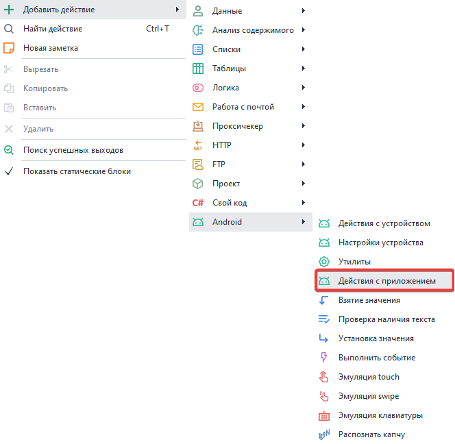
_______________________________________________
## Available actions.
### Install an app.
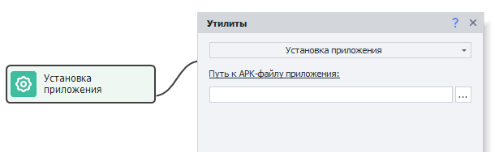
This action lets you install an app from an APK file. Supported formats: ***.xapk, .apkm, .apks***
_______________________________________________
### Uninstall an app.
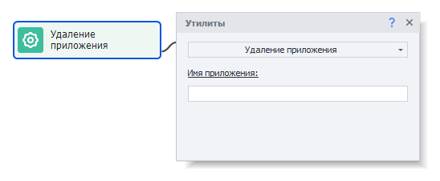
This action removes an installed app by its name, which you can find using the [**Installed Apps**](../../Tools/Installed_App) tool.
_______________________________________________
### Open an app.
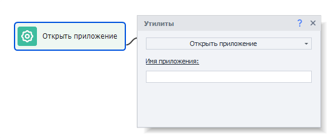
Lets you launch an app you've already installed.
_______________________________________________
### Close an app.
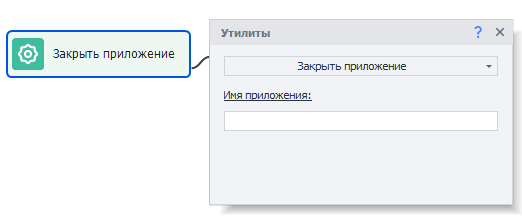
Closes an app (similar to the command `adb shell am force-stop com.package`).
_______________________________________________
### Clear app data.
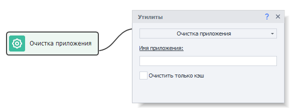
You use this action to wipe all user data.
If you check ***Clear cache only***, only the cache will be deleted, leaving everything else intact.
_______________________________________________
### Save app data.
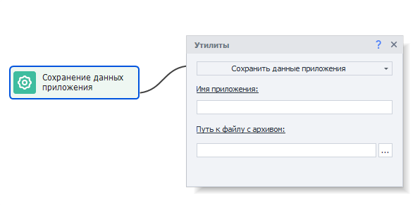
This action saves all app data.
#### Available parameters:
- *App name*. You can find it using the [**Installed Apps**](../../Tools/Installed_App) tool.
- *Path to archive file*. Here you need to enter the path where the archived app data will be saved (archive format is ***tar.gz***).
:::tip **Best practice.**
Before saving data, it's best to close the app by using the Keyboard Emulation action with this text: `{AndroidKeys.HOME}`. This emulates pressing the HOME button.
:::

#### Why close the app before saving data?
If the app is open while you’re saving its data, some files might still be in memory and not in the file system, so they might not get saved. Also, you shouldn’t close the app with the **Close app** action for this purpose, as it kills the process abruptly and could result in data loss.
### Restore app data.
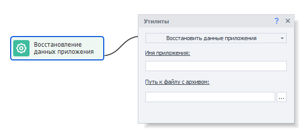
This lets you load app data previously saved using the ***Save app data*** action.
#### Available parameters:
- *App name*. You can find it using the [**Installed Apps**](../../Tools/Installed_App) tool.
- *Path to archive file*. Enter the path to the archive with the saved app data.
:::warning **Attention.**
The app must be installed in the system but not running when restoring its data!
:::

### Get the app’s apk.
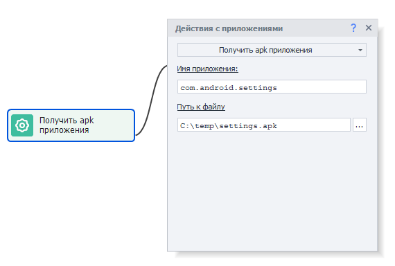
This action lets you extract the installation file for an app in ***.apk*** or ***.apks*** format.
You can later install the app using the **Install apk** action.
_______________________________________________
### Get cookies from the app.
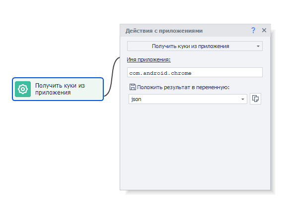
This action collects cookies from apps that display web content; the cookies are returned in json format.
You can then work with this data using the [**JSON and XML processing**](../../Data/JSON_XML) action.
_______________________________________________
### Get notifications.
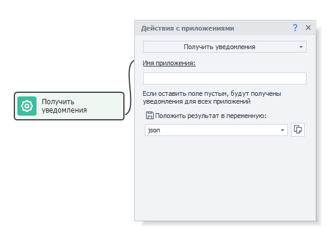
This action fetches notifications from the app notification shade (top panel) in json format.
You can then process this data using the [**JSON and XML processing**](../../Data/JSON_XML) action.
_______________________________________________
### Clear notifications.
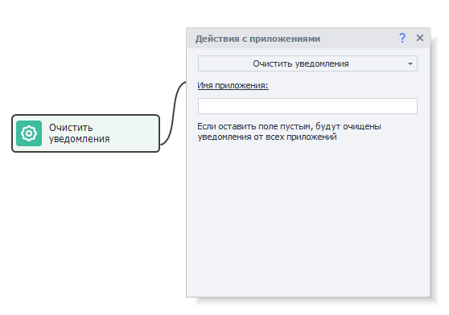
This feature clears all accumulated notifications from the top panel.
_______________________________________________
### Name of the active app.
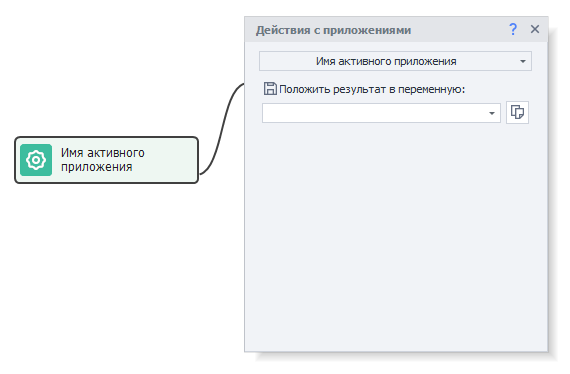
This action lets you get the name of the app that’s active and in the foreground on your device.
_______________________________________________
### Get the list of apps.
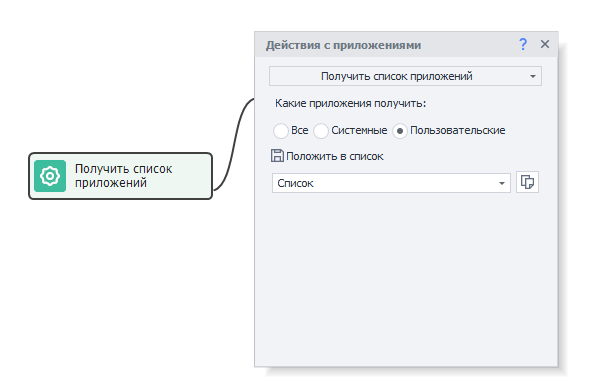
This action gets the names of all installed apps and saves them to a list.
#### Filter options for apps:
- *All*. All apps installed on the device.
- *System*. Pre-installed system apps, which are usually not removable (only hidable).
- *User*. Apps you’ve installed yourself.
_______________________________________________
### Check if the app is already installed.
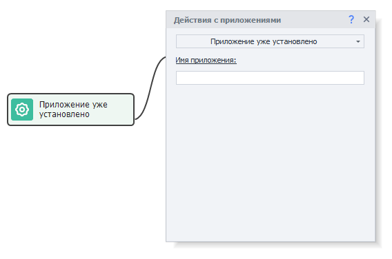
This action checks if an app is installed on the device. If it’s missing, the process will go down the error branch.
_______________________________________________
## Useful links.
- [**Getting Started with the Browser**](../../get-started/browser).
- [**Debugging Projects**](../../pm/Debugging).