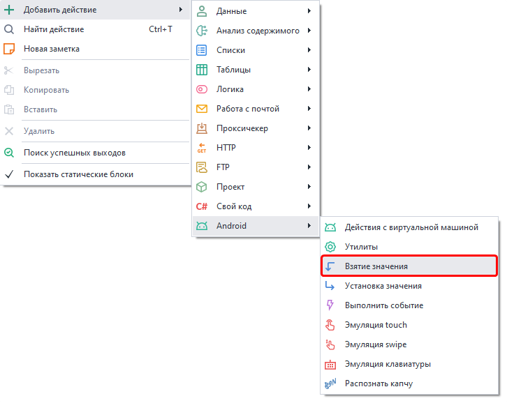
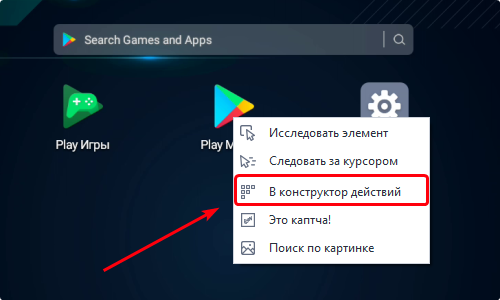
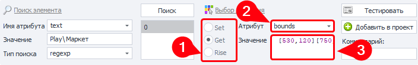
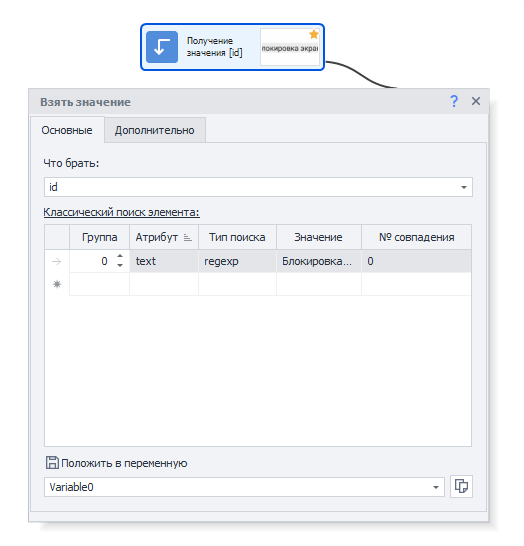
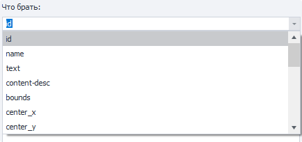
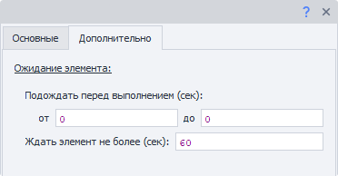
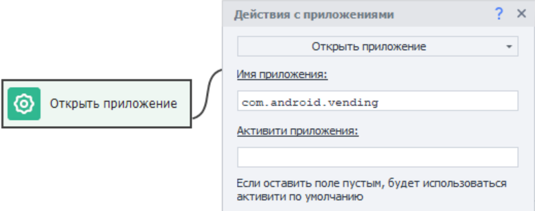
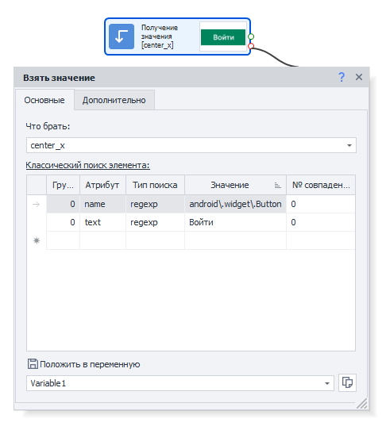

Please take a look at the [*Material Usage Rules on this platform*](../../Disclaimer).

_______________________________________________  
## Description  
This action is used to get attribute values from a specific element.  
For example:  
- height/width  
- inner text  
- center coordinates  
- element id  
- and more  

### Why is it helpful?  
It lets you check whether an element is present on a page. Used for:  
- **Checking authorization**  
For instance, when a user is logged into the app, a button to open the personal account or a logout icon appears. If either of these exists, you’re good—you’re logged in.  
- **Finding error messages**  
Useful when solving captchas. If a captcha is entered incorrectly, often a new element with an error message pops up. In this case, you’ll need to try solving the captcha again.  

### How to add it to your project  
Use the canvas context menu:  
**Add Action → Android → Get Value**

  
_______________________________________________ 
## Select an element to get a value from  
Any shortcut on the main screen can be an element, for example, Play Market. Right-click on it → **To Action Builder**.

 

After that, the [**Action Builder**](../../pm/Interface/ActionBuilder) opens at the bottom under the browser window.

  

The search data will be picked so that only one element remains in the result.

#### Explanation of points  
**1**. In *Action*, choose **Get**.  
**2**. Coordinates are stored in the **bounds** attribute.  
**3**. The first brackets `[]` are the top-left corner coordinates, the second—bottom-right corner.  

#### Step-by-step:  
- Choose **bounds** from the *Attribute* dropdown.  
- Coordinates will appear in the *Value* field (e.g., `[530,120][750,253]`).  
- Test it before adding the action to the project—click **Test**.  
- It’s recommended to add a comment to the action for clarity.  
- Finish by clicking **Add to project**.  
_______________________________________________ 
## Configuring the action  
### “Main” tab
  

#### What to get  
When you click, a list of attributes you can read appears.

#### Searching for the element  
Set the necessary parameters to find the right item.

### “Advanced” tab  
  

#### Wait before executing  
Set a range **FROM** and **TO** (in seconds)—a random wait time will be selected from this range before executing.

#### Wait for the element no longer than  
If the element doesn’t appear within the specified time (in seconds), the action will end with an error.
_______________________________________________ 
## Usage example  
Let’s look at how this action works using the Google Play app. Suppose you want to check if a user is logged in.

First, launch the app one of two ways:  
- With the [**Run Event**](./RunEvent) action  
- With [**App Actions. Open App**](./App#открыть-приложение)  

| We’ll use the second method:   | 
| -------- | 
|   | 
| *You can find out the app name through the [**Installed Apps**](../../Tools/Installed_App) window.* |  

If the user isn’t logged in, you’ll see a window with a **Sign in** button.   
| Not logged in    | Logged in |
| -------- | ------- |
|   |     |

App language depends on the virtual machine’s language.

Let’s look for the **Sign in** button using two criteria at once:  

  

If the button is found and the attribute value is retrieved, that means the user isn’t logged in.

But if the action can’t find the button, the user is logged in.
_______________________________________________