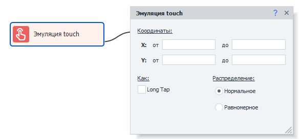
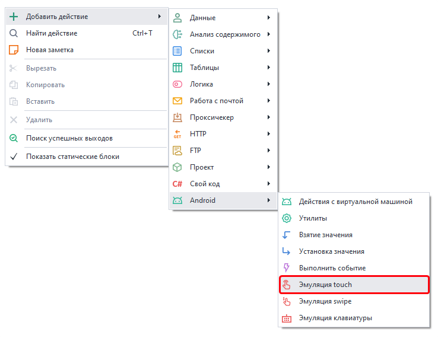
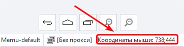

:::info **Please read the [*Terms of Use for materials on this site*](../../Disclaimer).**
:::
_______________________________________________  
## Description  
This action lets you emulate a screen tap (touch event) within the specified coordinates.

:::warning **The emulator’s resolution must stay the same.**
Both during development and when running the project. If you change the resolution, the coordinates of the elements change too.
:::

### Why use this?  
Simulating a finger tap is helpful when it’s difficult or impossible to trigger a click with the **Perform Event** action.

### How do you add it to your project?  
***Right-click → Add Action → Android → Emulate touch***

_______________________________________________  
## How to work with the action  
### Coordinates  
Here you enter the coordinates of the element you’re interested in. You can find them in the [**Emulator Window**](../../pm/Interface/DeviceWindow); the current cursor position is shown at the bottom when the cursor is inside that window.

**X (from, to)** — horizontal coordinates  
**Y (from, to)** — vertical coordinates

*A Touch tap* will be performed at these coordinates.

### Long Tap  
This does a long press, as if you’re holding your finger on the screen.

### Distribution  
Sets how precisely the tap happens on the screen:
- **Normal**: More likely to tap closer to the center of the object
- **Uniform**: Taps will be distributed evenly within the set coordinates
_______________________________________________